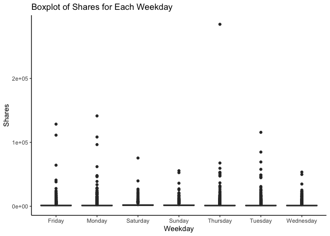
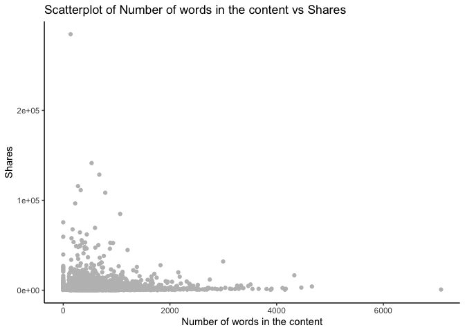
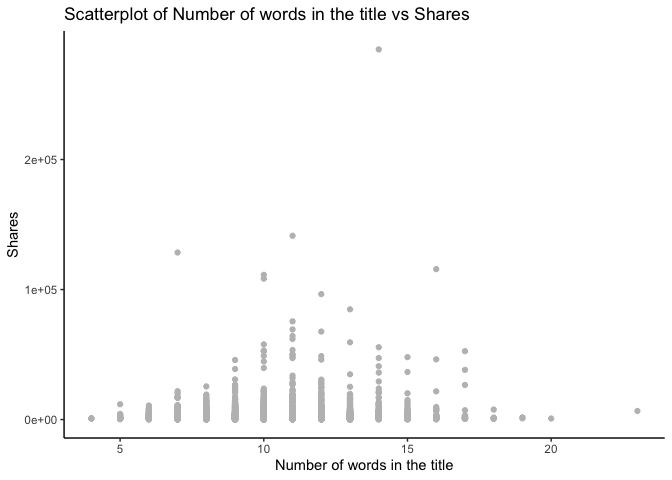
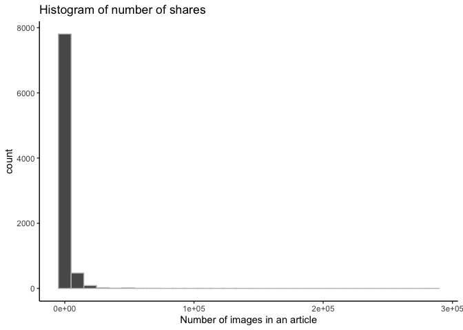
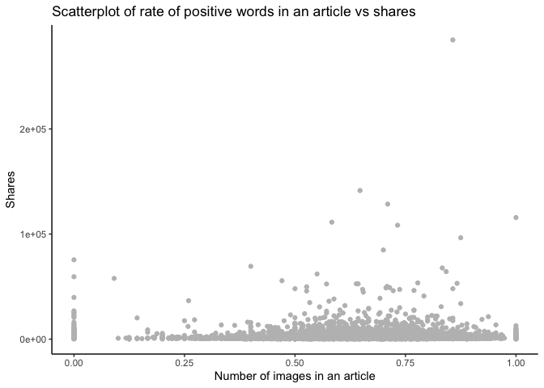
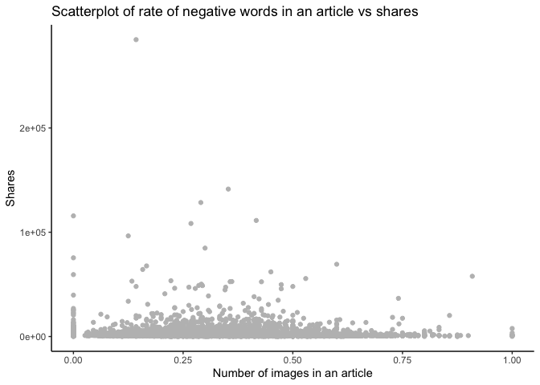
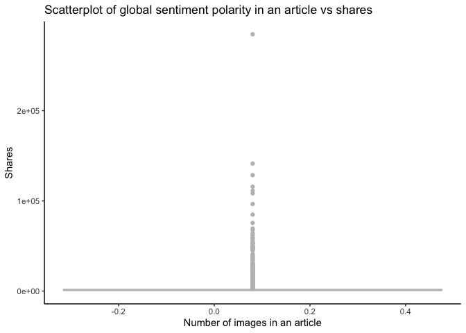

Tanley-Wood-Project2
================
Jordan Tanley and Jonathan Wood
2022-07-05

# Introduction - Jonathan

## Data

The data in this analysis will be the [online news popularity
dataset](https://archive.ics.uci.edu/ml/datasets/Online+News+Popularity).
This data has a set of features on articles from Mashable.com over a two
year period.

The goal of this project is to determine the number of shares (how many
times the article was shared over social media) the article has. We will
use this information to predict if an article can be popular by the
number of shares.

## Notable Variables

While there are 61 variables in the data set, we will not use all of
them for this project. The notable variables are the following:

-   “shares” - The number of shares the article has gotten over social
    media. This is the label or variable we want our models to predict
    for new articles
-   “data_channel_is” - A set of variables that tells if the article is
    in a particular category, such as business, sports, or lifestyle.
-   “weekday_is” - A set of variables that tells what day of the week
    the article was published on.
-   “num_images” - The number of images within the article
-   “num_videos” - The number of videos within the article
-   “n_tokens_content” - The number of tokens (words) within the
    article’s contents
-   “rate_positive_words” - The rate of the positive words in the
    article’s contents
-   “rate_negative_words” - The rate of the negative words in the
    article’s contents

## Methods

Multiple methods will be used for this project to predict the number of
shares a new article can generate, including

-   Linear regression
-   Tree-based models
    -   Random forest
    -   Boosted tree

# Data - Jordan

In order to read in the data using a relative path, be sure to have the
data file saved in your working directory.

``` r
# read in the data
news <- read_csv("OnlineNewsPopularity/OnlineNewsPopularity.csv")
```

    ## Rows: 39644 Columns: 61
    ## ── Column specification ──────────────────────────────────────────────────────────────────────────────────────────────────────────────────────────────────
    ## Delimiter: ","
    ## chr  (1): url
    ## dbl (60): timedelta, n_tokens_title, n_tokens_content, n_unique_tokens, n_non_stop_words, n_non_stop_unique_tokens, num_hrefs, num_self_hrefs, num_img...
    ## 
    ## ℹ Use `spec()` to retrieve the full column specification for this data.
    ## ℹ Specify the column types or set `show_col_types = FALSE` to quiet this message.

``` r
# sneek peek at the dataset
news %>%
  head() %>%
  kable()
```

| url                                                              | timedelta | n_tokens_title | n_tokens_content | n_unique_tokens | n_non_stop_words | n_non_stop_unique_tokens | num_hrefs | num_self_hrefs | num_imgs | num_videos | average_token_length | num_keywords | data_channel_is_lifestyle | data_channel_is_entertainment | data_channel_is_bus | data_channel_is_socmed | data_channel_is_tech | data_channel_is_world | kw_min_min | kw_max_min | kw_avg_min | kw_min_max | kw_max_max | kw_avg_max | kw_min_avg | kw_max_avg | kw_avg_avg | self_reference_min_shares | self_reference_max_shares | self_reference_avg_sharess | weekday_is_monday | weekday_is_tuesday | weekday_is_wednesday | weekday_is_thursday | weekday_is_friday | weekday_is_saturday | weekday_is_sunday | is_weekend |    LDA_00 |    LDA_01 |    LDA_02 |    LDA_03 |    LDA_04 | global_subjectivity | global_sentiment_polarity | global_rate_positive_words | global_rate_negative_words | rate_positive_words | rate_negative_words | avg_positive_polarity | min_positive_polarity | max_positive_polarity | avg_negative_polarity | min_negative_polarity | max_negative_polarity | title_subjectivity | title_sentiment_polarity | abs_title_subjectivity | abs_title_sentiment_polarity | shares |
|:-----------------------------------------------------------------|----------:|---------------:|-----------------:|----------------:|-----------------:|-------------------------:|----------:|---------------:|---------:|-----------:|---------------------:|-------------:|--------------------------:|------------------------------:|--------------------:|-----------------------:|---------------------:|----------------------:|-----------:|-----------:|-----------:|-----------:|-----------:|-----------:|-----------:|-----------:|-----------:|--------------------------:|--------------------------:|---------------------------:|------------------:|-------------------:|---------------------:|--------------------:|------------------:|--------------------:|------------------:|-----------:|----------:|----------:|----------:|----------:|----------:|--------------------:|--------------------------:|---------------------------:|---------------------------:|--------------------:|--------------------:|----------------------:|----------------------:|----------------------:|----------------------:|----------------------:|----------------------:|-------------------:|-------------------------:|-----------------------:|-----------------------------:|-------:|
| <http://mashable.com/2013/01/07/amazon-instant-video-browser/>   |       731 |             12 |              219 |       0.6635945 |                1 |                0.8153846 |         4 |              2 |        1 |          0 |             4.680365 |            5 |                         0 |                             1 |                   0 |                      0 |                    0 |                     0 |          0 |          0 |          0 |          0 |          0 |          0 |          0 |          0 |          0 |                       496 |                       496 |                    496.000 |                 1 |                  0 |                    0 |                   0 |                 0 |                   0 |                 0 |          0 | 0.5003312 | 0.3782789 | 0.0400047 | 0.0412626 | 0.0401225 |           0.5216171 |                 0.0925620 |                  0.0456621 |                  0.0136986 |           0.7692308 |           0.2307692 |             0.3786364 |             0.1000000 |                   0.7 |            -0.3500000 |                -0.600 |            -0.2000000 |          0.5000000 |               -0.1875000 |              0.0000000 |                    0.1875000 |    593 |
| <http://mashable.com/2013/01/07/ap-samsung-sponsored-tweets/>    |       731 |              9 |              255 |       0.6047431 |                1 |                0.7919463 |         3 |              1 |        1 |          0 |             4.913725 |            4 |                         0 |                             0 |                   1 |                      0 |                    0 |                     0 |          0 |          0 |          0 |          0 |          0 |          0 |          0 |          0 |          0 |                         0 |                         0 |                      0.000 |                 1 |                  0 |                    0 |                   0 |                 0 |                   0 |                 0 |          0 | 0.7997557 | 0.0500467 | 0.0500963 | 0.0501007 | 0.0500007 |           0.3412458 |                 0.1489478 |                  0.0431373 |                  0.0156863 |           0.7333333 |           0.2666667 |             0.2869146 |             0.0333333 |                   0.7 |            -0.1187500 |                -0.125 |            -0.1000000 |          0.0000000 |                0.0000000 |              0.5000000 |                    0.0000000 |    711 |
| <http://mashable.com/2013/01/07/apple-40-billion-app-downloads/> |       731 |              9 |              211 |       0.5751295 |                1 |                0.6638655 |         3 |              1 |        1 |          0 |             4.393365 |            6 |                         0 |                             0 |                   1 |                      0 |                    0 |                     0 |          0 |          0 |          0 |          0 |          0 |          0 |          0 |          0 |          0 |                       918 |                       918 |                    918.000 |                 1 |                  0 |                    0 |                   0 |                 0 |                   0 |                 0 |          0 | 0.2177923 | 0.0333345 | 0.0333514 | 0.0333335 | 0.6821883 |           0.7022222 |                 0.3233333 |                  0.0568720 |                  0.0094787 |           0.8571429 |           0.1428571 |             0.4958333 |             0.1000000 |                   1.0 |            -0.4666667 |                -0.800 |            -0.1333333 |          0.0000000 |                0.0000000 |              0.5000000 |                    0.0000000 |   1500 |
| <http://mashable.com/2013/01/07/astronaut-notre-dame-bcs/>       |       731 |              9 |              531 |       0.5037879 |                1 |                0.6656347 |         9 |              0 |        1 |          0 |             4.404896 |            7 |                         0 |                             1 |                   0 |                      0 |                    0 |                     0 |          0 |          0 |          0 |          0 |          0 |          0 |          0 |          0 |          0 |                         0 |                         0 |                      0.000 |                 1 |                  0 |                    0 |                   0 |                 0 |                   0 |                 0 |          0 | 0.0285732 | 0.4192996 | 0.4946508 | 0.0289047 | 0.0285716 |           0.4298497 |                 0.1007047 |                  0.0414313 |                  0.0207156 |           0.6666667 |           0.3333333 |             0.3859652 |             0.1363636 |                   0.8 |            -0.3696970 |                -0.600 |            -0.1666667 |          0.0000000 |                0.0000000 |              0.5000000 |                    0.0000000 |   1200 |
| <http://mashable.com/2013/01/07/att-u-verse-apps/>               |       731 |             13 |             1072 |       0.4156456 |                1 |                0.5408895 |        19 |             19 |       20 |          0 |             4.682836 |            7 |                         0 |                             0 |                   0 |                      0 |                    1 |                     0 |          0 |          0 |          0 |          0 |          0 |          0 |          0 |          0 |          0 |                       545 |                     16000 |                   3151.158 |                 1 |                  0 |                    0 |                   0 |                 0 |                   0 |                 0 |          0 | 0.0286328 | 0.0287936 | 0.0285752 | 0.0285717 | 0.8854268 |           0.5135021 |                 0.2810035 |                  0.0746269 |                  0.0121269 |           0.8602151 |           0.1397849 |             0.4111274 |             0.0333333 |                   1.0 |            -0.2201923 |                -0.500 |            -0.0500000 |          0.4545455 |                0.1363636 |              0.0454545 |                    0.1363636 |    505 |
| <http://mashable.com/2013/01/07/beewi-smart-toys/>               |       731 |             10 |              370 |       0.5598886 |                1 |                0.6981982 |         2 |              2 |        0 |          0 |             4.359459 |            9 |                         0 |                             0 |                   0 |                      0 |                    1 |                     0 |          0 |          0 |          0 |          0 |          0 |          0 |          0 |          0 |          0 |                      8500 |                      8500 |                   8500.000 |                 1 |                  0 |                    0 |                   0 |                 0 |                   0 |                 0 |          0 | 0.0222453 | 0.3067176 | 0.0222313 | 0.0222243 | 0.6265816 |           0.4374086 |                 0.0711842 |                  0.0297297 |                  0.0270270 |           0.5238095 |           0.4761905 |             0.3506100 |             0.1363636 |                   0.6 |            -0.1950000 |                -0.400 |            -0.1000000 |          0.6428571 |                0.2142857 |              0.1428571 |                    0.2142857 |    855 |

``` r
# Creating a weekday variable (basically undoing the 7 dummy variables that came with the data) for EDA
news$weekday <- ifelse(news$weekday_is_friday == 1, "Friday",
                       ifelse(news$weekday_is_monday == 1, "Monday",
                              ifelse(news$weekday_is_tuesday == 1, "Tuesday",
                                     ifelse(news$weekday_is_wednesday == 1, "Wednesday",
                                            ifelse(news$weekday_is_thursday == 1, "Thursday",
                                                   ifelse(news$weekday_is_saturday == 1, "Saturday", 
                                                          "Sunday"))))))
```

Next, let’s subset the data so that we can only look at the data channel
of interest. We will look at articles with the “Social Media” data
channel.

``` r
# Subset the data to  one of the parameterized data channels and drop unnecessary variables
chan <- paste0("data_channel_is_", params$channel)

print(chan)
```

    ## [1] "data_channel_is_lifestyle"

``` r
filtered_channel <- news %>% 
                as_tibble() %>% 
                filter(news[chan] == 1) %>% 
                select(-c(url, timedelta))

# take a peek at the data
filtered_channel %>%
  select(ends_with(chan))
```

# Summarizations - Both (at least 3 plots each)

For the numerical summaries, we can look at several aspects. Contingency
tables allow us to examine frequencies of categorical variables. The
first output below, for example, shows the counts for each weekday.
Similarly, the fifth table outputted shows the frequencies of number of
tokens in the article content. Another set of summary statistics to look
at are the 5 Number Summaries. These provide the minmum, 1st quantile,
median, 3rd quantile, and maximum for a particular variable.
Additionally, it may also be helful to look at the average. These are
helpful in determining the skewness (if mean = median vs. mean \< or \>
median) and helps in looking for outliers (anything outside (Q3 - Q1)1.5
from the median is generally considered an outlier). Below, the 5 Number
summaries (plus mean) are shown for Shares, Number of words in the
content, Number of words in the content for the upper quantile of
Shares, number of images in the article, number of videos in the
article, positive word rate, and negative word rate.

``` r
# Contingency table of frequencies for days of the week, added caption for clarity
kable(table(filtered_channel$weekday), 
      col.names = c("Weekday", "Frequency"), 
      caption = "Contingency table of frequencies for days of the week")
```

| Weekday   | Frequency |
|:----------|----------:|
| Friday    |       305 |
| Monday    |       322 |
| Saturday  |       182 |
| Sunday    |       210 |
| Thursday  |       358 |
| Tuesday   |       334 |
| Wednesday |       388 |

Contingency table of frequencies for days of the week

``` r
# Numerical Summary of Shares, added caption for clarity
filtered_channel %>% summarise(Minimum = min(shares), 
                          Q1 = quantile(shares, prob = 0.25), 
                          Average = mean(shares), 
                          Median = median(shares), 
                          Q3 = quantile(shares, prob = 0.75), 
                          Maximum = max(shares)) %>% 
                kable(caption = "Numerical Summary of Shares")
```

| Minimum |   Q1 |  Average | Median |   Q3 | Maximum |
|--------:|-----:|---------:|-------:|-----:|--------:|
|      28 | 1100 | 3682.123 |   1700 | 3250 |  208300 |

Numerical Summary of Shares

``` r
# Numerical Summary of Number of words in the content, added caption for clarity
filtered_channel %>% summarise(Minimum = min(n_tokens_content), 
                          Q1 = quantile(n_tokens_content, prob = 0.25), 
                          Average = mean(n_tokens_content), 
                          Median = median(n_tokens_content), 
                          Q3 = quantile(n_tokens_content, prob = 0.75), 
                          Maximum = max(n_tokens_content)) %>% 
                kable(caption = "Numerical Summary of Number of words in the content")
```

| Minimum |    Q1 |  Average | Median |  Q3 | Maximum |
|--------:|------:|---------:|-------:|----:|--------:|
|       0 | 308.5 | 621.3273 |    502 | 795 |    8474 |

Numerical Summary of Number of words in the content

``` r
# Numerical Summary of Number of words in the content for the upper quantile of Shares, added caption for clarity
filtered_channel %>% filter(shares > quantile(shares, prob = 0.75)) %>%
                summarise(Minimum = min(n_tokens_content), 
                          Q1 = quantile(n_tokens_content, prob = 0.25), 
                          Average = mean(n_tokens_content), 
                          Median = median(n_tokens_content), 
                          Q3 = quantile(n_tokens_content, prob = 0.75), 
                          Maximum = max(n_tokens_content)) %>% 
                kable(caption = "Numerical Summary of Number of words in the content for the upper quantile of Shares")
```

| Minimum |  Q1 |  Average | Median |  Q3 | Maximum |
|--------:|----:|---------:|-------:|----:|--------:|
|       0 | 306 | 679.1752 |    505 | 883 |    8474 |

Numerical Summary of Number of words in the content for the upper
quantile of Shares

``` r
kable(table(filtered_channel$n_tokens_content),
  col.names = c("Tokens", "Frequency"), 
  caption = "Contingency table of frequencies for number of tokens in the article content")
```

| Tokens | Frequency |
|:-------|----------:|
| 0      |        22 |
| 68     |         1 |
| 77     |         1 |
| 81     |         2 |
| 85     |         1 |
| 89     |         1 |
| 91     |         2 |
| 96     |         1 |
| 97     |         1 |
| 98     |         1 |
| 99     |         2 |
| 101    |         1 |
| 102    |         1 |
| 103    |         1 |
| 105    |         2 |
| 106    |         1 |
| 107    |         1 |
| 110    |         2 |
| 112    |         1 |
| 113    |         2 |
| 114    |         2 |
| 115    |         3 |
| 116    |         5 |
| 117    |         2 |
| 118    |         1 |
| 120    |         1 |
| 121    |         3 |
| 123    |         6 |
| 124    |         1 |
| 126    |         1 |
| 128    |         1 |
| 129    |         1 |
| 130    |         1 |
| 131    |         2 |
| 132    |         1 |
| 135    |         1 |
| 137    |         3 |
| 138    |         3 |
| 139    |         2 |
| 140    |         2 |
| 141    |         3 |
| 143    |         1 |
| 144    |         2 |
| 145    |         1 |
| 146    |         2 |
| 147    |         3 |
| 149    |         4 |
| 150    |         3 |
| 151    |         1 |
| 153    |         1 |
| 154    |         3 |
| 155    |         1 |
| 156    |         2 |
| 157    |         2 |
| 158    |         3 |
| 159    |         4 |
| 160    |         1 |
| 161    |         2 |
| 163    |         3 |
| 165    |         1 |
| 166    |         2 |
| 167    |         1 |
| 169    |         4 |
| 171    |         4 |
| 172    |         1 |
| 173    |         3 |
| 174    |         4 |
| 175    |         4 |
| 178    |         3 |
| 179    |         3 |
| 180    |         2 |
| 181    |         1 |
| 182    |         2 |
| 183    |         2 |
| 184    |         3 |
| 187    |         3 |
| 188    |         1 |
| 189    |         2 |
| 191    |         2 |
| 192    |         1 |
| 193    |         2 |
| 194    |         2 |
| 195    |         5 |
| 196    |         1 |
| 197    |         5 |
| 198    |         2 |
| 199    |         4 |
| 200    |         2 |
| 202    |         4 |
| 203    |         5 |
| 204    |         5 |
| 205    |         1 |
| 206    |         4 |
| 207    |         3 |
| 208    |         1 |
| 209    |         2 |
| 210    |         6 |
| 211    |         3 |
| 212    |         1 |
| 213    |         3 |
| 214    |         6 |
| 215    |         4 |
| 216    |         4 |
| 217    |         3 |
| 218    |         2 |
| 219    |         1 |
| 221    |         2 |
| 222    |         7 |
| 223    |         2 |
| 224    |         3 |
| 225    |         1 |
| 226    |         4 |
| 228    |         2 |
| 229    |         3 |
| 230    |         4 |
| 231    |         2 |
| 232    |         3 |
| 234    |         2 |
| 235    |         4 |
| 236    |         2 |
| 237    |         4 |
| 238    |         2 |
| 239    |         3 |
| 240    |         4 |
| 241    |         3 |
| 242    |         3 |
| 243    |         7 |
| 244    |         1 |
| 246    |         3 |
| 247    |         4 |
| 249    |         6 |
| 250    |         1 |
| 251    |         1 |
| 252    |         3 |
| 253    |         2 |
| 254    |         4 |
| 255    |         2 |
| 256    |         7 |
| 257    |         1 |
| 258    |         6 |
| 259    |         2 |
| 260    |         1 |
| 261    |         7 |
| 262    |         2 |
| 263    |         3 |
| 264    |         2 |
| 265    |         6 |
| 266    |         6 |
| 267    |         4 |
| 268    |         6 |
| 269    |         4 |
| 270    |         5 |
| 271    |         3 |
| 272    |         5 |
| 273    |         5 |
| 275    |         1 |
| 276    |         9 |
| 277    |         3 |
| 278    |         3 |
| 279    |         4 |
| 280    |         2 |
| 281    |         2 |
| 282    |         4 |
| 283    |         5 |
| 285    |         1 |
| 286    |         2 |
| 287    |         3 |
| 289    |         2 |
| 290    |         1 |
| 291    |         6 |
| 292    |         5 |
| 293    |         4 |
| 294    |         5 |
| 295    |         2 |
| 296    |         1 |
| 297    |         5 |
| 298    |         2 |
| 299    |         3 |
| 300    |         4 |
| 301    |         2 |
| 303    |         1 |
| 304    |         1 |
| 305    |         4 |
| 306    |         3 |
| 307    |         2 |
| 308    |         3 |
| 309    |         3 |
| 310    |         2 |
| 311    |         2 |
| 312    |         3 |
| 313    |         4 |
| 314    |         1 |
| 315    |         5 |
| 316    |         3 |
| 317    |         4 |
| 318    |         6 |
| 319    |         3 |
| 320    |         3 |
| 322    |         3 |
| 323    |         4 |
| 324    |         1 |
| 325    |         7 |
| 326    |         5 |
| 327    |         3 |
| 328    |         2 |
| 329    |         2 |
| 330    |         3 |
| 331    |         4 |
| 332    |         6 |
| 333    |         1 |
| 334    |         4 |
| 335    |         5 |
| 336    |         3 |
| 337    |         5 |
| 338    |         5 |
| 339    |         3 |
| 340    |         4 |
| 341    |         2 |
| 342    |         8 |
| 344    |         4 |
| 345    |         3 |
| 346    |         2 |
| 347    |         4 |
| 348    |         4 |
| 349    |         2 |
| 350    |         4 |
| 351    |         2 |
| 352    |         5 |
| 353    |         4 |
| 354    |         5 |
| 355    |         4 |
| 356    |         3 |
| 357    |         2 |
| 358    |         2 |
| 359    |         1 |
| 360    |         3 |
| 361    |         2 |
| 362    |         3 |
| 363    |         1 |
| 364    |         3 |
| 365    |         3 |
| 366    |         3 |
| 367    |         5 |
| 368    |         5 |
| 369    |         1 |
| 370    |         4 |
| 371    |         1 |
| 372    |         1 |
| 373    |         1 |
| 374    |         2 |
| 375    |         2 |
| 376    |         4 |
| 377    |         1 |
| 378    |         5 |
| 379    |         5 |
| 380    |         3 |
| 381    |         3 |
| 382    |         5 |
| 383    |         5 |
| 385    |         1 |
| 386    |         1 |
| 387    |         3 |
| 388    |         3 |
| 389    |         1 |
| 390    |         2 |
| 391    |         2 |
| 393    |         3 |
| 394    |         4 |
| 395    |         5 |
| 396    |         2 |
| 397    |         5 |
| 398    |         4 |
| 399    |         6 |
| 400    |         3 |
| 401    |         2 |
| 402    |         3 |
| 403    |         3 |
| 404    |         2 |
| 405    |         3 |
| 406    |         3 |
| 407    |         3 |
| 408    |         4 |
| 409    |         6 |
| 410    |         4 |
| 411    |         4 |
| 412    |         4 |
| 413    |         3 |
| 414    |         4 |
| 415    |         2 |
| 416    |         3 |
| 417    |         2 |
| 418    |         3 |
| 419    |         2 |
| 420    |         3 |
| 421    |         1 |
| 422    |         1 |
| 423    |         3 |
| 424    |         1 |
| 425    |         1 |
| 427    |         2 |
| 428    |         4 |
| 429    |         3 |
| 430    |         3 |
| 432    |         2 |
| 434    |         4 |
| 436    |         2 |
| 437    |         1 |
| 438    |         1 |
| 439    |         2 |
| 440    |         5 |
| 441    |         4 |
| 442    |         2 |
| 443    |         2 |
| 444    |         1 |
| 445    |         4 |
| 446    |         6 |
| 447    |         2 |
| 448    |        10 |
| 451    |         1 |
| 452    |         3 |
| 453    |         5 |
| 454    |         2 |
| 455    |         1 |
| 456    |         2 |
| 457    |         6 |
| 458    |         2 |
| 459    |         4 |
| 460    |         1 |
| 461    |         2 |
| 463    |         3 |
| 464    |         2 |
| 465    |         1 |
| 466    |         2 |
| 467    |         1 |
| 468    |         3 |
| 469    |         1 |
| 470    |         1 |
| 471    |         3 |
| 473    |         2 |
| 475    |         1 |
| 476    |         2 |
| 477    |         1 |
| 478    |         2 |
| 480    |         4 |
| 481    |         2 |
| 482    |         2 |
| 483    |         3 |
| 484    |         1 |
| 485    |         5 |
| 486    |         4 |
| 487    |         3 |
| 488    |         2 |
| 489    |         2 |
| 490    |         4 |
| 491    |         2 |
| 492    |         1 |
| 494    |         1 |
| 495    |         2 |
| 496    |         2 |
| 497    |         2 |
| 498    |         4 |
| 499    |         4 |
| 500    |         2 |
| 501    |         2 |
| 502    |         2 |
| 503    |         4 |
| 504    |         2 |
| 505    |         4 |
| 506    |         3 |
| 507    |         1 |
| 508    |         2 |
| 509    |         3 |
| 510    |         4 |
| 511    |         4 |
| 512    |         1 |
| 513    |         3 |
| 514    |         4 |
| 516    |         3 |
| 517    |         4 |
| 518    |         4 |
| 519    |         1 |
| 521    |         2 |
| 522    |         2 |
| 524    |         1 |
| 525    |         1 |
| 526    |         1 |
| 527    |         4 |
| 528    |         1 |
| 529    |         4 |
| 530    |         5 |
| 531    |         2 |
| 532    |         1 |
| 533    |         2 |
| 534    |         3 |
| 535    |         6 |
| 536    |         3 |
| 537    |         1 |
| 538    |         2 |
| 539    |         3 |
| 540    |         2 |
| 541    |         3 |
| 542    |         2 |
| 543    |         2 |
| 544    |         4 |
| 545    |         2 |
| 546    |         1 |
| 547    |         1 |
| 548    |         7 |
| 549    |         5 |
| 550    |         2 |
| 551    |         2 |
| 552    |         1 |
| 554    |         3 |
| 555    |         3 |
| 556    |         1 |
| 557    |         4 |
| 558    |         1 |
| 560    |         2 |
| 561    |         2 |
| 562    |         3 |
| 563    |         1 |
| 564    |         1 |
| 565    |         3 |
| 566    |         1 |
| 567    |         3 |
| 568    |         4 |
| 569    |         2 |
| 570    |         3 |
| 571    |         6 |
| 572    |         2 |
| 573    |         3 |
| 574    |         2 |
| 575    |         3 |
| 576    |         4 |
| 577    |         2 |
| 578    |         3 |
| 579    |         1 |
| 580    |         3 |
| 581    |         1 |
| 582    |         3 |
| 583    |         3 |
| 584    |         3 |
| 586    |         1 |
| 587    |         1 |
| 588    |         2 |
| 589    |         4 |
| 590    |         2 |
| 591    |         4 |
| 592    |         2 |
| 593    |         1 |
| 594    |         3 |
| 595    |         2 |
| 596    |         2 |
| 598    |         1 |
| 599    |         3 |
| 600    |         1 |
| 601    |         3 |
| 602    |         2 |
| 603    |         1 |
| 604    |         2 |
| 605    |         1 |
| 606    |         2 |
| 607    |         1 |
| 608    |         1 |
| 609    |         2 |
| 610    |         2 |
| 611    |         3 |
| 612    |         3 |
| 613    |         2 |
| 614    |         3 |
| 615    |         3 |
| 616    |         1 |
| 619    |         2 |
| 620    |         2 |
| 621    |         1 |
| 622    |         2 |
| 623    |         1 |
| 624    |         2 |
| 625    |         2 |
| 626    |         3 |
| 627    |         2 |
| 628    |         2 |
| 629    |         1 |
| 630    |         1 |
| 631    |         1 |
| 632    |         2 |
| 633    |         1 |
| 634    |         1 |
| 635    |         1 |
| 636    |         3 |
| 637    |         3 |
| 638    |         4 |
| 639    |         5 |
| 640    |         2 |
| 641    |         2 |
| 642    |         1 |
| 643    |         1 |
| 645    |         3 |
| 646    |         2 |
| 647    |         2 |
| 651    |         2 |
| 652    |         2 |
| 653    |         2 |
| 654    |         1 |
| 655    |         1 |
| 659    |         2 |
| 660    |         3 |
| 661    |         3 |
| 662    |         1 |
| 663    |         5 |
| 664    |         2 |
| 665    |         1 |
| 666    |         1 |
| 667    |         2 |
| 668    |         1 |
| 670    |         3 |
| 671    |         2 |
| 672    |         3 |
| 673    |         3 |
| 674    |         1 |
| 675    |         3 |
| 676    |         1 |
| 677    |         2 |
| 679    |         1 |
| 680    |         1 |
| 681    |         1 |
| 682    |         1 |
| 683    |         4 |
| 687    |         2 |
| 689    |         2 |
| 690    |         3 |
| 691    |         3 |
| 692    |         1 |
| 695    |         4 |
| 696    |         2 |
| 697    |         2 |
| 698    |         4 |
| 699    |         3 |
| 702    |         3 |
| 703    |         1 |
| 704    |         2 |
| 706    |         1 |
| 707    |         4 |
| 708    |         3 |
| 710    |         1 |
| 712    |         3 |
| 713    |         2 |
| 715    |         2 |
| 716    |         3 |
| 717    |         2 |
| 719    |         3 |
| 720    |         3 |
| 723    |         2 |
| 724    |         1 |
| 725    |         3 |
| 726    |         3 |
| 727    |         2 |
| 728    |         1 |
| 729    |         1 |
| 730    |         2 |
| 731    |         3 |
| 732    |         5 |
| 733    |         1 |
| 734    |         4 |
| 736    |         1 |
| 739    |         3 |
| 743    |         2 |
| 744    |         1 |
| 745    |         2 |
| 746    |         1 |
| 747    |         1 |
| 748    |         1 |
| 749    |         3 |
| 752    |         1 |
| 754    |         2 |
| 755    |         1 |
| 756    |         1 |
| 757    |         2 |
| 759    |         2 |
| 760    |         1 |
| 762    |         5 |
| 763    |         3 |
| 764    |         1 |
| 768    |         4 |
| 769    |         2 |
| 771    |         1 |
| 772    |         1 |
| 773    |         1 |
| 774    |         3 |
| 776    |         2 |
| 781    |         1 |
| 783    |         2 |
| 784    |         2 |
| 785    |         1 |
| 788    |         1 |
| 791    |         1 |
| 792    |         2 |
| 793    |         3 |
| 794    |         2 |
| 795    |         2 |
| 796    |         1 |
| 799    |         1 |
| 801    |         2 |
| 802    |         1 |
| 803    |         2 |
| 804    |         2 |
| 806    |         2 |
| 807    |         3 |
| 808    |         2 |
| 809    |         3 |
| 810    |         1 |
| 811    |         1 |
| 812    |         2 |
| 814    |         2 |
| 816    |         1 |
| 817    |         2 |
| 818    |         2 |
| 819    |         3 |
| 820    |         1 |
| 822    |         1 |
| 823    |         1 |
| 824    |         3 |
| 825    |         1 |
| 826    |         1 |
| 827    |         1 |
| 828    |         2 |
| 830    |         2 |
| 831    |         2 |
| 832    |         2 |
| 837    |         1 |
| 839    |         1 |
| 840    |         2 |
| 841    |         1 |
| 842    |         1 |
| 843    |         1 |
| 847    |         2 |
| 851    |         2 |
| 852    |         1 |
| 854    |         2 |
| 855    |         2 |
| 857    |         2 |
| 858    |         1 |
| 859    |         5 |
| 860    |         2 |
| 861    |         2 |
| 863    |         7 |
| 864    |         2 |
| 865    |         1 |
| 868    |         1 |
| 869    |         1 |
| 870    |         1 |
| 871    |         1 |
| 872    |         2 |
| 873    |         3 |
| 874    |         1 |
| 877    |         1 |
| 878    |         2 |
| 879    |         1 |
| 880    |         1 |
| 881    |         2 |
| 883    |         3 |
| 886    |         1 |
| 888    |         1 |
| 889    |         1 |
| 890    |         2 |
| 891    |         2 |
| 893    |         2 |
| 894    |         1 |
| 895    |         4 |
| 897    |         1 |
| 899    |         4 |
| 900    |         1 |
| 901    |         1 |
| 902    |         2 |
| 903    |         1 |
| 906    |         2 |
| 907    |         3 |
| 908    |         1 |
| 909    |         1 |
| 910    |         1 |
| 911    |         2 |
| 912    |         2 |
| 913    |         2 |
| 914    |         1 |
| 916    |         1 |
| 917    |         3 |
| 918    |         1 |
| 919    |         2 |
| 920    |         3 |
| 921    |         1 |
| 926    |         1 |
| 927    |         1 |
| 928    |         2 |
| 930    |         2 |
| 931    |         1 |
| 932    |         3 |
| 934    |         1 |
| 935    |         3 |
| 937    |         1 |
| 939    |         2 |
| 940    |         2 |
| 941    |         1 |
| 942    |         1 |
| 947    |         1 |
| 948    |         3 |
| 950    |         1 |
| 953    |         2 |
| 955    |         3 |
| 957    |         1 |
| 958    |         1 |
| 960    |         2 |
| 962    |         1 |
| 963    |         1 |
| 964    |         1 |
| 965    |         3 |
| 968    |         1 |
| 970    |         2 |
| 971    |         1 |
| 972    |         2 |
| 974    |         1 |
| 977    |         4 |
| 983    |         3 |
| 984    |         1 |
| 986    |         1 |
| 988    |         1 |
| 992    |         2 |
| 999    |         2 |
| 1000   |         1 |
| 1002   |         1 |
| 1005   |         1 |
| 1006   |         1 |
| 1007   |         2 |
| 1009   |         1 |
| 1010   |         1 |
| 1011   |         1 |
| 1013   |         1 |
| 1014   |         1 |
| 1015   |         2 |
| 1018   |         2 |
| 1019   |         1 |
| 1020   |         3 |
| 1021   |         2 |
| 1022   |         2 |
| 1023   |         1 |
| 1024   |         3 |
| 1026   |         1 |
| 1028   |         3 |
| 1029   |         1 |
| 1030   |         1 |
| 1034   |         4 |
| 1035   |         1 |
| 1037   |         1 |
| 1041   |         2 |
| 1044   |         1 |
| 1045   |         2 |
| 1046   |         1 |
| 1050   |         1 |
| 1053   |         2 |
| 1058   |         1 |
| 1059   |         1 |
| 1060   |         2 |
| 1064   |         1 |
| 1067   |         1 |
| 1069   |         1 |
| 1074   |         1 |
| 1075   |         1 |
| 1076   |         1 |
| 1079   |         1 |
| 1080   |         1 |
| 1084   |         2 |
| 1085   |         1 |
| 1089   |         1 |
| 1091   |         1 |
| 1092   |         1 |
| 1094   |         1 |
| 1095   |         1 |
| 1096   |         1 |
| 1099   |         2 |
| 1100   |         1 |
| 1103   |         2 |
| 1105   |         3 |
| 1106   |         1 |
| 1107   |         1 |
| 1110   |         1 |
| 1111   |         1 |
| 1117   |         1 |
| 1118   |         1 |
| 1119   |         1 |
| 1122   |         1 |
| 1127   |         1 |
| 1132   |         1 |
| 1133   |         2 |
| 1134   |         1 |
| 1135   |         1 |
| 1138   |         1 |
| 1140   |         2 |
| 1141   |         3 |
| 1144   |         2 |
| 1145   |         1 |
| 1146   |         1 |
| 1147   |         2 |
| 1148   |         1 |
| 1151   |         1 |
| 1153   |         1 |
| 1158   |         2 |
| 1159   |         1 |
| 1160   |         1 |
| 1167   |         1 |
| 1168   |         2 |
| 1172   |         1 |
| 1175   |         1 |
| 1177   |         1 |
| 1180   |         1 |
| 1181   |         1 |
| 1182   |         1 |
| 1183   |         2 |
| 1184   |         2 |
| 1185   |         1 |
| 1190   |         1 |
| 1191   |         2 |
| 1197   |         1 |
| 1198   |         1 |
| 1200   |         2 |
| 1205   |         1 |
| 1210   |         1 |
| 1215   |         2 |
| 1223   |         2 |
| 1224   |         1 |
| 1225   |         1 |
| 1226   |         1 |
| 1227   |         2 |
| 1229   |         1 |
| 1238   |         1 |
| 1239   |         1 |
| 1240   |         1 |
| 1245   |         1 |
| 1247   |         1 |
| 1248   |         1 |
| 1249   |         1 |
| 1256   |         1 |
| 1257   |         1 |
| 1266   |         2 |
| 1267   |         1 |
| 1271   |         1 |
| 1278   |         1 |
| 1279   |         2 |
| 1281   |         1 |
| 1282   |         1 |
| 1284   |         1 |
| 1285   |         2 |
| 1286   |         1 |
| 1287   |         1 |
| 1293   |         1 |
| 1294   |         2 |
| 1295   |         1 |
| 1303   |         1 |
| 1307   |         1 |
| 1311   |         2 |
| 1314   |         1 |
| 1316   |         3 |
| 1318   |         1 |
| 1322   |         1 |
| 1323   |         1 |
| 1326   |         1 |
| 1327   |         1 |
| 1331   |         1 |
| 1338   |         1 |
| 1344   |         1 |
| 1347   |         1 |
| 1348   |         1 |
| 1349   |         1 |
| 1359   |         1 |
| 1361   |         1 |
| 1365   |         1 |
| 1368   |         1 |
| 1370   |         1 |
| 1375   |         1 |
| 1376   |         1 |
| 1378   |         2 |
| 1381   |         1 |
| 1388   |         1 |
| 1393   |         1 |
| 1398   |         1 |
| 1401   |         1 |
| 1411   |         1 |
| 1416   |         1 |
| 1418   |         1 |
| 1427   |         1 |
| 1434   |         1 |
| 1435   |         1 |
| 1437   |         1 |
| 1441   |         1 |
| 1444   |         1 |
| 1445   |         1 |
| 1447   |         1 |
| 1460   |         1 |
| 1471   |         2 |
| 1477   |         1 |
| 1487   |         2 |
| 1494   |         1 |
| 1498   |         1 |
| 1506   |         1 |
| 1508   |         1 |
| 1519   |         1 |
| 1524   |         1 |
| 1525   |         1 |
| 1528   |         1 |
| 1530   |         1 |
| 1539   |         1 |
| 1542   |         2 |
| 1546   |         2 |
| 1547   |         1 |
| 1549   |         1 |
| 1556   |         1 |
| 1557   |         1 |
| 1559   |         1 |
| 1572   |         1 |
| 1578   |         1 |
| 1579   |         1 |
| 1582   |         1 |
| 1587   |         1 |
| 1601   |         1 |
| 1611   |         1 |
| 1613   |         1 |
| 1618   |         1 |
| 1643   |         1 |
| 1671   |         1 |
| 1672   |         2 |
| 1701   |         1 |
| 1727   |         1 |
| 1752   |         1 |
| 1784   |         2 |
| 1798   |         1 |
| 1809   |         1 |
| 1821   |         1 |
| 1822   |         1 |
| 1834   |         1 |
| 1866   |         1 |
| 1889   |         1 |
| 1901   |         1 |
| 1906   |         1 |
| 1939   |         2 |
| 1963   |         1 |
| 1971   |         1 |
| 1976   |         1 |
| 1987   |         1 |
| 2034   |         1 |
| 2055   |         1 |
| 2061   |         1 |
| 2071   |         1 |
| 2119   |         1 |
| 2147   |         1 |
| 2168   |         1 |
| 2182   |         1 |
| 2199   |         1 |
| 2301   |         1 |
| 2392   |         1 |
| 2405   |         1 |
| 2448   |         1 |
| 2454   |         1 |
| 2509   |         1 |
| 2542   |         1 |
| 2571   |         1 |
| 2781   |         1 |
| 2873   |         1 |
| 2907   |         1 |
| 3007   |         1 |
| 3083   |         1 |
| 3233   |         1 |
| 3727   |         1 |
| 4089   |         1 |
| 4130   |         1 |
| 7004   |         1 |
| 7034   |         1 |
| 7185   |         1 |
| 7413   |         1 |
| 7764   |         1 |
| 8474   |         1 |

Contingency table of frequencies for number of tokens in the article
content

``` r
# Summarizing the number of images in the article
filtered_channel %>% 
  summarise(Minimum = min(num_imgs), 
      Q1 = quantile(num_imgs, prob = 0.25), 
      Average = mean(num_imgs), 
      Median = median(num_imgs), 
      Q3 = quantile(num_imgs, prob = 0.75), 
      Maximum = max(num_imgs)) %>% 
  kable(caption = "Numerical summary of number of images in an article")
```

| Minimum |  Q1 |  Average | Median |  Q3 | Maximum |
|--------:|----:|---------:|-------:|----:|--------:|
|       0 |   1 | 4.904717 |      1 |   8 |     111 |

Numerical summary of number of images in an article

``` r
# Summarizing the number of videos in the article
filtered_channel %>% 
  summarise(Minimum = min(num_videos), 
      Q1 = quantile(num_videos, prob = 0.25), 
      Average = mean(num_videos), 
      Median = median(num_videos), 
      Q3 = quantile(num_videos, prob = 0.75), 
      Maximum = max(num_videos)) %>% 
  kable(caption = "Numerical summary of number of videos in an article")
```

| Minimum |  Q1 |   Average | Median |  Q3 | Maximum |
|--------:|----:|----------:|-------:|----:|--------:|
|       0 |   0 | 0.4749881 |      0 |   0 |      50 |

Numerical summary of number of videos in an article

``` r
# Summarizing the number of positive word rate
filtered_channel %>% 
  summarise(Minimum = min(rate_positive_words), 
      Q1 = quantile(rate_positive_words, prob = 0.25), 
      Average = mean(rate_positive_words), 
      Median = median(rate_positive_words), 
      Q3 = quantile(rate_positive_words, prob = 0.75), 
      Maximum = max(rate_positive_words)) %>% 
  kable(caption = "Numerical Summary of the rate of positive words in an article")
```

| Minimum |        Q1 |   Average |    Median |     Q3 | Maximum |
|--------:|----------:|----------:|----------:|-------:|--------:|
|       0 | 0.6624941 | 0.7226337 | 0.7377049 | 0.8125 |       1 |

Numerical Summary of the rate of positive words in an article

``` r
# Summarizing the number of negative word rate
filtered_channel %>% 
  summarise(Minimum = min(rate_negative_words), 
      Q1 = quantile(rate_negative_words, prob = 0.25), 
      Average = mean(rate_negative_words), 
      Median = median(rate_negative_words), 
      Q3 = quantile(rate_negative_words, prob = 0.75), 
      Maximum = max(rate_negative_words)) %>% 
  kable(caption = "Numerical Summary of the rate of negative words in an article")
```

| Minimum |        Q1 |   Average |    Median |        Q3 | Maximum |
|--------:|----------:|----------:|----------:|----------:|--------:|
|       0 | 0.1836735 | 0.2668851 | 0.2580645 | 0.3333333 |       1 |

Numerical Summary of the rate of negative words in an article

The graphical summaries more dramatically show the trends in the data,
including skewness and outliers. The boxplots below show a visual
representation of the 5 Number summaries for Shares, split up by
weekday, and shares split up by text sentiment polarity. Boxplots make
it even easier to look out for outliers (look for the dots separated
from the main boxplot). Next, we can examine several scatterplots.
Scatterplots allow us to look at one numerical variable vs another to
see if there is any correlation between them. Look out for any plots
that have most of the points on a diagonal line! There are four
scatterplots below, investigating shares vs Number of words in the
content, Number of words in the title, rate of positive words, and rate
of negative words. Finally, a histogram can show the overall
distribution of a numerical variable, including skewness. The histogram
below sows the distribution of the shares variable. Look for a left or
right tail to signify skewness, and look out for multiple peaks to
signify a multi-modal variable.

``` r
# Boxplot of Shares for Each Weekday, colored gray with classic theme, added labels and title
ggplot(filtered_channel, aes(x = weekday, y = shares)) + 
          geom_boxplot(fill = "grey") + 
          labs(x = "Weekday", title = "Boxplot of Shares for Each Weekday", y = "Shares") + 
          theme_classic()
```

<!-- -->

``` r
# Scatterplot of Number of words in the content vs Shares, colored gray with classic theme, added labels and title
ggplot(filtered_channel, aes(x = n_tokens_content, y = shares)) + 
          geom_point(color = "grey") +
          labs(x = "Number of words in the content", y = "Shares", 
               title = "Scatterplot of Number of words in the content vs Shares") +
          theme_classic()
```

<!-- -->

``` r
# Scatterplot of Number of words in the title vs Shares, colored gray with classic theme, added labels and title
ggplot(filtered_channel, aes(x = n_tokens_title, y = shares)) + 
          geom_point(color = "grey") +
          labs(x = "Number of words in the title", y = "Shares", 
               title = "Scatterplot of Number of words in the title vs Shares") +
          theme_classic()
```

<!-- -->

``` r
ggplot(filtered_channel, aes(x=shares)) +
  geom_histogram(color="grey", binwidth = 2000) +
  labs(x = "Shares", 
               title = "Histogram of number of shares") +
  theme_classic()
```

<!-- -->

``` r
ggplot(filtered_channel, aes(x=rate_positive_words, y=shares)) +
  geom_point(color="grey") +
  labs(x = "rate of positive words in an article", y = "Shares", 
               title = "Scatterplot of rate of positive words in an article vs shares") +
  theme_classic()
```

<!-- -->

``` r
ggplot(filtered_channel, aes(x=rate_negative_words, y=shares)) +
  geom_point(color="grey") +
  labs(x = "rate of negative words in an article", y = "Shares", 
               title = "Scatterplot of rate of negative words in an article vs shares") +
  theme_classic()
```

<!-- -->

``` r
ggplot(filtered_channel, aes(x=global_sentiment_polarity, y=shares)) +
  geom_point(color="grey") +
  labs(x = "global sentiment polarity in an article", y = "Shares", 
               title = "Scatterplot of global sentiment polarity in an article vs shares") +
  theme_classic()
```

<!-- -->

``` r
# drop the weekday variable created for EDA (will get in the way for our models if we don't drop it)
filtered_channel <- subset(filtered_channel, select = -c(weekday))
```

# Modeling

## Splitting the Data

First, let’s split up the data into a testing set and a training set
using the proportions: 70% training and 30% testing.

``` r
set.seed(9876)
# Split the data into a training and test set (70/30 split)
# indices
train <- sample(1:nrow(filtered_channel), size = nrow(filtered_channel)*.70)
test <- setdiff(1:nrow(filtered_channel), train)

# training and testing subsets
Training <- filtered_channel[train, ]
Testing <- filtered_channel[test, ]
```

## Linear Models

Linear regression models allow us to look at relationships between one
response variable and several explanatory variables. A model can also
include interaction terms and even higher order terms. The general form
for a linear model is
,
where each

represents a predictor variable and the “…” can include more predictors,
interactions and/or higher order terms. Since our goal is to predict
shares, we will be using these models to predict of a subset of the data
created for training, and then we will later test the models on the
other subsetted data set aside for testing.

Linear Model \#1: - Jordan

``` r
# linear model on training dataset with 5-fold cv
fit1 <- train(shares ~ . , data = Training, method = "lm",
              preProcess = c("center", "scale"), 
              trControl = trainControl(method = "cv", number = 5))
```

Linear Model \#2: - Jonathan

``` r
lm_fit <- train(
  shares ~ .^2,
  data=Training,
  method="lm",
  preProcess = c("center", "scale"), 
  trControl = trainControl(method = "cv", number = 5)
)
```

## Random Forest - Jordan

Random Forest is a tree based method for fitting predictive models, that
averages across all trees. One may choose to use a tree based method due
to their prediction accuracy, the fact that predictors do not need to be
scaled, no statistical assumptions, and a built-in variable selection
process. Random forest, in particular, randomly selects a subset of

predictors. This corrects the bagging issue where every bootstrap
contains a strong predictor for the first split.

``` r
# fandom forest model on training dataset with 5-fold cv
ranfor <- train(shares ~ ., data = Training, method = "rf", preProcess = c("center", "scale"),
                trControl = trainControl(method = "cv", number = 5), 
                tuneGrid = expand.grid(mtry = c(1:round(ncol(Training)/3))))
```

    ## Warning in preProcess.default(thresh = 0.95, k = 5, freqCut = 19, uniqueCut = 10, : These variables have zero variances:
    ## data_channel_is_lifestyle, data_channel_is_entertainment, data_channel_is_bus, data_channel_is_socmed, data_channel_is_tech,
    ## data_channel_is_world

    ## Warning in preProcess.default(thresh = 0.95, k = 5, freqCut = 19, uniqueCut = 10, : These variables have zero variances:
    ## data_channel_is_lifestyle, data_channel_is_entertainment, data_channel_is_bus, data_channel_is_socmed, data_channel_is_tech,
    ## data_channel_is_world

    ## Warning in preProcess.default(thresh = 0.95, k = 5, freqCut = 19, uniqueCut = 10, : These variables have zero variances:
    ## data_channel_is_lifestyle, data_channel_is_entertainment, data_channel_is_bus, data_channel_is_socmed, data_channel_is_tech,
    ## data_channel_is_world

    ## Warning in preProcess.default(thresh = 0.95, k = 5, freqCut = 19, uniqueCut = 10, : These variables have zero variances:
    ## data_channel_is_lifestyle, data_channel_is_entertainment, data_channel_is_bus, data_channel_is_socmed, data_channel_is_tech,
    ## data_channel_is_world

    ## Warning in preProcess.default(thresh = 0.95, k = 5, freqCut = 19, uniqueCut = 10, : These variables have zero variances:
    ## data_channel_is_lifestyle, data_channel_is_entertainment, data_channel_is_bus, data_channel_is_socmed, data_channel_is_tech,
    ## data_channel_is_world

    ## Warning in preProcess.default(thresh = 0.95, k = 5, freqCut = 19, uniqueCut = 10, : These variables have zero variances:
    ## data_channel_is_lifestyle, data_channel_is_entertainment, data_channel_is_bus, data_channel_is_socmed, data_channel_is_tech,
    ## data_channel_is_world

    ## Warning in preProcess.default(thresh = 0.95, k = 5, freqCut = 19, uniqueCut = 10, : These variables have zero variances:
    ## data_channel_is_lifestyle, data_channel_is_entertainment, data_channel_is_bus, data_channel_is_socmed, data_channel_is_tech,
    ## data_channel_is_world

    ## Warning in preProcess.default(thresh = 0.95, k = 5, freqCut = 19, uniqueCut = 10, : These variables have zero variances:
    ## data_channel_is_lifestyle, data_channel_is_entertainment, data_channel_is_bus, data_channel_is_socmed, data_channel_is_tech,
    ## data_channel_is_world

    ## Warning in preProcess.default(thresh = 0.95, k = 5, freqCut = 19, uniqueCut = 10, : These variables have zero variances:
    ## data_channel_is_lifestyle, data_channel_is_entertainment, data_channel_is_bus, data_channel_is_socmed, data_channel_is_tech,
    ## data_channel_is_world

    ## Warning in preProcess.default(thresh = 0.95, k = 5, freqCut = 19, uniqueCut = 10, : These variables have zero variances:
    ## data_channel_is_lifestyle, data_channel_is_entertainment, data_channel_is_bus, data_channel_is_socmed, data_channel_is_tech,
    ## data_channel_is_world

    ## Warning in preProcess.default(thresh = 0.95, k = 5, freqCut = 19, uniqueCut = 10, : These variables have zero variances:
    ## data_channel_is_lifestyle, data_channel_is_entertainment, data_channel_is_bus, data_channel_is_socmed, data_channel_is_tech,
    ## data_channel_is_world

    ## Warning in preProcess.default(thresh = 0.95, k = 5, freqCut = 19, uniqueCut = 10, : These variables have zero variances:
    ## data_channel_is_lifestyle, data_channel_is_entertainment, data_channel_is_bus, data_channel_is_socmed, data_channel_is_tech,
    ## data_channel_is_world

    ## Warning in preProcess.default(thresh = 0.95, k = 5, freqCut = 19, uniqueCut = 10, : These variables have zero variances:
    ## data_channel_is_lifestyle, data_channel_is_entertainment, data_channel_is_bus, data_channel_is_socmed, data_channel_is_tech,
    ## data_channel_is_world

    ## Warning in preProcess.default(thresh = 0.95, k = 5, freqCut = 19, uniqueCut = 10, : These variables have zero variances:
    ## data_channel_is_lifestyle, data_channel_is_entertainment, data_channel_is_bus, data_channel_is_socmed, data_channel_is_tech,
    ## data_channel_is_world

    ## Warning in preProcess.default(thresh = 0.95, k = 5, freqCut = 19, uniqueCut = 10, : These variables have zero variances:
    ## data_channel_is_lifestyle, data_channel_is_entertainment, data_channel_is_bus, data_channel_is_socmed, data_channel_is_tech,
    ## data_channel_is_world

    ## Warning in preProcess.default(thresh = 0.95, k = 5, freqCut = 19, uniqueCut = 10, : These variables have zero variances:
    ## data_channel_is_lifestyle, data_channel_is_entertainment, data_channel_is_bus, data_channel_is_socmed, data_channel_is_tech,
    ## data_channel_is_world

    ## Warning in preProcess.default(thresh = 0.95, k = 5, freqCut = 19, uniqueCut = 10, : These variables have zero variances:
    ## data_channel_is_lifestyle, data_channel_is_entertainment, data_channel_is_bus, data_channel_is_socmed, data_channel_is_tech,
    ## data_channel_is_world

    ## Warning in preProcess.default(thresh = 0.95, k = 5, freqCut = 19, uniqueCut = 10, : These variables have zero variances:
    ## data_channel_is_lifestyle, data_channel_is_entertainment, data_channel_is_bus, data_channel_is_socmed, data_channel_is_tech,
    ## data_channel_is_world

    ## Warning in preProcess.default(thresh = 0.95, k = 5, freqCut = 19, uniqueCut = 10, : These variables have zero variances:
    ## data_channel_is_lifestyle, data_channel_is_entertainment, data_channel_is_bus, data_channel_is_socmed, data_channel_is_tech,
    ## data_channel_is_world

    ## Warning in preProcess.default(thresh = 0.95, k = 5, freqCut = 19, uniqueCut = 10, : These variables have zero variances:
    ## data_channel_is_lifestyle, data_channel_is_entertainment, data_channel_is_bus, data_channel_is_socmed, data_channel_is_tech,
    ## data_channel_is_world

    ## Warning in preProcess.default(thresh = 0.95, k = 5, freqCut = 19, uniqueCut = 10, : These variables have zero variances:
    ## data_channel_is_lifestyle, data_channel_is_entertainment, data_channel_is_bus, data_channel_is_socmed, data_channel_is_tech,
    ## data_channel_is_world

    ## Warning in preProcess.default(thresh = 0.95, k = 5, freqCut = 19, uniqueCut = 10, : These variables have zero variances:
    ## data_channel_is_lifestyle, data_channel_is_entertainment, data_channel_is_bus, data_channel_is_socmed, data_channel_is_tech,
    ## data_channel_is_world

    ## Warning in preProcess.default(thresh = 0.95, k = 5, freqCut = 19, uniqueCut = 10, : These variables have zero variances:
    ## data_channel_is_lifestyle, data_channel_is_entertainment, data_channel_is_bus, data_channel_is_socmed, data_channel_is_tech,
    ## data_channel_is_world

    ## Warning in preProcess.default(thresh = 0.95, k = 5, freqCut = 19, uniqueCut = 10, : These variables have zero variances:
    ## data_channel_is_lifestyle, data_channel_is_entertainment, data_channel_is_bus, data_channel_is_socmed, data_channel_is_tech,
    ## data_channel_is_world

    ## Warning in preProcess.default(thresh = 0.95, k = 5, freqCut = 19, uniqueCut = 10, : These variables have zero variances:
    ## data_channel_is_lifestyle, data_channel_is_entertainment, data_channel_is_bus, data_channel_is_socmed, data_channel_is_tech,
    ## data_channel_is_world

    ## Warning in preProcess.default(thresh = 0.95, k = 5, freqCut = 19, uniqueCut = 10, : These variables have zero variances:
    ## data_channel_is_lifestyle, data_channel_is_entertainment, data_channel_is_bus, data_channel_is_socmed, data_channel_is_tech,
    ## data_channel_is_world

    ## Warning in preProcess.default(thresh = 0.95, k = 5, freqCut = 19, uniqueCut = 10, : These variables have zero variances:
    ## data_channel_is_lifestyle, data_channel_is_entertainment, data_channel_is_bus, data_channel_is_socmed, data_channel_is_tech,
    ## data_channel_is_world

    ## Warning in preProcess.default(thresh = 0.95, k = 5, freqCut = 19, uniqueCut = 10, : These variables have zero variances:
    ## data_channel_is_lifestyle, data_channel_is_entertainment, data_channel_is_bus, data_channel_is_socmed, data_channel_is_tech,
    ## data_channel_is_world

    ## Warning in preProcess.default(thresh = 0.95, k = 5, freqCut = 19, uniqueCut = 10, : These variables have zero variances:
    ## data_channel_is_lifestyle, data_channel_is_entertainment, data_channel_is_bus, data_channel_is_socmed, data_channel_is_tech,
    ## data_channel_is_world

    ## Warning in preProcess.default(thresh = 0.95, k = 5, freqCut = 19, uniqueCut = 10, : These variables have zero variances:
    ## data_channel_is_lifestyle, data_channel_is_entertainment, data_channel_is_bus, data_channel_is_socmed, data_channel_is_tech,
    ## data_channel_is_world

    ## Warning in preProcess.default(thresh = 0.95, k = 5, freqCut = 19, uniqueCut = 10, : These variables have zero variances:
    ## data_channel_is_lifestyle, data_channel_is_entertainment, data_channel_is_bus, data_channel_is_socmed, data_channel_is_tech,
    ## data_channel_is_world

    ## Warning in preProcess.default(thresh = 0.95, k = 5, freqCut = 19, uniqueCut = 10, : These variables have zero variances:
    ## data_channel_is_lifestyle, data_channel_is_entertainment, data_channel_is_bus, data_channel_is_socmed, data_channel_is_tech,
    ## data_channel_is_world

    ## Warning in preProcess.default(thresh = 0.95, k = 5, freqCut = 19, uniqueCut = 10, : These variables have zero variances:
    ## data_channel_is_lifestyle, data_channel_is_entertainment, data_channel_is_bus, data_channel_is_socmed, data_channel_is_tech,
    ## data_channel_is_world

    ## Warning in preProcess.default(thresh = 0.95, k = 5, freqCut = 19, uniqueCut = 10, : These variables have zero variances:
    ## data_channel_is_lifestyle, data_channel_is_entertainment, data_channel_is_bus, data_channel_is_socmed, data_channel_is_tech,
    ## data_channel_is_world

    ## Warning in preProcess.default(thresh = 0.95, k = 5, freqCut = 19, uniqueCut = 10, : These variables have zero variances:
    ## data_channel_is_lifestyle, data_channel_is_entertainment, data_channel_is_bus, data_channel_is_socmed, data_channel_is_tech,
    ## data_channel_is_world

    ## Warning in preProcess.default(thresh = 0.95, k = 5, freqCut = 19, uniqueCut = 10, : These variables have zero variances:
    ## data_channel_is_lifestyle, data_channel_is_entertainment, data_channel_is_bus, data_channel_is_socmed, data_channel_is_tech,
    ## data_channel_is_world

    ## Warning in preProcess.default(thresh = 0.95, k = 5, freqCut = 19, uniqueCut = 10, : These variables have zero variances:
    ## data_channel_is_lifestyle, data_channel_is_entertainment, data_channel_is_bus, data_channel_is_socmed, data_channel_is_tech,
    ## data_channel_is_world

    ## Warning in preProcess.default(thresh = 0.95, k = 5, freqCut = 19, uniqueCut = 10, : These variables have zero variances:
    ## data_channel_is_lifestyle, data_channel_is_entertainment, data_channel_is_bus, data_channel_is_socmed, data_channel_is_tech,
    ## data_channel_is_world

    ## Warning in preProcess.default(thresh = 0.95, k = 5, freqCut = 19, uniqueCut = 10, : These variables have zero variances:
    ## data_channel_is_lifestyle, data_channel_is_entertainment, data_channel_is_bus, data_channel_is_socmed, data_channel_is_tech,
    ## data_channel_is_world

    ## Warning in preProcess.default(thresh = 0.95, k = 5, freqCut = 19, uniqueCut = 10, : These variables have zero variances:
    ## data_channel_is_lifestyle, data_channel_is_entertainment, data_channel_is_bus, data_channel_is_socmed, data_channel_is_tech,
    ## data_channel_is_world

    ## Warning in preProcess.default(thresh = 0.95, k = 5, freqCut = 19, uniqueCut = 10, : These variables have zero variances:
    ## data_channel_is_lifestyle, data_channel_is_entertainment, data_channel_is_bus, data_channel_is_socmed, data_channel_is_tech,
    ## data_channel_is_world

    ## Warning in preProcess.default(thresh = 0.95, k = 5, freqCut = 19, uniqueCut = 10, : These variables have zero variances:
    ## data_channel_is_lifestyle, data_channel_is_entertainment, data_channel_is_bus, data_channel_is_socmed, data_channel_is_tech,
    ## data_channel_is_world

    ## Warning in preProcess.default(thresh = 0.95, k = 5, freqCut = 19, uniqueCut = 10, : These variables have zero variances:
    ## data_channel_is_lifestyle, data_channel_is_entertainment, data_channel_is_bus, data_channel_is_socmed, data_channel_is_tech,
    ## data_channel_is_world

    ## Warning in preProcess.default(thresh = 0.95, k = 5, freqCut = 19, uniqueCut = 10, : These variables have zero variances:
    ## data_channel_is_lifestyle, data_channel_is_entertainment, data_channel_is_bus, data_channel_is_socmed, data_channel_is_tech,
    ## data_channel_is_world

    ## Warning in preProcess.default(thresh = 0.95, k = 5, freqCut = 19, uniqueCut = 10, : These variables have zero variances:
    ## data_channel_is_lifestyle, data_channel_is_entertainment, data_channel_is_bus, data_channel_is_socmed, data_channel_is_tech,
    ## data_channel_is_world

    ## Warning in preProcess.default(thresh = 0.95, k = 5, freqCut = 19, uniqueCut = 10, : These variables have zero variances:
    ## data_channel_is_lifestyle, data_channel_is_entertainment, data_channel_is_bus, data_channel_is_socmed, data_channel_is_tech,
    ## data_channel_is_world

    ## Warning in preProcess.default(thresh = 0.95, k = 5, freqCut = 19, uniqueCut = 10, : These variables have zero variances:
    ## data_channel_is_lifestyle, data_channel_is_entertainment, data_channel_is_bus, data_channel_is_socmed, data_channel_is_tech,
    ## data_channel_is_world

    ## Warning in preProcess.default(thresh = 0.95, k = 5, freqCut = 19, uniqueCut = 10, : These variables have zero variances:
    ## data_channel_is_lifestyle, data_channel_is_entertainment, data_channel_is_bus, data_channel_is_socmed, data_channel_is_tech,
    ## data_channel_is_world

    ## Warning in preProcess.default(thresh = 0.95, k = 5, freqCut = 19, uniqueCut = 10, : These variables have zero variances:
    ## data_channel_is_lifestyle, data_channel_is_entertainment, data_channel_is_bus, data_channel_is_socmed, data_channel_is_tech,
    ## data_channel_is_world

    ## Warning in preProcess.default(thresh = 0.95, k = 5, freqCut = 19, uniqueCut = 10, : These variables have zero variances:
    ## data_channel_is_lifestyle, data_channel_is_entertainment, data_channel_is_bus, data_channel_is_socmed, data_channel_is_tech,
    ## data_channel_is_world

    ## Warning in preProcess.default(thresh = 0.95, k = 5, freqCut = 19, uniqueCut = 10, : These variables have zero variances:
    ## data_channel_is_lifestyle, data_channel_is_entertainment, data_channel_is_bus, data_channel_is_socmed, data_channel_is_tech,
    ## data_channel_is_world

    ## Warning in preProcess.default(thresh = 0.95, k = 5, freqCut = 19, uniqueCut = 10, : These variables have zero variances:
    ## data_channel_is_lifestyle, data_channel_is_entertainment, data_channel_is_bus, data_channel_is_socmed, data_channel_is_tech,
    ## data_channel_is_world

    ## Warning in preProcess.default(thresh = 0.95, k = 5, freqCut = 19, uniqueCut = 10, : These variables have zero variances:
    ## data_channel_is_lifestyle, data_channel_is_entertainment, data_channel_is_bus, data_channel_is_socmed, data_channel_is_tech,
    ## data_channel_is_world

    ## Warning in preProcess.default(thresh = 0.95, k = 5, freqCut = 19, uniqueCut = 10, : These variables have zero variances:
    ## data_channel_is_lifestyle, data_channel_is_entertainment, data_channel_is_bus, data_channel_is_socmed, data_channel_is_tech,
    ## data_channel_is_world

    ## Warning in preProcess.default(thresh = 0.95, k = 5, freqCut = 19, uniqueCut = 10, : These variables have zero variances:
    ## data_channel_is_lifestyle, data_channel_is_entertainment, data_channel_is_bus, data_channel_is_socmed, data_channel_is_tech,
    ## data_channel_is_world

    ## Warning in preProcess.default(thresh = 0.95, k = 5, freqCut = 19, uniqueCut = 10, : These variables have zero variances:
    ## data_channel_is_lifestyle, data_channel_is_entertainment, data_channel_is_bus, data_channel_is_socmed, data_channel_is_tech,
    ## data_channel_is_world

    ## Warning in preProcess.default(thresh = 0.95, k = 5, freqCut = 19, uniqueCut = 10, : These variables have zero variances:
    ## data_channel_is_lifestyle, data_channel_is_entertainment, data_channel_is_bus, data_channel_is_socmed, data_channel_is_tech,
    ## data_channel_is_world

    ## Warning in preProcess.default(thresh = 0.95, k = 5, freqCut = 19, uniqueCut = 10, : These variables have zero variances:
    ## data_channel_is_lifestyle, data_channel_is_entertainment, data_channel_is_bus, data_channel_is_socmed, data_channel_is_tech,
    ## data_channel_is_world

    ## Warning in preProcess.default(thresh = 0.95, k = 5, freqCut = 19, uniqueCut = 10, : These variables have zero variances:
    ## data_channel_is_lifestyle, data_channel_is_entertainment, data_channel_is_bus, data_channel_is_socmed, data_channel_is_tech,
    ## data_channel_is_world

    ## Warning in preProcess.default(thresh = 0.95, k = 5, freqCut = 19, uniqueCut = 10, : These variables have zero variances:
    ## data_channel_is_lifestyle, data_channel_is_entertainment, data_channel_is_bus, data_channel_is_socmed, data_channel_is_tech,
    ## data_channel_is_world

    ## Warning in preProcess.default(thresh = 0.95, k = 5, freqCut = 19, uniqueCut = 10, : These variables have zero variances:
    ## data_channel_is_lifestyle, data_channel_is_entertainment, data_channel_is_bus, data_channel_is_socmed, data_channel_is_tech,
    ## data_channel_is_world

    ## Warning in preProcess.default(thresh = 0.95, k = 5, freqCut = 19, uniqueCut = 10, : These variables have zero variances:
    ## data_channel_is_lifestyle, data_channel_is_entertainment, data_channel_is_bus, data_channel_is_socmed, data_channel_is_tech,
    ## data_channel_is_world

    ## Warning in preProcess.default(thresh = 0.95, k = 5, freqCut = 19, uniqueCut = 10, : These variables have zero variances:
    ## data_channel_is_lifestyle, data_channel_is_entertainment, data_channel_is_bus, data_channel_is_socmed, data_channel_is_tech,
    ## data_channel_is_world

    ## Warning in preProcess.default(thresh = 0.95, k = 5, freqCut = 19, uniqueCut = 10, : These variables have zero variances:
    ## data_channel_is_lifestyle, data_channel_is_entertainment, data_channel_is_bus, data_channel_is_socmed, data_channel_is_tech,
    ## data_channel_is_world

    ## Warning in preProcess.default(thresh = 0.95, k = 5, freqCut = 19, uniqueCut = 10, : These variables have zero variances:
    ## data_channel_is_lifestyle, data_channel_is_entertainment, data_channel_is_bus, data_channel_is_socmed, data_channel_is_tech,
    ## data_channel_is_world

    ## Warning in preProcess.default(thresh = 0.95, k = 5, freqCut = 19, uniqueCut = 10, : These variables have zero variances:
    ## data_channel_is_lifestyle, data_channel_is_entertainment, data_channel_is_bus, data_channel_is_socmed, data_channel_is_tech,
    ## data_channel_is_world

    ## Warning in preProcess.default(thresh = 0.95, k = 5, freqCut = 19, uniqueCut = 10, : These variables have zero variances:
    ## data_channel_is_lifestyle, data_channel_is_entertainment, data_channel_is_bus, data_channel_is_socmed, data_channel_is_tech,
    ## data_channel_is_world

    ## Warning in preProcess.default(thresh = 0.95, k = 5, freqCut = 19, uniqueCut = 10, : These variables have zero variances:
    ## data_channel_is_lifestyle, data_channel_is_entertainment, data_channel_is_bus, data_channel_is_socmed, data_channel_is_tech,
    ## data_channel_is_world

    ## Warning in preProcess.default(thresh = 0.95, k = 5, freqCut = 19, uniqueCut = 10, : These variables have zero variances:
    ## data_channel_is_lifestyle, data_channel_is_entertainment, data_channel_is_bus, data_channel_is_socmed, data_channel_is_tech,
    ## data_channel_is_world

    ## Warning in preProcess.default(thresh = 0.95, k = 5, freqCut = 19, uniqueCut = 10, : These variables have zero variances:
    ## data_channel_is_lifestyle, data_channel_is_entertainment, data_channel_is_bus, data_channel_is_socmed, data_channel_is_tech,
    ## data_channel_is_world

    ## Warning in preProcess.default(thresh = 0.95, k = 5, freqCut = 19, uniqueCut = 10, : These variables have zero variances:
    ## data_channel_is_lifestyle, data_channel_is_entertainment, data_channel_is_bus, data_channel_is_socmed, data_channel_is_tech,
    ## data_channel_is_world

    ## Warning in preProcess.default(thresh = 0.95, k = 5, freqCut = 19, uniqueCut = 10, : These variables have zero variances:
    ## data_channel_is_lifestyle, data_channel_is_entertainment, data_channel_is_bus, data_channel_is_socmed, data_channel_is_tech,
    ## data_channel_is_world

    ## Warning in preProcess.default(thresh = 0.95, k = 5, freqCut = 19, uniqueCut = 10, : These variables have zero variances:
    ## data_channel_is_lifestyle, data_channel_is_entertainment, data_channel_is_bus, data_channel_is_socmed, data_channel_is_tech,
    ## data_channel_is_world

    ## Warning in preProcess.default(thresh = 0.95, k = 5, freqCut = 19, uniqueCut = 10, : These variables have zero variances:
    ## data_channel_is_lifestyle, data_channel_is_entertainment, data_channel_is_bus, data_channel_is_socmed, data_channel_is_tech,
    ## data_channel_is_world

    ## Warning in preProcess.default(thresh = 0.95, k = 5, freqCut = 19, uniqueCut = 10, : These variables have zero variances:
    ## data_channel_is_lifestyle, data_channel_is_entertainment, data_channel_is_bus, data_channel_is_socmed, data_channel_is_tech,
    ## data_channel_is_world

    ## Warning in preProcess.default(thresh = 0.95, k = 5, freqCut = 19, uniqueCut = 10, : These variables have zero variances:
    ## data_channel_is_lifestyle, data_channel_is_entertainment, data_channel_is_bus, data_channel_is_socmed, data_channel_is_tech,
    ## data_channel_is_world

    ## Warning in preProcess.default(thresh = 0.95, k = 5, freqCut = 19, uniqueCut = 10, : These variables have zero variances:
    ## data_channel_is_lifestyle, data_channel_is_entertainment, data_channel_is_bus, data_channel_is_socmed, data_channel_is_tech,
    ## data_channel_is_world

    ## Warning in preProcess.default(thresh = 0.95, k = 5, freqCut = 19, uniqueCut = 10, : These variables have zero variances:
    ## data_channel_is_lifestyle, data_channel_is_entertainment, data_channel_is_bus, data_channel_is_socmed, data_channel_is_tech,
    ## data_channel_is_world

    ## Warning in preProcess.default(thresh = 0.95, k = 5, freqCut = 19, uniqueCut = 10, : These variables have zero variances:
    ## data_channel_is_lifestyle, data_channel_is_entertainment, data_channel_is_bus, data_channel_is_socmed, data_channel_is_tech,
    ## data_channel_is_world

    ## Warning in preProcess.default(thresh = 0.95, k = 5, freqCut = 19, uniqueCut = 10, : These variables have zero variances:
    ## data_channel_is_lifestyle, data_channel_is_entertainment, data_channel_is_bus, data_channel_is_socmed, data_channel_is_tech,
    ## data_channel_is_world

    ## Warning in preProcess.default(thresh = 0.95, k = 5, freqCut = 19, uniqueCut = 10, : These variables have zero variances:
    ## data_channel_is_lifestyle, data_channel_is_entertainment, data_channel_is_bus, data_channel_is_socmed, data_channel_is_tech,
    ## data_channel_is_world

    ## Warning in preProcess.default(thresh = 0.95, k = 5, freqCut = 19, uniqueCut = 10, : These variables have zero variances:
    ## data_channel_is_lifestyle, data_channel_is_entertainment, data_channel_is_bus, data_channel_is_socmed, data_channel_is_tech,
    ## data_channel_is_world

    ## Warning in preProcess.default(thresh = 0.95, k = 5, freqCut = 19, uniqueCut = 10, : These variables have zero variances:
    ## data_channel_is_lifestyle, data_channel_is_entertainment, data_channel_is_bus, data_channel_is_socmed, data_channel_is_tech,
    ## data_channel_is_world

    ## Warning in preProcess.default(thresh = 0.95, k = 5, freqCut = 19, uniqueCut = 10, : These variables have zero variances:
    ## data_channel_is_lifestyle, data_channel_is_entertainment, data_channel_is_bus, data_channel_is_socmed, data_channel_is_tech,
    ## data_channel_is_world

    ## Warning in preProcess.default(thresh = 0.95, k = 5, freqCut = 19, uniqueCut = 10, : These variables have zero variances:
    ## data_channel_is_lifestyle, data_channel_is_entertainment, data_channel_is_bus, data_channel_is_socmed, data_channel_is_tech,
    ## data_channel_is_world

    ## Warning in preProcess.default(thresh = 0.95, k = 5, freqCut = 19, uniqueCut = 10, : These variables have zero variances:
    ## data_channel_is_lifestyle, data_channel_is_entertainment, data_channel_is_bus, data_channel_is_socmed, data_channel_is_tech,
    ## data_channel_is_world

    ## Warning in preProcess.default(thresh = 0.95, k = 5, freqCut = 19, uniqueCut = 10, : These variables have zero variances:
    ## data_channel_is_lifestyle, data_channel_is_entertainment, data_channel_is_bus, data_channel_is_socmed, data_channel_is_tech,
    ## data_channel_is_world

    ## Warning in preProcess.default(thresh = 0.95, k = 5, freqCut = 19, uniqueCut = 10, : These variables have zero variances:
    ## data_channel_is_lifestyle, data_channel_is_entertainment, data_channel_is_bus, data_channel_is_socmed, data_channel_is_tech,
    ## data_channel_is_world

    ## Warning in preProcess.default(thresh = 0.95, k = 5, freqCut = 19, uniqueCut = 10, : These variables have zero variances:
    ## data_channel_is_lifestyle, data_channel_is_entertainment, data_channel_is_bus, data_channel_is_socmed, data_channel_is_tech,
    ## data_channel_is_world

    ## Warning in preProcess.default(thresh = 0.95, k = 5, freqCut = 19, uniqueCut = 10, : These variables have zero variances:
    ## data_channel_is_lifestyle, data_channel_is_entertainment, data_channel_is_bus, data_channel_is_socmed, data_channel_is_tech,
    ## data_channel_is_world

    ## Warning in preProcess.default(thresh = 0.95, k = 5, freqCut = 19, uniqueCut = 10, : These variables have zero variances:
    ## data_channel_is_lifestyle, data_channel_is_entertainment, data_channel_is_bus, data_channel_is_socmed, data_channel_is_tech,
    ## data_channel_is_world

    ## Warning in preProcess.default(thresh = 0.95, k = 5, freqCut = 19, uniqueCut = 10, : These variables have zero variances:
    ## data_channel_is_lifestyle, data_channel_is_entertainment, data_channel_is_bus, data_channel_is_socmed, data_channel_is_tech,
    ## data_channel_is_world

    ## Warning in preProcess.default(thresh = 0.95, k = 5, freqCut = 19, uniqueCut = 10, : These variables have zero variances:
    ## data_channel_is_lifestyle, data_channel_is_entertainment, data_channel_is_bus, data_channel_is_socmed, data_channel_is_tech,
    ## data_channel_is_world

    ## Warning in preProcess.default(thresh = 0.95, k = 5, freqCut = 19, uniqueCut = 10, : These variables have zero variances:
    ## data_channel_is_lifestyle, data_channel_is_entertainment, data_channel_is_bus, data_channel_is_socmed, data_channel_is_tech,
    ## data_channel_is_world

    ## Warning in preProcess.default(thresh = 0.95, k = 5, freqCut = 19, uniqueCut = 10, : These variables have zero variances:
    ## data_channel_is_lifestyle, data_channel_is_entertainment, data_channel_is_bus, data_channel_is_socmed, data_channel_is_tech,
    ## data_channel_is_world

    ## Warning in preProcess.default(thresh = 0.95, k = 5, freqCut = 19, uniqueCut = 10, : These variables have zero variances:
    ## data_channel_is_lifestyle, data_channel_is_entertainment, data_channel_is_bus, data_channel_is_socmed, data_channel_is_tech,
    ## data_channel_is_world

    ## Warning in preProcess.default(thresh = 0.95, k = 5, freqCut = 19, uniqueCut = 10, : These variables have zero variances:
    ## data_channel_is_lifestyle, data_channel_is_entertainment, data_channel_is_bus, data_channel_is_socmed, data_channel_is_tech,
    ## data_channel_is_world

    ## Warning in preProcess.default(thresh = 0.95, k = 5, freqCut = 19, uniqueCut = 10, : These variables have zero variances:
    ## data_channel_is_lifestyle, data_channel_is_entertainment, data_channel_is_bus, data_channel_is_socmed, data_channel_is_tech,
    ## data_channel_is_world

    ## Warning in preProcess.default(thresh = 0.95, k = 5, freqCut = 19, uniqueCut = 10, : These variables have zero variances:
    ## data_channel_is_lifestyle, data_channel_is_entertainment, data_channel_is_bus, data_channel_is_socmed, data_channel_is_tech,
    ## data_channel_is_world

    ## Warning in preProcess.default(thresh = 0.95, k = 5, freqCut = 19, uniqueCut = 10, : These variables have zero variances:
    ## data_channel_is_lifestyle, data_channel_is_entertainment, data_channel_is_bus, data_channel_is_socmed, data_channel_is_tech,
    ## data_channel_is_world

    ## Warning in preProcess.default(thresh = 0.95, k = 5, freqCut = 19, uniqueCut = 10, : These variables have zero variances:
    ## data_channel_is_lifestyle, data_channel_is_entertainment, data_channel_is_bus, data_channel_is_socmed, data_channel_is_tech,
    ## data_channel_is_world

``` r
ranfor
```

    ## Random Forest 
    ## 
    ## 1469 samples
    ##   58 predictor
    ## 
    ## Pre-processing: centered (58), scaled (58) 
    ## Resampling: Cross-Validated (5 fold) 
    ## Summary of sample sizes: 1176, 1175, 1175, 1174, 1176 
    ## Resampling results across tuning parameters:
    ## 
    ##   mtry  RMSE      Rsquared     MAE     
    ##    1    8647.401  0.013806063  3339.815
    ##    2    8670.942  0.016487776  3416.647
    ##    3    8746.959  0.012640866  3453.693
    ##    4    8793.486  0.010810707  3490.870
    ##    5    8820.633  0.010464841  3515.555
    ##    6    8890.127  0.010299153  3534.856
    ##    7    8954.947  0.006461325  3577.440
    ##    8    8950.874  0.009611146  3564.044
    ##    9    9050.297  0.007999605  3592.140
    ##   10    9062.713  0.008020117  3603.272
    ##   11    9140.680  0.008393644  3629.264
    ##   12    9135.058  0.006962249  3631.516
    ##   13    9208.666  0.006922996  3654.880
    ##   14    9254.574  0.006711465  3659.443
    ##   15    9318.889  0.007400555  3685.630
    ##   16    9326.816  0.006721992  3683.519
    ##   17    9394.413  0.006586585  3708.637
    ##   18    9412.480  0.005168434  3712.670
    ##   19    9464.970  0.006418984  3694.991
    ##   20    9507.476  0.005502456  3729.256
    ## 
    ## RMSE was used to select the optimal model using the smallest value.
    ## The final value used for the model was mtry = 1.

## Boosted Tree - Jonathan

Boosted Trees is an ensemble model similar to bagging where it builds
multiple tree models. The previous tree built is used to build a new
tree by taking into account the errors of the previous tree.

``` r
tune_grid <- expand.grid(
  n.trees = c(5, 10, 50, 100),
  interaction.depth = c(1,2,3, 4),
  shrinkage = 0.1,
  n.minobsinnode = 10
)

bt_fit <- train(
  shares ~ .,
  data=Training,
  method="gbm",
  preProcess = c("center", "scale"), 
  tuneGrid = tune_grid,
  trControl = trainControl(method = "cv", number = 5)
)
```

    ## Warning in preProcess.default(thresh = 0.95, k = 5, freqCut = 19, uniqueCut = 10, : These variables have zero variances:
    ## data_channel_is_lifestyle, data_channel_is_entertainment, data_channel_is_bus, data_channel_is_socmed, data_channel_is_tech,
    ## data_channel_is_world

    ## Warning in (function (x, y, offset = NULL, misc = NULL, distribution = "bernoulli", : variable 12: data_channel_is_lifestyle has no
    ## variation.

    ## Warning in (function (x, y, offset = NULL, misc = NULL, distribution = "bernoulli", : variable 13: data_channel_is_entertainment has
    ## no variation.

    ## Warning in (function (x, y, offset = NULL, misc = NULL, distribution = "bernoulli", : variable 14: data_channel_is_bus has no
    ## variation.

    ## Warning in (function (x, y, offset = NULL, misc = NULL, distribution = "bernoulli", : variable 15: data_channel_is_socmed has no
    ## variation.

    ## Warning in (function (x, y, offset = NULL, misc = NULL, distribution = "bernoulli", : variable 16: data_channel_is_tech has no
    ## variation.

    ## Warning in (function (x, y, offset = NULL, misc = NULL, distribution = "bernoulli", : variable 17: data_channel_is_world has no
    ## variation.

    ## Iter   TrainDeviance   ValidDeviance   StepSize   Improve
    ##      1 105186414.4306             nan     0.1000 -8190.9660
    ##      2 104635533.6093             nan     0.1000 -119296.8594
    ##      3 104211064.0922             nan     0.1000 -204272.3253
    ##      4 103885509.2736             nan     0.1000 -376674.2633
    ##      5 103703849.9430             nan     0.1000 -177405.1232
    ##      6 103626315.2741             nan     0.1000 -267489.9525
    ##      7 103007318.3224             nan     0.1000 -16195.9567
    ##      8 102922125.1071             nan     0.1000 -270800.8586
    ##      9 102573079.7617             nan     0.1000 -130064.6672
    ##     10 102157664.0377             nan     0.1000 -82946.5969
    ##     20 100203925.4856             nan     0.1000 -168592.0259
    ##     40 98750209.5697             nan     0.1000 -546520.8452
    ##     60 97314754.5000             nan     0.1000 65730.8357
    ##     80 95330791.3015             nan     0.1000 -1018941.3423
    ##    100 94586741.8314             nan     0.1000 -262842.8154

    ## Warning in preProcess.default(thresh = 0.95, k = 5, freqCut = 19, uniqueCut = 10, : These variables have zero variances:
    ## data_channel_is_lifestyle, data_channel_is_entertainment, data_channel_is_bus, data_channel_is_socmed, data_channel_is_tech,
    ## data_channel_is_world

    ## Warning in (function (x, y, offset = NULL, misc = NULL, distribution = "bernoulli", : variable 12: data_channel_is_lifestyle has no
    ## variation.

    ## Warning in (function (x, y, offset = NULL, misc = NULL, distribution = "bernoulli", : variable 13: data_channel_is_entertainment has
    ## no variation.

    ## Warning in (function (x, y, offset = NULL, misc = NULL, distribution = "bernoulli", : variable 14: data_channel_is_bus has no
    ## variation.

    ## Warning in (function (x, y, offset = NULL, misc = NULL, distribution = "bernoulli", : variable 15: data_channel_is_socmed has no
    ## variation.

    ## Warning in (function (x, y, offset = NULL, misc = NULL, distribution = "bernoulli", : variable 16: data_channel_is_tech has no
    ## variation.

    ## Warning in (function (x, y, offset = NULL, misc = NULL, distribution = "bernoulli", : variable 17: data_channel_is_world has no
    ## variation.

    ## Iter   TrainDeviance   ValidDeviance   StepSize   Improve
    ##      1 105340130.3730             nan     0.1000 53235.3244
    ##      2 104485193.8217             nan     0.1000 -124474.1481
    ##      3 103627616.5294             nan     0.1000 -133949.3479
    ##      4 102793201.2806             nan     0.1000 -305504.6198
    ##      5 102254619.1289             nan     0.1000 -13277.7068
    ##      6 101848289.1047             nan     0.1000 -113815.1896
    ##      7 101476440.9914             nan     0.1000 -94793.8621
    ##      8 101087293.8282             nan     0.1000 -431026.8615
    ##      9 100945281.5334             nan     0.1000 -373295.1814
    ##     10 100805246.9067             nan     0.1000 -206026.9420
    ##     20 97163395.4192             nan     0.1000 -511558.1065
    ##     40 91233727.3673             nan     0.1000 -624421.5774
    ##     60 86568700.8920             nan     0.1000 -321063.1790
    ##     80 83918176.6155             nan     0.1000 -441631.8540
    ##    100 79928494.4332             nan     0.1000 -261104.3991

    ## Warning in preProcess.default(thresh = 0.95, k = 5, freqCut = 19, uniqueCut = 10, : These variables have zero variances:
    ## data_channel_is_lifestyle, data_channel_is_entertainment, data_channel_is_bus, data_channel_is_socmed, data_channel_is_tech,
    ## data_channel_is_world

    ## Warning in (function (x, y, offset = NULL, misc = NULL, distribution = "bernoulli", : variable 12: data_channel_is_lifestyle has no
    ## variation.

    ## Warning in (function (x, y, offset = NULL, misc = NULL, distribution = "bernoulli", : variable 13: data_channel_is_entertainment has
    ## no variation.

    ## Warning in (function (x, y, offset = NULL, misc = NULL, distribution = "bernoulli", : variable 14: data_channel_is_bus has no
    ## variation.

    ## Warning in (function (x, y, offset = NULL, misc = NULL, distribution = "bernoulli", : variable 15: data_channel_is_socmed has no
    ## variation.

    ## Warning in (function (x, y, offset = NULL, misc = NULL, distribution = "bernoulli", : variable 16: data_channel_is_tech has no
    ## variation.

    ## Warning in (function (x, y, offset = NULL, misc = NULL, distribution = "bernoulli", : variable 17: data_channel_is_world has no
    ## variation.

    ## Iter   TrainDeviance   ValidDeviance   StepSize   Improve
    ##      1 104398436.2349             nan     0.1000 64940.8695
    ##      2 103935092.4514             nan     0.1000 69670.5743
    ##      3 102758799.8749             nan     0.1000 -160706.4574
    ##      4 101819209.8987             nan     0.1000 -433361.2082
    ##      5 101378461.4125             nan     0.1000 -278735.8525
    ##      6 100967996.9766             nan     0.1000 -735710.1032
    ##      7 99855839.9426             nan     0.1000 162389.2990
    ##      8 99718987.1115             nan     0.1000 -236724.4173
    ##      9 99350210.5370             nan     0.1000 -80729.5711
    ##     10 98306067.1087             nan     0.1000 -177829.4290
    ##     20 94772646.6563             nan     0.1000 -258699.0329
    ##     40 87117817.9660             nan     0.1000 -927163.4356
    ##     60 82472883.0719             nan     0.1000 -403617.6339
    ##     80 77902477.8875             nan     0.1000 -113608.7509
    ##    100 74058089.0248             nan     0.1000 -634199.0223

    ## Warning in preProcess.default(thresh = 0.95, k = 5, freqCut = 19, uniqueCut = 10, : These variables have zero variances:
    ## data_channel_is_lifestyle, data_channel_is_entertainment, data_channel_is_bus, data_channel_is_socmed, data_channel_is_tech,
    ## data_channel_is_world

    ## Warning in (function (x, y, offset = NULL, misc = NULL, distribution = "bernoulli", : variable 12: data_channel_is_lifestyle has no
    ## variation.

    ## Warning in (function (x, y, offset = NULL, misc = NULL, distribution = "bernoulli", : variable 13: data_channel_is_entertainment has
    ## no variation.

    ## Warning in (function (x, y, offset = NULL, misc = NULL, distribution = "bernoulli", : variable 14: data_channel_is_bus has no
    ## variation.

    ## Warning in (function (x, y, offset = NULL, misc = NULL, distribution = "bernoulli", : variable 15: data_channel_is_socmed has no
    ## variation.

    ## Warning in (function (x, y, offset = NULL, misc = NULL, distribution = "bernoulli", : variable 16: data_channel_is_tech has no
    ## variation.

    ## Warning in (function (x, y, offset = NULL, misc = NULL, distribution = "bernoulli", : variable 17: data_channel_is_world has no
    ## variation.

    ## Iter   TrainDeviance   ValidDeviance   StepSize   Improve
    ##      1 104579941.9926             nan     0.1000 31785.1807
    ##      2 103289608.1701             nan     0.1000 -65357.7591
    ##      3 101911230.2214             nan     0.1000 -426587.8466
    ##      4 101329251.5305             nan     0.1000 -109293.9873
    ##      5 100671700.7279             nan     0.1000 -187070.6456
    ##      6 99897256.8663             nan     0.1000 -158682.7518
    ##      7 99505374.1655             nan     0.1000 -874378.4669
    ##      8 99186305.5806             nan     0.1000 -649468.3243
    ##      9 98966332.5532             nan     0.1000 -174945.4825
    ##     10 98493572.6948             nan     0.1000 -612405.3488
    ##     20 93867803.4541             nan     0.1000 -515074.7668
    ##     40 87110660.0682             nan     0.1000 -996738.2898
    ##     60 78062657.8536             nan     0.1000 -667097.3612
    ##     80 71983700.3763             nan     0.1000 -510740.5305
    ##    100 69124305.1541             nan     0.1000 -459286.9713

    ## Warning in preProcess.default(thresh = 0.95, k = 5, freqCut = 19, uniqueCut = 10, : These variables have zero variances:
    ## data_channel_is_lifestyle, data_channel_is_entertainment, data_channel_is_bus, data_channel_is_socmed, data_channel_is_tech,
    ## data_channel_is_world

    ## Warning in (function (x, y, offset = NULL, misc = NULL, distribution = "bernoulli", : variable 12: data_channel_is_lifestyle has no
    ## variation.

    ## Warning in (function (x, y, offset = NULL, misc = NULL, distribution = "bernoulli", : variable 13: data_channel_is_entertainment has
    ## no variation.

    ## Warning in (function (x, y, offset = NULL, misc = NULL, distribution = "bernoulli", : variable 14: data_channel_is_bus has no
    ## variation.

    ## Warning in (function (x, y, offset = NULL, misc = NULL, distribution = "bernoulli", : variable 15: data_channel_is_socmed has no
    ## variation.

    ## Warning in (function (x, y, offset = NULL, misc = NULL, distribution = "bernoulli", : variable 16: data_channel_is_tech has no
    ## variation.

    ## Warning in (function (x, y, offset = NULL, misc = NULL, distribution = "bernoulli", : variable 17: data_channel_is_world has no
    ## variation.

    ## Iter   TrainDeviance   ValidDeviance   StepSize   Improve
    ##      1 37669769.9294             nan     0.1000 -41139.4849
    ##      2 37191170.4604             nan     0.1000 29571.1303
    ##      3 37094748.8507             nan     0.1000 1997.0348
    ##      4 36907467.5069             nan     0.1000 76062.0774
    ##      5 36534542.4517             nan     0.1000 -60508.3187
    ##      6 36424199.7869             nan     0.1000 -53829.3578
    ##      7 36306700.5758             nan     0.1000 20151.9112
    ##      8 35899725.1787             nan     0.1000 183047.8316
    ##      9 35835652.9430             nan     0.1000 -57478.4418
    ##     10 35715081.0503             nan     0.1000 38852.0699
    ##     20 34097426.8243             nan     0.1000 25861.0666
    ##     40 33015256.8642             nan     0.1000 -17857.7902
    ##     60 32396059.7287             nan     0.1000 -140506.4840
    ##     80 32074254.7842             nan     0.1000 -126577.7930
    ##    100 31643404.0182             nan     0.1000 -36080.4857

    ## Warning in preProcess.default(thresh = 0.95, k = 5, freqCut = 19, uniqueCut = 10, : These variables have zero variances:
    ## data_channel_is_lifestyle, data_channel_is_entertainment, data_channel_is_bus, data_channel_is_socmed, data_channel_is_tech,
    ## data_channel_is_world

    ## Warning in (function (x, y, offset = NULL, misc = NULL, distribution = "bernoulli", : variable 12: data_channel_is_lifestyle has no
    ## variation.

    ## Warning in (function (x, y, offset = NULL, misc = NULL, distribution = "bernoulli", : variable 13: data_channel_is_entertainment has
    ## no variation.

    ## Warning in (function (x, y, offset = NULL, misc = NULL, distribution = "bernoulli", : variable 14: data_channel_is_bus has no
    ## variation.

    ## Warning in (function (x, y, offset = NULL, misc = NULL, distribution = "bernoulli", : variable 15: data_channel_is_socmed has no
    ## variation.

    ## Warning in (function (x, y, offset = NULL, misc = NULL, distribution = "bernoulli", : variable 16: data_channel_is_tech has no
    ## variation.

    ## Warning in (function (x, y, offset = NULL, misc = NULL, distribution = "bernoulli", : variable 17: data_channel_is_world has no
    ## variation.

    ## Iter   TrainDeviance   ValidDeviance   StepSize   Improve
    ##      1 37830802.9730             nan     0.1000 -28209.0801
    ##      2 37505202.7995             nan     0.1000 246391.9089
    ##      3 37346541.6617             nan     0.1000 -6771.5828
    ##      4 36971537.5699             nan     0.1000 157792.3090
    ##      5 36474333.0465             nan     0.1000 42508.6152
    ##      6 36203271.3755             nan     0.1000 16862.2638
    ##      7 35849822.3426             nan     0.1000 51209.3508
    ##      8 35494610.2977             nan     0.1000 -72492.1116
    ##      9 35312086.2465             nan     0.1000 -9227.3600
    ##     10 35095385.8074             nan     0.1000 -78146.7432
    ##     20 33057060.2985             nan     0.1000 -186947.4600
    ##     40 30686944.6303             nan     0.1000 -29295.4968
    ##     60 28697475.2974             nan     0.1000 -78603.8019
    ##     80 27567245.7904             nan     0.1000 -109727.1466
    ##    100 26350082.5531             nan     0.1000 -17334.3729

    ## Warning in preProcess.default(thresh = 0.95, k = 5, freqCut = 19, uniqueCut = 10, : These variables have zero variances:
    ## data_channel_is_lifestyle, data_channel_is_entertainment, data_channel_is_bus, data_channel_is_socmed, data_channel_is_tech,
    ## data_channel_is_world

    ## Warning in (function (x, y, offset = NULL, misc = NULL, distribution = "bernoulli", : variable 12: data_channel_is_lifestyle has no
    ## variation.

    ## Warning in (function (x, y, offset = NULL, misc = NULL, distribution = "bernoulli", : variable 13: data_channel_is_entertainment has
    ## no variation.

    ## Warning in (function (x, y, offset = NULL, misc = NULL, distribution = "bernoulli", : variable 14: data_channel_is_bus has no
    ## variation.

    ## Warning in (function (x, y, offset = NULL, misc = NULL, distribution = "bernoulli", : variable 15: data_channel_is_socmed has no
    ## variation.

    ## Warning in (function (x, y, offset = NULL, misc = NULL, distribution = "bernoulli", : variable 16: data_channel_is_tech has no
    ## variation.

    ## Warning in (function (x, y, offset = NULL, misc = NULL, distribution = "bernoulli", : variable 17: data_channel_is_world has no
    ## variation.

    ## Iter   TrainDeviance   ValidDeviance   StepSize   Improve
    ##      1 37488430.9317             nan     0.1000 287343.1803
    ##      2 37176742.3470             nan     0.1000 34434.4850
    ##      3 36852825.2639             nan     0.1000 49692.1310
    ##      4 36270138.6879             nan     0.1000 433883.9911
    ##      5 35679707.3062             nan     0.1000 -146214.4092
    ##      6 35208681.3663             nan     0.1000 66930.7013
    ##      7 34769790.5246             nan     0.1000 22808.4487
    ##      8 34483382.3733             nan     0.1000 -129494.3192
    ##      9 34253440.8443             nan     0.1000 137599.2808
    ##     10 33918885.4085             nan     0.1000 -92141.3637
    ##     20 31832613.4848             nan     0.1000 7097.7731
    ##     40 28979390.2770             nan     0.1000 -112631.5965
    ##     60 26123939.3114             nan     0.1000 -145591.0925
    ##     80 24076495.4634             nan     0.1000 -248799.1608
    ##    100 22111382.0918             nan     0.1000 -130404.1874

    ## Warning in preProcess.default(thresh = 0.95, k = 5, freqCut = 19, uniqueCut = 10, : These variables have zero variances:
    ## data_channel_is_lifestyle, data_channel_is_entertainment, data_channel_is_bus, data_channel_is_socmed, data_channel_is_tech,
    ## data_channel_is_world

    ## Warning in (function (x, y, offset = NULL, misc = NULL, distribution = "bernoulli", : variable 12: data_channel_is_lifestyle has no
    ## variation.

    ## Warning in (function (x, y, offset = NULL, misc = NULL, distribution = "bernoulli", : variable 13: data_channel_is_entertainment has
    ## no variation.

    ## Warning in (function (x, y, offset = NULL, misc = NULL, distribution = "bernoulli", : variable 14: data_channel_is_bus has no
    ## variation.

    ## Warning in (function (x, y, offset = NULL, misc = NULL, distribution = "bernoulli", : variable 15: data_channel_is_socmed has no
    ## variation.

    ## Warning in (function (x, y, offset = NULL, misc = NULL, distribution = "bernoulli", : variable 16: data_channel_is_tech has no
    ## variation.

    ## Warning in (function (x, y, offset = NULL, misc = NULL, distribution = "bernoulli", : variable 17: data_channel_is_world has no
    ## variation.

    ## Iter   TrainDeviance   ValidDeviance   StepSize   Improve
    ##      1 37406202.6033             nan     0.1000 -80415.7262
    ##      2 37034485.7614             nan     0.1000 205448.6962
    ##      3 36460853.7225             nan     0.1000 186799.2269
    ##      4 35805911.7725             nan     0.1000 66964.4793
    ##      5 35227595.2036             nan     0.1000 50551.7148
    ##      6 34907863.4907             nan     0.1000 -44655.1112
    ##      7 34665245.0946             nan     0.1000 99611.5146
    ##      8 34377972.2412             nan     0.1000 49792.9930
    ##      9 33885203.1464             nan     0.1000 -69594.7312
    ##     10 33505284.3781             nan     0.1000 -173511.2405
    ##     20 30609726.3927             nan     0.1000 -46757.1581
    ##     40 26933919.9015             nan     0.1000 -250140.0771
    ##     60 24230725.1963             nan     0.1000 -47983.2220
    ##     80 21854086.1581             nan     0.1000 -92434.5889
    ##    100 19894419.4192             nan     0.1000 -15845.6149

    ## Warning in preProcess.default(thresh = 0.95, k = 5, freqCut = 19, uniqueCut = 10, : These variables have zero variances:
    ## data_channel_is_lifestyle, data_channel_is_entertainment, data_channel_is_bus, data_channel_is_socmed, data_channel_is_tech,
    ## data_channel_is_world

    ## Warning in (function (x, y, offset = NULL, misc = NULL, distribution = "bernoulli", : variable 12: data_channel_is_lifestyle has no
    ## variation.

    ## Warning in (function (x, y, offset = NULL, misc = NULL, distribution = "bernoulli", : variable 13: data_channel_is_entertainment has
    ## no variation.

    ## Warning in (function (x, y, offset = NULL, misc = NULL, distribution = "bernoulli", : variable 14: data_channel_is_bus has no
    ## variation.

    ## Warning in (function (x, y, offset = NULL, misc = NULL, distribution = "bernoulli", : variable 15: data_channel_is_socmed has no
    ## variation.

    ## Warning in (function (x, y, offset = NULL, misc = NULL, distribution = "bernoulli", : variable 16: data_channel_is_tech has no
    ## variation.

    ## Warning in (function (x, y, offset = NULL, misc = NULL, distribution = "bernoulli", : variable 17: data_channel_is_world has no
    ## variation.

    ## Iter   TrainDeviance   ValidDeviance   StepSize   Improve
    ##      1 103071525.6410             nan     0.1000 -120243.6853
    ##      2 102728544.1322             nan     0.1000 -175821.1860
    ##      3 102374379.8622             nan     0.1000 -20887.8079
    ##      4 102214308.8572             nan     0.1000 121912.7115
    ##      5 102174370.3218             nan     0.1000 -79455.7557
    ##      6 101993144.1361             nan     0.1000 -131610.8986
    ##      7 101362752.2058             nan     0.1000 -131108.4138
    ##      8 101037869.9590             nan     0.1000 -31671.7046
    ##      9 100707942.0132             nan     0.1000 -313281.8899
    ##     10 100671329.8075             nan     0.1000 -139015.3046
    ##     20 99394719.1552             nan     0.1000 -302311.9989
    ##     40 97313970.3357             nan     0.1000 -182962.1236
    ##     60 95791179.9495             nan     0.1000 -526239.0257
    ##     80 94506300.2278             nan     0.1000 -393202.6593
    ##    100 92603575.1175             nan     0.1000 8342.9428

    ## Warning in preProcess.default(thresh = 0.95, k = 5, freqCut = 19, uniqueCut = 10, : These variables have zero variances:
    ## data_channel_is_lifestyle, data_channel_is_entertainment, data_channel_is_bus, data_channel_is_socmed, data_channel_is_tech,
    ## data_channel_is_world

    ## Warning in (function (x, y, offset = NULL, misc = NULL, distribution = "bernoulli", : variable 12: data_channel_is_lifestyle has no
    ## variation.

    ## Warning in (function (x, y, offset = NULL, misc = NULL, distribution = "bernoulli", : variable 13: data_channel_is_entertainment has
    ## no variation.

    ## Warning in (function (x, y, offset = NULL, misc = NULL, distribution = "bernoulli", : variable 14: data_channel_is_bus has no
    ## variation.

    ## Warning in (function (x, y, offset = NULL, misc = NULL, distribution = "bernoulli", : variable 15: data_channel_is_socmed has no
    ## variation.

    ## Warning in (function (x, y, offset = NULL, misc = NULL, distribution = "bernoulli", : variable 16: data_channel_is_tech has no
    ## variation.

    ## Warning in (function (x, y, offset = NULL, misc = NULL, distribution = "bernoulli", : variable 17: data_channel_is_world has no
    ## variation.

    ## Iter   TrainDeviance   ValidDeviance   StepSize   Improve
    ##      1 103198464.6020             nan     0.1000 -44896.8021
    ##      2 102744791.0401             nan     0.1000 -91670.4848
    ##      3 101864383.1589             nan     0.1000 -133153.5701
    ##      4 100845560.7950             nan     0.1000 -292152.7133
    ##      5 100498069.4302             nan     0.1000 -80086.5379
    ##      6 100095297.5131             nan     0.1000 -66595.7967
    ##      7 99777590.2803             nan     0.1000 -308513.8815
    ##      8 99479903.1580             nan     0.1000 -205444.4466
    ##      9 98966904.9331             nan     0.1000 -386725.2999
    ##     10 97948544.2103             nan     0.1000 -552764.9787
    ##     20 94744574.0694             nan     0.1000 -464440.5594
    ##     40 89999486.6643             nan     0.1000 -24286.3604
    ##     60 86208057.9388             nan     0.1000 -195334.6651
    ##     80 83269723.2689             nan     0.1000 30283.0117
    ##    100 80474278.9291             nan     0.1000 -478491.6057

    ## Warning in preProcess.default(thresh = 0.95, k = 5, freqCut = 19, uniqueCut = 10, : These variables have zero variances:
    ## data_channel_is_lifestyle, data_channel_is_entertainment, data_channel_is_bus, data_channel_is_socmed, data_channel_is_tech,
    ## data_channel_is_world

    ## Warning in (function (x, y, offset = NULL, misc = NULL, distribution = "bernoulli", : variable 12: data_channel_is_lifestyle has no
    ## variation.

    ## Warning in (function (x, y, offset = NULL, misc = NULL, distribution = "bernoulli", : variable 13: data_channel_is_entertainment has
    ## no variation.

    ## Warning in (function (x, y, offset = NULL, misc = NULL, distribution = "bernoulli", : variable 14: data_channel_is_bus has no
    ## variation.

    ## Warning in (function (x, y, offset = NULL, misc = NULL, distribution = "bernoulli", : variable 15: data_channel_is_socmed has no
    ## variation.

    ## Warning in (function (x, y, offset = NULL, misc = NULL, distribution = "bernoulli", : variable 16: data_channel_is_tech has no
    ## variation.

    ## Warning in (function (x, y, offset = NULL, misc = NULL, distribution = "bernoulli", : variable 17: data_channel_is_world has no
    ## variation.

    ## Iter   TrainDeviance   ValidDeviance   StepSize   Improve
    ##      1 101965685.4884             nan     0.1000 -140056.9150
    ##      2 101410207.0937             nan     0.1000 -73276.1437
    ##      3 100390371.4320             nan     0.1000 -268780.6081
    ##      4 99886866.1687             nan     0.1000 32521.1897
    ##      5 99043422.5329             nan     0.1000 -386666.4730
    ##      6 98467940.9017             nan     0.1000 -137203.8956
    ##      7 98120429.8231             nan     0.1000 -592679.5702
    ##      8 97564605.4316             nan     0.1000 -231804.5849
    ##      9 96532449.4717             nan     0.1000 -226391.5010
    ##     10 96270453.7863             nan     0.1000 -627093.1032
    ##     20 91632866.8200             nan     0.1000 -448069.6605
    ##     40 82418868.5774             nan     0.1000 15203.7707
    ##     60 77280757.7329             nan     0.1000 -166045.5178
    ##     80 74278309.1533             nan     0.1000 -636635.7718
    ##    100 69996649.7629             nan     0.1000 -321138.0534

    ## Warning in preProcess.default(thresh = 0.95, k = 5, freqCut = 19, uniqueCut = 10, : These variables have zero variances:
    ## data_channel_is_lifestyle, data_channel_is_entertainment, data_channel_is_bus, data_channel_is_socmed, data_channel_is_tech,
    ## data_channel_is_world

    ## Warning in (function (x, y, offset = NULL, misc = NULL, distribution = "bernoulli", : variable 12: data_channel_is_lifestyle has no
    ## variation.

    ## Warning in (function (x, y, offset = NULL, misc = NULL, distribution = "bernoulli", : variable 13: data_channel_is_entertainment has
    ## no variation.

    ## Warning in (function (x, y, offset = NULL, misc = NULL, distribution = "bernoulli", : variable 14: data_channel_is_bus has no
    ## variation.

    ## Warning in (function (x, y, offset = NULL, misc = NULL, distribution = "bernoulli", : variable 15: data_channel_is_socmed has no
    ## variation.

    ## Warning in (function (x, y, offset = NULL, misc = NULL, distribution = "bernoulli", : variable 16: data_channel_is_tech has no
    ## variation.

    ## Warning in (function (x, y, offset = NULL, misc = NULL, distribution = "bernoulli", : variable 17: data_channel_is_world has no
    ## variation.

    ## Iter   TrainDeviance   ValidDeviance   StepSize   Improve
    ##      1 102661554.1582             nan     0.1000 -305054.1063
    ##      2 101838268.5188             nan     0.1000 -12562.4477
    ##      3 100624737.8995             nan     0.1000 46124.4480
    ##      4 100381139.6218             nan     0.1000 -313793.7931
    ##      5 99814347.9756             nan     0.1000 -256602.5253
    ##      6 99332104.3829             nan     0.1000 38143.2162
    ##      7 98728313.5976             nan     0.1000 -137022.0994
    ##      8 98070150.7971             nan     0.1000 -500336.2537
    ##      9 97649326.9801             nan     0.1000 -320449.6776
    ##     10 97221411.5799             nan     0.1000 -603136.9008
    ##     20 94179237.1853             nan     0.1000 -901949.9488
    ##     40 86852262.0194             nan     0.1000 -811800.5931
    ##     60 81332691.0226             nan     0.1000 -474019.3399
    ##     80 76274552.0633             nan     0.1000 -570085.7966
    ##    100 72371654.5670             nan     0.1000 -330039.0923

    ## Warning in preProcess.default(thresh = 0.95, k = 5, freqCut = 19, uniqueCut = 10, : These variables have zero variances:
    ## data_channel_is_lifestyle, data_channel_is_entertainment, data_channel_is_bus, data_channel_is_socmed, data_channel_is_tech,
    ## data_channel_is_world

    ## Warning in (function (x, y, offset = NULL, misc = NULL, distribution = "bernoulli", : variable 12: data_channel_is_lifestyle has no
    ## variation.

    ## Warning in (function (x, y, offset = NULL, misc = NULL, distribution = "bernoulli", : variable 13: data_channel_is_entertainment has
    ## no variation.

    ## Warning in (function (x, y, offset = NULL, misc = NULL, distribution = "bernoulli", : variable 14: data_channel_is_bus has no
    ## variation.

    ## Warning in (function (x, y, offset = NULL, misc = NULL, distribution = "bernoulli", : variable 15: data_channel_is_socmed has no
    ## variation.

    ## Warning in (function (x, y, offset = NULL, misc = NULL, distribution = "bernoulli", : variable 16: data_channel_is_tech has no
    ## variation.

    ## Warning in (function (x, y, offset = NULL, misc = NULL, distribution = "bernoulli", : variable 17: data_channel_is_world has no
    ## variation.

    ## Iter   TrainDeviance   ValidDeviance   StepSize   Improve
    ##      1 91751282.8415             nan     0.1000 -62755.7044
    ##      2 91381557.2867             nan     0.1000 -14313.0563
    ##      3 91178641.1177             nan     0.1000 -64640.9700
    ##      4 90541849.4373             nan     0.1000 -5364.6618
    ##      5 90420825.8934             nan     0.1000 -24254.3014
    ##      6 90104801.5857             nan     0.1000 -61134.6671
    ##      7 89968414.6215             nan     0.1000 -71861.6740
    ##      8 89729218.8785             nan     0.1000 -268765.5259
    ##      9 89188768.2165             nan     0.1000 -228247.9160
    ##     10 88886086.9884             nan     0.1000 -226078.6434
    ##     20 87910094.2109             nan     0.1000 -265477.8536
    ##     40 86402946.4108             nan     0.1000 -394945.4080
    ##     60 85445439.4697             nan     0.1000 -276914.7774
    ##     80 84651705.3543             nan     0.1000 -340093.9938
    ##    100 83516029.4452             nan     0.1000 -552252.9176

    ## Warning in preProcess.default(thresh = 0.95, k = 5, freqCut = 19, uniqueCut = 10, : These variables have zero variances:
    ## data_channel_is_lifestyle, data_channel_is_entertainment, data_channel_is_bus, data_channel_is_socmed, data_channel_is_tech,
    ## data_channel_is_world

    ## Warning in (function (x, y, offset = NULL, misc = NULL, distribution = "bernoulli", : variable 12: data_channel_is_lifestyle has no
    ## variation.

    ## Warning in (function (x, y, offset = NULL, misc = NULL, distribution = "bernoulli", : variable 13: data_channel_is_entertainment has
    ## no variation.

    ## Warning in (function (x, y, offset = NULL, misc = NULL, distribution = "bernoulli", : variable 14: data_channel_is_bus has no
    ## variation.

    ## Warning in (function (x, y, offset = NULL, misc = NULL, distribution = "bernoulli", : variable 15: data_channel_is_socmed has no
    ## variation.

    ## Warning in (function (x, y, offset = NULL, misc = NULL, distribution = "bernoulli", : variable 16: data_channel_is_tech has no
    ## variation.

    ## Warning in (function (x, y, offset = NULL, misc = NULL, distribution = "bernoulli", : variable 17: data_channel_is_world has no
    ## variation.

    ## Iter   TrainDeviance   ValidDeviance   StepSize   Improve
    ##      1 90831813.4233             nan     0.1000 -131760.1970
    ##      2 90717128.7155             nan     0.1000 4069.3320
    ##      3 89779999.8172             nan     0.1000 -309695.9135
    ##      4 89189084.3790             nan     0.1000 -307699.5097
    ##      5 89009331.7819             nan     0.1000 -172018.1064
    ##      6 88674052.0012             nan     0.1000 -192203.3741
    ##      7 88723207.2231             nan     0.1000 -570073.3855
    ##      8 88533114.6802             nan     0.1000 18952.4328
    ##      9 88535076.2451             nan     0.1000 -325341.4256
    ##     10 88234723.0531             nan     0.1000 -208740.3562
    ##     20 86186529.3913             nan     0.1000 -154244.4332
    ##     40 83688490.4550             nan     0.1000 -770536.1796
    ##     60 79163220.3880             nan     0.1000 -564848.4279
    ##     80 76767299.2783             nan     0.1000 -115702.2524
    ##    100 74615367.8139             nan     0.1000 -139295.2548

    ## Warning in preProcess.default(thresh = 0.95, k = 5, freqCut = 19, uniqueCut = 10, : These variables have zero variances:
    ## data_channel_is_lifestyle, data_channel_is_entertainment, data_channel_is_bus, data_channel_is_socmed, data_channel_is_tech,
    ## data_channel_is_world

    ## Warning in (function (x, y, offset = NULL, misc = NULL, distribution = "bernoulli", : variable 12: data_channel_is_lifestyle has no
    ## variation.

    ## Warning in (function (x, y, offset = NULL, misc = NULL, distribution = "bernoulli", : variable 13: data_channel_is_entertainment has
    ## no variation.

    ## Warning in (function (x, y, offset = NULL, misc = NULL, distribution = "bernoulli", : variable 14: data_channel_is_bus has no
    ## variation.

    ## Warning in (function (x, y, offset = NULL, misc = NULL, distribution = "bernoulli", : variable 15: data_channel_is_socmed has no
    ## variation.

    ## Warning in (function (x, y, offset = NULL, misc = NULL, distribution = "bernoulli", : variable 16: data_channel_is_tech has no
    ## variation.

    ## Warning in (function (x, y, offset = NULL, misc = NULL, distribution = "bernoulli", : variable 17: data_channel_is_world has no
    ## variation.

    ## Iter   TrainDeviance   ValidDeviance   StepSize   Improve
    ##      1 91985268.6189             nan     0.1000 -148323.7785
    ##      2 90568587.3772             nan     0.1000 -151338.1988
    ##      3 90058814.1934             nan     0.1000 -69469.2350
    ##      4 89887826.0475             nan     0.1000 -67049.7609
    ##      5 89445270.4717             nan     0.1000 -55376.5091
    ##      6 88702430.8037             nan     0.1000 -212877.8207
    ##      7 88275239.3778             nan     0.1000 -523764.2191
    ##      8 87741512.0668             nan     0.1000 -587828.3332
    ##      9 87572671.4504             nan     0.1000 -10532.7897
    ##     10 87561440.3497             nan     0.1000 -383927.8826
    ##     20 85865755.0607             nan     0.1000 -723618.5025
    ##     40 83259363.3971             nan     0.1000 -711969.4976
    ##     60 78988566.0543             nan     0.1000 -909520.4924
    ##     80 75230894.6190             nan     0.1000 -762681.5196
    ##    100 71774446.8260             nan     0.1000 -340032.0213

    ## Warning in preProcess.default(thresh = 0.95, k = 5, freqCut = 19, uniqueCut = 10, : These variables have zero variances:
    ## data_channel_is_lifestyle, data_channel_is_entertainment, data_channel_is_bus, data_channel_is_socmed, data_channel_is_tech,
    ## data_channel_is_world

    ## Warning in (function (x, y, offset = NULL, misc = NULL, distribution = "bernoulli", : variable 12: data_channel_is_lifestyle has no
    ## variation.

    ## Warning in (function (x, y, offset = NULL, misc = NULL, distribution = "bernoulli", : variable 13: data_channel_is_entertainment has
    ## no variation.

    ## Warning in (function (x, y, offset = NULL, misc = NULL, distribution = "bernoulli", : variable 14: data_channel_is_bus has no
    ## variation.

    ## Warning in (function (x, y, offset = NULL, misc = NULL, distribution = "bernoulli", : variable 15: data_channel_is_socmed has no
    ## variation.

    ## Warning in (function (x, y, offset = NULL, misc = NULL, distribution = "bernoulli", : variable 16: data_channel_is_tech has no
    ## variation.

    ## Warning in (function (x, y, offset = NULL, misc = NULL, distribution = "bernoulli", : variable 17: data_channel_is_world has no
    ## variation.

    ## Iter   TrainDeviance   ValidDeviance   StepSize   Improve
    ##      1 91550029.2670             nan     0.1000 -8033.8977
    ##      2 90853152.0484             nan     0.1000 -11138.6566
    ##      3 90618996.1759             nan     0.1000 -88870.2690
    ##      4 89456376.7951             nan     0.1000 -327527.4428
    ##      5 89302835.6352             nan     0.1000 -66192.8558
    ##      6 88577921.1840             nan     0.1000 -331079.7156
    ##      7 87418832.8215             nan     0.1000 -270600.3131
    ##      8 86970903.5005             nan     0.1000 -158648.8559
    ##      9 86842871.2072             nan     0.1000 -769084.8205
    ##     10 86646991.3001             nan     0.1000 -255950.3686
    ##     20 85039652.9717             nan     0.1000 -815788.3424
    ##     40 78188519.4178             nan     0.1000 -1038188.0156
    ##     60 73926576.9255             nan     0.1000 -552365.6360
    ##     80 71588228.2849             nan     0.1000 -29258.9359
    ##    100 68551900.4689             nan     0.1000 -272014.8627

    ## Warning in preProcess.default(thresh = 0.95, k = 5, freqCut = 19, uniqueCut = 10, : These variables have zero variances:
    ## data_channel_is_lifestyle, data_channel_is_entertainment, data_channel_is_bus, data_channel_is_socmed, data_channel_is_tech,
    ## data_channel_is_world

    ## Warning in (function (x, y, offset = NULL, misc = NULL, distribution = "bernoulli", : variable 12: data_channel_is_lifestyle has no
    ## variation.

    ## Warning in (function (x, y, offset = NULL, misc = NULL, distribution = "bernoulli", : variable 13: data_channel_is_entertainment has
    ## no variation.

    ## Warning in (function (x, y, offset = NULL, misc = NULL, distribution = "bernoulli", : variable 14: data_channel_is_bus has no
    ## variation.

    ## Warning in (function (x, y, offset = NULL, misc = NULL, distribution = "bernoulli", : variable 15: data_channel_is_socmed has no
    ## variation.

    ## Warning in (function (x, y, offset = NULL, misc = NULL, distribution = "bernoulli", : variable 16: data_channel_is_tech has no
    ## variation.

    ## Warning in (function (x, y, offset = NULL, misc = NULL, distribution = "bernoulli", : variable 17: data_channel_is_world has no
    ## variation.

    ## Iter   TrainDeviance   ValidDeviance   StepSize   Improve
    ##      1 96711704.3748             nan     0.1000 195613.5442
    ##      2 96196893.5270             nan     0.1000 -66207.6519
    ##      3 95653181.1448             nan     0.1000 5892.1171
    ##      4 95289490.3662             nan     0.1000 -62783.5708
    ##      5 94984094.6632             nan     0.1000 -61706.9291
    ##      6 94745914.7633             nan     0.1000 -40311.7138
    ##      7 94546951.7829             nan     0.1000 -307054.7396
    ##      8 94228640.8934             nan     0.1000 143124.6963
    ##      9 94079936.3402             nan     0.1000 -88224.3549
    ##     10 93923531.0946             nan     0.1000 -767730.8557
    ##     20 92778891.7595             nan     0.1000 -461202.3512
    ##     40 91337469.4669             nan     0.1000 -372918.8873
    ##     60 89796812.8914             nan     0.1000 -434719.5770
    ##     80 88122090.5775             nan     0.1000 -436299.8784
    ##    100 87537241.3655             nan     0.1000 -627923.6507

    ## Warning in preProcess.default(thresh = 0.95, k = 5, freqCut = 19, uniqueCut = 10, : These variables have zero variances:
    ## data_channel_is_lifestyle, data_channel_is_entertainment, data_channel_is_bus, data_channel_is_socmed, data_channel_is_tech,
    ## data_channel_is_world

    ## Warning in (function (x, y, offset = NULL, misc = NULL, distribution = "bernoulli", : variable 12: data_channel_is_lifestyle has no
    ## variation.

    ## Warning in (function (x, y, offset = NULL, misc = NULL, distribution = "bernoulli", : variable 13: data_channel_is_entertainment has
    ## no variation.

    ## Warning in (function (x, y, offset = NULL, misc = NULL, distribution = "bernoulli", : variable 14: data_channel_is_bus has no
    ## variation.

    ## Warning in (function (x, y, offset = NULL, misc = NULL, distribution = "bernoulli", : variable 15: data_channel_is_socmed has no
    ## variation.

    ## Warning in (function (x, y, offset = NULL, misc = NULL, distribution = "bernoulli", : variable 16: data_channel_is_tech has no
    ## variation.

    ## Warning in (function (x, y, offset = NULL, misc = NULL, distribution = "bernoulli", : variable 17: data_channel_is_world has no
    ## variation.

    ## Iter   TrainDeviance   ValidDeviance   StepSize   Improve
    ##      1 96282563.0408             nan     0.1000 -37669.7831
    ##      2 95703573.9601             nan     0.1000 -163635.9166
    ##      3 95046640.1721             nan     0.1000 -253413.3110
    ##      4 93488089.8238             nan     0.1000 -466567.5492
    ##      5 92862906.1518             nan     0.1000 -192794.2785
    ##      6 92461606.8963             nan     0.1000 -62471.4315
    ##      7 92120114.5441             nan     0.1000 -476738.8750
    ##      8 91911186.1512             nan     0.1000 -496220.9269
    ##      9 91854431.3037             nan     0.1000 -312834.1544
    ##     10 91654807.6477             nan     0.1000 -286201.5479
    ##     20 87332422.4312             nan     0.1000 -236268.6436
    ##     40 83248465.4155             nan     0.1000 -237759.8802
    ##     60 78910547.2826             nan     0.1000 -159859.8899
    ##     80 76745991.1648             nan     0.1000 -547596.2134
    ##    100 74953848.2511             nan     0.1000 -368588.1956

    ## Warning in preProcess.default(thresh = 0.95, k = 5, freqCut = 19, uniqueCut = 10, : These variables have zero variances:
    ## data_channel_is_lifestyle, data_channel_is_entertainment, data_channel_is_bus, data_channel_is_socmed, data_channel_is_tech,
    ## data_channel_is_world

    ## Warning in (function (x, y, offset = NULL, misc = NULL, distribution = "bernoulli", : variable 12: data_channel_is_lifestyle has no
    ## variation.

    ## Warning in (function (x, y, offset = NULL, misc = NULL, distribution = "bernoulli", : variable 13: data_channel_is_entertainment has
    ## no variation.

    ## Warning in (function (x, y, offset = NULL, misc = NULL, distribution = "bernoulli", : variable 14: data_channel_is_bus has no
    ## variation.

    ## Warning in (function (x, y, offset = NULL, misc = NULL, distribution = "bernoulli", : variable 15: data_channel_is_socmed has no
    ## variation.

    ## Warning in (function (x, y, offset = NULL, misc = NULL, distribution = "bernoulli", : variable 16: data_channel_is_tech has no
    ## variation.

    ## Warning in (function (x, y, offset = NULL, misc = NULL, distribution = "bernoulli", : variable 17: data_channel_is_world has no
    ## variation.

    ## Iter   TrainDeviance   ValidDeviance   StepSize   Improve
    ##      1 95947571.1501             nan     0.1000 18522.9311
    ##      2 95029993.9922             nan     0.1000 -249907.3378
    ##      3 94494284.4259             nan     0.1000 -314890.5015
    ##      4 94025143.1136             nan     0.1000 -412418.8237
    ##      5 93778188.6797             nan     0.1000 -437106.7982
    ##      6 92728578.0881             nan     0.1000 -197461.1801
    ##      7 92559233.8687             nan     0.1000 -354815.9042
    ##      8 92378871.2837             nan     0.1000 -297440.4800
    ##      9 92113698.5418             nan     0.1000 -387359.6024
    ##     10 91931626.3464             nan     0.1000 -610376.1028
    ##     20 87664044.8855             nan     0.1000 278434.0442
    ##     40 81731161.2983             nan     0.1000 -597280.3847
    ##     60 76586004.5095             nan     0.1000 -241732.6696
    ##     80 73127721.5246             nan     0.1000 -575590.9972
    ##    100 69088411.2538             nan     0.1000 -249837.0606

    ## Warning in preProcess.default(thresh = 0.95, k = 5, freqCut = 19, uniqueCut = 10, : These variables have zero variances:
    ## data_channel_is_lifestyle, data_channel_is_entertainment, data_channel_is_bus, data_channel_is_socmed, data_channel_is_tech,
    ## data_channel_is_world

    ## Warning in (function (x, y, offset = NULL, misc = NULL, distribution = "bernoulli", : variable 12: data_channel_is_lifestyle has no
    ## variation.

    ## Warning in (function (x, y, offset = NULL, misc = NULL, distribution = "bernoulli", : variable 13: data_channel_is_entertainment has
    ## no variation.

    ## Warning in (function (x, y, offset = NULL, misc = NULL, distribution = "bernoulli", : variable 14: data_channel_is_bus has no
    ## variation.

    ## Warning in (function (x, y, offset = NULL, misc = NULL, distribution = "bernoulli", : variable 15: data_channel_is_socmed has no
    ## variation.

    ## Warning in (function (x, y, offset = NULL, misc = NULL, distribution = "bernoulli", : variable 16: data_channel_is_tech has no
    ## variation.

    ## Warning in (function (x, y, offset = NULL, misc = NULL, distribution = "bernoulli", : variable 17: data_channel_is_world has no
    ## variation.

    ## Iter   TrainDeviance   ValidDeviance   StepSize   Improve
    ##      1 96198688.4175             nan     0.1000 -338571.7932
    ##      2 95836475.7136             nan     0.1000 101554.6784
    ##      3 94785945.1945             nan     0.1000 -355946.1306
    ##      4 93488524.7324             nan     0.1000 -438747.1385
    ##      5 92832578.2357             nan     0.1000 -173097.6934
    ##      6 92393840.2959             nan     0.1000 -209063.0516
    ##      7 92435728.2033             nan     0.1000 -817789.2433
    ##      8 92147654.7496             nan     0.1000 -518450.9081
    ##      9 92013538.7011             nan     0.1000 -355000.6703
    ##     10 91616373.9813             nan     0.1000 -108446.3450
    ##     20 87269506.0745             nan     0.1000 -599544.7571
    ##     40 81676440.2376             nan     0.1000 -552475.6655
    ##     60 73964555.4514             nan     0.1000 -451791.9225
    ##     80 69774904.8951             nan     0.1000 -409836.6920
    ##    100 67010492.7532             nan     0.1000 -587178.0453

    ## Warning in preProcess.default(thresh = 0.95, k = 5, freqCut = 19, uniqueCut = 10, : These variables have zero variances:
    ## data_channel_is_lifestyle, data_channel_is_entertainment, data_channel_is_bus, data_channel_is_socmed, data_channel_is_tech,
    ## data_channel_is_world

    ## Warning in (function (x, y, offset = NULL, misc = NULL, distribution = "bernoulli", : variable 12: data_channel_is_lifestyle has no
    ## variation.

    ## Warning in (function (x, y, offset = NULL, misc = NULL, distribution = "bernoulli", : variable 13: data_channel_is_entertainment has
    ## no variation.

    ## Warning in (function (x, y, offset = NULL, misc = NULL, distribution = "bernoulli", : variable 14: data_channel_is_bus has no
    ## variation.

    ## Warning in (function (x, y, offset = NULL, misc = NULL, distribution = "bernoulli", : variable 15: data_channel_is_socmed has no
    ## variation.

    ## Warning in (function (x, y, offset = NULL, misc = NULL, distribution = "bernoulli", : variable 16: data_channel_is_tech has no
    ## variation.

    ## Warning in (function (x, y, offset = NULL, misc = NULL, distribution = "bernoulli", : variable 17: data_channel_is_world has no
    ## variation.

    ## Iter   TrainDeviance   ValidDeviance   StepSize   Improve
    ##      1 86698278.8732             nan     0.1000 161152.8424
    ##      2 86164738.6774             nan     0.1000 2036.7354
    ##      3 85696456.1746             nan     0.1000 -176233.3639
    ##      4 85123794.6305             nan     0.1000 -48061.2017
    ##      5 84597291.6373             nan     0.1000 -351254.3042

``` r
bt_fit
```

    ## Stochastic Gradient Boosting 
    ## 
    ## 1469 samples
    ##   58 predictor
    ## 
    ## Pre-processing: centered (58), scaled (58) 
    ## Resampling: Cross-Validated (5 fold) 
    ## Summary of sample sizes: 1174, 1175, 1175, 1176, 1176 
    ## Resampling results across tuning parameters:
    ## 
    ##   interaction.depth  n.trees  RMSE      Rsquared     MAE     
    ##   1                    5      8165.421  0.005096493  3371.056
    ##   1                   10      8196.132  0.007551899  3362.414
    ##   1                   50      8381.475  0.008373412  3407.874
    ##   1                  100      8440.339  0.008902974  3452.295
    ##   2                    5      8148.357  0.008164890  3399.161
    ##   2                   10      8201.933  0.007609891  3389.915
    ##   2                   50      8405.176  0.012781046  3439.845
    ##   2                  100      8562.265  0.010497550  3536.516
    ##   3                    5      8165.285  0.008663343  3377.172
    ##   3                   10      8199.797  0.011038976  3378.280
    ##   3                   50      8383.000  0.014013506  3465.067
    ##   3                  100      8534.508  0.014561547  3554.871
    ##   4                    5      8149.778  0.004361652  3364.159
    ##   4                   10      8190.586  0.010058920  3378.623
    ##   4                   50      8460.894  0.017205681  3559.072
    ##   4                  100      8519.830  0.015968110  3627.882
    ## 
    ## Tuning parameter 'shrinkage' was held constant at a value of 0.1
    ## Tuning parameter 'n.minobsinnode' was held constant at a value
    ##  of 10
    ## RMSE was used to select the optimal model using the smallest value.
    ## The final values used for the model were n.trees = 5, interaction.depth = 2, shrinkage = 0.1 and n.minobsinnode = 10.

# Comparison - Jordan

Finally, let’s compare our four models: 2 linear models, 1 random forest
model, and 1 boosted tree model.

``` r
# random forest prediction on testing model and its performance
predRF <- predict(ranfor, newdata = Testing)
RF <- postResample(predRF, Testing$shares)

# linear model 1 prediction on testing model and its performance
predlm1 <- predict(fit1, newdata = Testing)
LM <- postResample(predlm1, Testing$shares)

# linear model 2 prediction on testing model and its performance
predlm2 <- predict(lm_fit, newdata = Testing)
LM2 <- postResample(predlm2, Testing$shares)

# boosted tree prediction on testing model and its performance
predbt <- predict(bt_fit, newdata = Testing)
BT <- postResample(predbt, Testing$shares)

# combine each of the performance stats for the models and add a column with the model names
dat <- data.frame(rbind(t(data.frame(LM)), t(data.frame(RF)), t(data.frame(LM2)), t(data.frame(BT))))
df <- as_tibble(rownames_to_column(dat, "models"))

# find the model with the lowesr RMSE
best <- df %>% filter(RMSE == min(RMSE)) %>% select(models)

# print "The Best fitting model according to RMSE is [insert model name for lowest RMSE here]"
paste("The Best fitting model according to RMSE is", best$models, sep = " ")
```

    ## [1] "The Best fitting model according to RMSE is RF"
