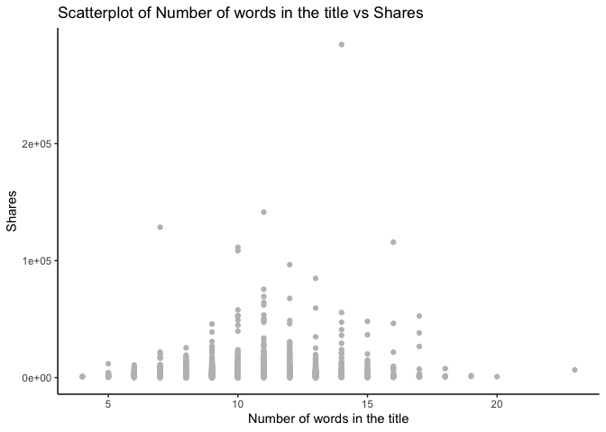

Tanley-Wood-Project2
================
Jordan Tanley and Jonathan Wood
2022-07-05

# Introduction - Jonathan

## Data

The data in this analysis will be the [online news popularity
dataset](https://archive.ics.uci.edu/ml/datasets/Online+News+Popularity).
This data has a set of features on articles from Mashable.com over a two
year period.

The goal of this project is to determine the number of shares (how many
times the article was shared over social media) the article has. We will
use this information to predict if an article can be popular by the
number of shares.

## Notable Variables

While there are 61 variables in the data set, we will not use all of
them for this project. The notable variables are the following:

-   “shares” - the number of shares the article has gotten over social
    media. This is the label or variable we want our models to predict
    for new articles
-   “data_channel_is” - a set of variables that tells if the article is
    in a particular category, such as business, sports, or lifestyle.
-   “weekday_is” - a set of variables that tells what day of the week
    the article was published on.
-   “num_keywords” - the number of keywords within the article
-   “num_images” - the number of images within the article
-   “num_videos” - the number of videos within the article

## Methods

Multiple methods will be used for this project to predict the number of
shares a new article can generate, including

-   Linear regression
-   Tree-based models
    -   Random forest
    -   Boosted tree

# Data - Jordan

In order to read in the data using a relative path, be sure to have the
data file saved in your working directory.

``` r
# read in the data
news <- read_csv("OnlineNewsPopularity/OnlineNewsPopularity.csv")
```

    ## Rows: 39644 Columns: 61
    ## ── Column specification ─────────────────────────────────────────────────────────────────────────────────────────────
    ## Delimiter: ","
    ## chr  (1): url
    ## dbl (60): timedelta, n_tokens_title, n_tokens_content, n_unique_tokens, n_non_stop_words, n_non_stop_unique_token...
    ## 
    ## ℹ Use `spec()` to retrieve the full column specification for this data.
    ## ℹ Specify the column types or set `show_col_types = FALSE` to quiet this message.

``` r
# sneek peek at the dataset
head(news)
```

``` r
# Creating a weekday variable (basically undoing the 7 dummy variables that came with the data) for EDA
news$weekday <- ifelse(news$weekday_is_friday == 1, "Friday",
                       ifelse(news$weekday_is_monday == 1, "Monday",
                              ifelse(news$weekday_is_tuesday == 1, "Tuesday",
                                     ifelse(news$weekday_is_wednesday == 1, "Wednesday",
                                            ifelse(news$weekday_is_thursday == 1, "Thursday",
                                                   ifelse(news$weekday_is_saturday == 1, "Saturday", 
                                                          "Sunday"))))))
```

Next, let’s subset the data so that we can only look at the data channel
of interest. We will look at articles with the “Social Media” data
channel.

``` r
# Subset the data to  one of the parameterized data channels and drop unnecessary variables
chan <- paste0("data_channel_is_", params$channel)

print(chan)
```

    ## [1] "data_channel_is_socmed"

``` r
filtered_channel <- news %>% 
                as_tibble() %>% 
                filter(news[chan] == 1) %>% 
                select(-c(url, timedelta))

# take a peek at the data
filtered_channel %>%
  select(ends_with(chan))
```

# Summarizations - Both (at least 3 plots each)

For the numerical summaries, we can look at several aspects. Contingency
tables allow us to examine frequencies of categorical variables. The
first output below, for example, shows the counts for each weekday.
Similarly, the fifth table outputted shows the frequencies of number of
tokens in the article content. Another set of summary statistics to look
at are the 5 Number Summaries. These provide the minmum, 1st quantile,
median, 3rd quantile, and maximum for a particular variable.
Additionally, it may also be helful to look at the average. These are
helpful in determining the skewness (if mean = median vs. mean \< or \>
median) and helps in looking for outliers (anything outside (Q3 - Q1)1.5
from the median is generally considered an outlier). Below, the 5 Number
summaries (plus mean) are shown for Shares, Number of words in the
content, Number of words in the content for the upper quantile of
Shares, number of images in the article, number of videos in the
article, positive word rate, and negative word rate.

``` r
# Contingency table of frequencies for days of the week, added caption for clarity
kable(table(filtered_channel$weekday), 
      col.names = c("Weekday", "Frequency"), 
      caption = "Contingency table of frequencies for days of the week")
```

| Weekday   | Frequency |
|:----------|----------:|
| Friday    |       332 |
| Monday    |       337 |
| Saturday  |       180 |
| Sunday    |       137 |
| Thursday  |       463 |
| Tuesday   |       458 |
| Wednesday |       416 |

Contingency table of frequencies for days of the week

``` r
# Numerical Summary of Shares, added caption for clarity
filtered_channel %>% summarise(Minimum = min(shares), 
                          Q1 = quantile(shares, prob = 0.25), 
                          Average = mean(shares), 
                          Median = median(shares), 
                          Q3 = quantile(shares, prob = 0.75), 
                          Maximum = max(shares)) %>% 
                kable(caption = "Numerical Summary of Shares")
```

| Minimum |   Q1 |  Average | Median |   Q3 | Maximum |
|--------:|-----:|---------:|-------:|-----:|--------:|
|       5 | 1400 | 3629.383 |   2100 | 3800 |  122800 |

Numerical Summary of Shares

``` r
# Numerical Summary of Number of words in the content, added caption for clarity
filtered_channel %>% summarise(Minimum = min(n_tokens_content), 
                          Q1 = quantile(n_tokens_content, prob = 0.25), 
                          Average = mean(n_tokens_content), 
                          Median = median(n_tokens_content), 
                          Q3 = quantile(n_tokens_content, prob = 0.75), 
                          Maximum = max(n_tokens_content)) %>% 
                kable(caption = "Numerical Summary of Number of words in the content")
```

| Minimum |  Q1 |  Average | Median |    Q3 | Maximum |
|--------:|----:|---------:|-------:|------:|--------:|
|       0 | 253 | 609.6281 |    434 | 761.5 |    4878 |

Numerical Summary of Number of words in the content

``` r
# Numerical Summary of Number of words in the content for the upper quantile of Shares, added caption for clarity
filtered_channel %>% filter(shares > quantile(shares, prob = 0.75)) %>%
                summarise(Minimum = min(n_tokens_content), 
                          Q1 = quantile(n_tokens_content, prob = 0.25), 
                          Average = mean(n_tokens_content), 
                          Median = median(n_tokens_content), 
                          Q3 = quantile(n_tokens_content, prob = 0.75), 
                          Maximum = max(n_tokens_content)) %>% 
                kable(caption = "Numerical Summary of Number of words in the content for the upper quantile of Shares")
```

| Minimum |    Q1 |  Average | Median |  Q3 | Maximum |
|--------:|------:|---------:|-------:|----:|--------:|
|       0 | 274.5 | 633.4116 |    461 | 845 |    4451 |

Numerical Summary of Number of words in the content for the upper
quantile of Shares

``` r
kable(table(filtered_channel$n_tokens_content),
  col.names = c("Tokens", "Frequency"), 
  caption = "Contingency table of frequencies for number of tokens in the article content")
```

| Tokens | Frequency |
|:-------|----------:|
| 0      |        12 |
| 31     |         1 |
| 32     |         1 |
| 34     |         2 |
| 35     |         1 |
| 37     |         1 |
| 39     |         1 |
| 40     |         1 |
| 42     |         1 |
| 44     |         1 |
| 45     |         2 |
| 46     |         1 |
| 47     |         4 |
| 48     |         1 |
| 49     |         2 |
| 53     |         2 |
| 56     |         3 |
| 57     |         2 |
| 58     |         1 |
| 59     |         2 |
| 62     |         2 |
| 66     |         2 |
| 68     |         1 |
| 69     |         3 |
| 72     |         1 |
| 73     |         1 |
| 77     |         1 |
| 79     |         1 |
| 80     |         1 |
| 81     |         3 |
| 82     |         1 |
| 85     |         1 |
| 88     |         1 |
| 89     |         3 |
| 90     |         3 |
| 91     |         2 |
| 94     |         2 |
| 95     |         1 |
| 96     |         2 |
| 97     |         1 |
| 98     |         8 |
| 99     |         4 |
| 100    |         4 |
| 101    |         3 |
| 102    |         3 |
| 103    |         2 |
| 104    |         2 |
| 105    |         1 |
| 106    |         2 |
| 107    |         3 |
| 108    |         1 |
| 109    |         1 |
| 110    |         1 |
| 111    |         1 |
| 112    |         3 |
| 113    |         1 |
| 115    |         2 |
| 116    |         2 |
| 117    |         4 |
| 121    |         3 |
| 123    |         4 |
| 124    |         1 |
| 125    |         4 |
| 127    |         2 |
| 128    |         3 |
| 129    |         2 |
| 131    |         1 |
| 132    |         3 |
| 133    |         1 |
| 134    |         1 |
| 135    |         3 |
| 136    |         3 |
| 137    |         2 |
| 138    |         2 |
| 139    |         3 |
| 140    |         4 |
| 141    |         2 |
| 142    |         1 |
| 143    |         3 |
| 144    |         4 |
| 145    |         6 |
| 146    |         4 |
| 147    |         2 |
| 148    |         3 |
| 150    |         7 |
| 151    |         7 |
| 152    |         3 |
| 153    |         2 |
| 154    |         3 |
| 155    |         5 |
| 156    |         5 |
| 157    |         2 |
| 158    |         3 |
| 159    |         3 |
| 160    |         4 |
| 161    |         5 |
| 162    |         3 |
| 163    |         7 |
| 164    |         1 |
| 165    |         3 |
| 166    |         2 |
| 167    |         1 |
| 168    |         5 |
| 169    |         3 |
| 170    |         3 |
| 171    |         3 |
| 172    |         5 |
| 173    |         2 |
| 174    |         3 |
| 175    |         2 |
| 176    |         4 |
| 177    |         4 |
| 178    |         5 |
| 179    |         3 |
| 180    |         4 |
| 181    |         4 |
| 182    |         4 |
| 183    |         3 |
| 184    |         5 |
| 185    |         4 |
| 186    |         4 |
| 187    |         6 |
| 188    |         6 |
| 189    |         5 |
| 190    |         1 |
| 191    |         6 |
| 192    |         7 |
| 193    |         2 |
| 194    |         2 |
| 195    |         2 |
| 196    |         8 |
| 197    |         5 |
| 198    |         5 |
| 200    |         3 |
| 201    |         3 |
| 202    |         2 |
| 203    |         1 |
| 204    |         4 |
| 205    |         8 |
| 206    |         3 |
| 207    |         5 |
| 208    |         7 |
| 209    |         5 |
| 210    |         7 |
| 211    |         2 |
| 212    |         5 |
| 213    |         2 |
| 214    |         1 |
| 215    |         3 |
| 216    |         3 |
| 217    |         7 |
| 218    |         5 |
| 219    |         3 |
| 220    |         2 |
| 221    |         2 |
| 223    |         8 |
| 224    |         8 |
| 225    |         4 |
| 226    |         1 |
| 228    |         4 |
| 229    |         4 |
| 230    |         4 |
| 231    |         1 |
| 232    |         1 |
| 233    |         4 |
| 234    |         5 |
| 235    |         4 |
| 236    |         1 |
| 237    |         3 |
| 238    |         2 |
| 239    |         3 |
| 240    |         7 |
| 241    |         4 |
| 242    |         3 |
| 243    |         4 |
| 244    |         3 |
| 245    |         7 |
| 246    |         1 |
| 247    |         3 |
| 248    |         6 |
| 249    |         4 |
| 250    |         9 |
| 251    |         3 |
| 252    |         4 |
| 253    |         5 |
| 254    |         4 |
| 255    |         4 |
| 256    |         3 |
| 257    |         3 |
| 258    |         7 |
| 259    |         4 |
| 260    |         3 |
| 261    |         7 |
| 262    |         1 |
| 263    |         3 |
| 264    |         1 |
| 265    |         4 |
| 266    |         2 |
| 267    |         4 |
| 268    |         3 |
| 269    |         1 |
| 270    |         4 |
| 271    |         2 |
| 272    |         3 |
| 273    |         6 |
| 274    |         1 |
| 275    |         3 |
| 276    |         3 |
| 277    |         3 |
| 278    |         3 |
| 279    |         6 |
| 280    |         2 |
| 281    |         6 |
| 282    |         2 |
| 283    |         3 |
| 284    |         2 |
| 285    |         5 |
| 286    |         5 |
| 287    |         5 |
| 288    |         3 |
| 289    |         5 |
| 290    |         6 |
| 291    |         9 |
| 292    |         5 |
| 293    |         6 |
| 294    |         4 |
| 295    |         3 |
| 296    |         3 |
| 297    |         3 |
| 298    |         1 |
| 299    |         5 |
| 300    |         4 |
| 301    |         5 |
| 302    |         2 |
| 303    |         2 |
| 304    |         1 |
| 305    |         3 |
| 306    |         3 |
| 307    |         7 |
| 308    |         3 |
| 309    |         5 |
| 310    |         5 |
| 311    |         2 |
| 312    |         7 |
| 313    |         2 |
| 314    |         7 |
| 315    |         4 |
| 316    |         4 |
| 317    |         4 |
| 318    |         2 |
| 319    |         3 |
| 320    |         4 |
| 321    |         5 |
| 322    |         5 |
| 323    |         4 |
| 324    |         6 |
| 325    |         5 |
| 326    |         3 |
| 327    |         3 |
| 328    |         5 |
| 329    |         3 |
| 330    |         1 |
| 331    |         4 |
| 332    |         3 |
| 333    |         3 |
| 334    |         3 |
| 335    |         4 |
| 336    |         2 |
| 337    |         7 |
| 338    |         1 |
| 340    |         3 |
| 341    |         1 |
| 342    |         7 |
| 343    |         2 |
| 344    |         6 |
| 345    |         1 |
| 346    |         3 |
| 347    |         3 |
| 348    |         1 |
| 349    |         4 |
| 350    |         3 |
| 351    |         7 |
| 352    |         3 |
| 353    |         3 |
| 354    |         2 |
| 355    |         5 |
| 357    |         2 |
| 358    |         7 |
| 359    |         2 |
| 360    |         1 |
| 361    |         2 |
| 362    |         1 |
| 363    |         3 |
| 365    |         6 |
| 366    |         4 |
| 367    |         3 |
| 368    |         4 |
| 369    |         2 |
| 370    |         4 |
| 371    |         4 |
| 372    |         5 |
| 373    |         2 |
| 374    |         1 |
| 375    |         4 |
| 376    |         4 |
| 377    |         2 |
| 378    |         4 |
| 379    |         5 |
| 380    |         3 |
| 381    |         5 |
| 382    |         4 |
| 383    |         3 |
| 384    |         2 |
| 385    |         4 |
| 386    |         4 |
| 387    |         2 |
| 388    |         2 |
| 389    |         4 |
| 390    |         1 |
| 391    |         2 |
| 393    |         3 |
| 394    |         3 |
| 395    |         1 |
| 396    |         4 |
| 397    |         2 |
| 398    |         3 |
| 399    |         3 |
| 400    |         2 |
| 401    |         2 |
| 402    |         2 |
| 403    |         1 |
| 405    |         4 |
| 406    |         1 |
| 407    |         3 |
| 408    |         2 |
| 409    |         3 |
| 410    |         3 |
| 411    |         3 |
| 412    |         1 |
| 413    |         1 |
| 414    |         2 |
| 416    |         3 |
| 417    |         1 |
| 418    |         3 |
| 419    |         4 |
| 420    |         2 |
| 421    |         2 |
| 422    |         6 |
| 423    |         5 |
| 424    |         1 |
| 425    |         4 |
| 426    |         5 |
| 428    |         2 |
| 429    |         1 |
| 430    |         4 |
| 432    |         3 |
| 433    |         2 |
| 434    |         3 |
| 435    |         1 |
| 436    |         3 |
| 437    |         4 |
| 439    |         2 |
| 440    |         3 |
| 441    |         1 |
| 442    |         2 |
| 443    |         2 |
| 444    |         3 |
| 445    |         5 |
| 446    |         6 |
| 447    |         4 |
| 448    |         3 |
| 449    |         4 |
| 450    |         3 |
| 451    |         7 |
| 452    |         2 |
| 453    |         1 |
| 454    |         3 |
| 456    |         1 |
| 457    |         2 |
| 458    |         3 |
| 459    |         4 |
| 461    |         2 |
| 462    |         4 |
| 463    |         4 |
| 464    |         4 |
| 465    |         2 |
| 466    |         6 |
| 467    |         3 |
| 468    |         1 |
| 469    |         3 |
| 470    |         2 |
| 471    |         3 |
| 472    |         2 |
| 473    |         1 |
| 474    |         1 |
| 475    |         5 |
| 476    |         2 |
| 477    |         2 |
| 478    |         5 |
| 479    |         4 |
| 480    |         5 |
| 481    |         4 |
| 482    |         2 |
| 483    |         3 |
| 484    |         6 |
| 485    |         2 |
| 486    |         2 |
| 487    |         1 |
| 488    |         2 |
| 489    |         1 |
| 490    |         2 |
| 492    |         1 |
| 494    |         4 |
| 495    |         2 |
| 496    |         1 |
| 497    |         1 |
| 498    |         3 |
| 499    |         2 |
| 500    |         2 |
| 501    |         2 |
| 502    |         4 |
| 503    |         3 |
| 504    |         2 |
| 505    |         2 |
| 506    |         3 |
| 507    |         4 |
| 508    |         1 |
| 509    |         4 |
| 510    |         1 |
| 511    |         2 |
| 512    |         1 |
| 513    |         2 |
| 514    |         1 |
| 515    |         2 |
| 516    |         3 |
| 517    |         3 |
| 518    |         1 |
| 519    |         3 |
| 520    |         2 |
| 521    |         3 |
| 522    |         2 |
| 524    |         3 |
| 525    |         1 |
| 526    |         4 |
| 527    |         7 |
| 528    |         2 |
| 529    |         4 |
| 530    |         1 |
| 531    |         1 |
| 532    |         3 |
| 533    |         3 |
| 534    |         1 |
| 535    |         5 |
| 536    |         1 |
| 537    |         1 |
| 538    |         4 |
| 539    |         5 |
| 540    |         4 |
| 541    |         2 |
| 542    |         1 |
| 543    |         3 |
| 544    |         1 |
| 545    |         2 |
| 546    |         1 |
| 547    |         1 |
| 549    |         3 |
| 550    |         3 |
| 551    |         2 |
| 552    |         1 |
| 554    |         4 |
| 556    |         2 |
| 557    |         1 |
| 558    |         1 |
| 559    |         5 |
| 561    |         3 |
| 562    |         2 |
| 563    |         1 |
| 564    |         3 |
| 565    |         2 |
| 566    |         2 |
| 567    |         2 |
| 568    |         2 |
| 569    |         1 |
| 571    |         4 |
| 572    |         3 |
| 573    |         5 |
| 574    |         2 |
| 576    |         3 |
| 577    |         1 |
| 578    |         3 |
| 579    |         2 |
| 580    |         3 |
| 582    |         1 |
| 583    |         1 |
| 584    |         1 |
| 585    |         2 |
| 586    |         4 |
| 588    |         3 |
| 589    |         2 |
| 590    |         4 |
| 591    |         2 |
| 592    |         1 |
| 593    |         3 |
| 594    |         2 |
| 595    |         2 |
| 596    |         2 |
| 597    |         1 |
| 598    |         1 |
| 599    |         3 |
| 600    |         6 |
| 601    |         1 |
| 603    |         1 |
| 604    |         1 |
| 605    |         2 |
| 606    |         1 |
| 607    |         1 |
| 609    |         1 |
| 610    |         1 |
| 611    |         1 |
| 612    |         3 |
| 614    |         5 |
| 615    |         1 |
| 617    |         2 |
| 618    |         1 |
| 620    |         1 |
| 621    |         4 |
| 622    |         1 |
| 625    |         1 |
| 626    |         3 |
| 627    |         2 |
| 628    |         1 |
| 629    |         1 |
| 630    |         1 |
| 631    |         2 |
| 634    |         1 |
| 635    |         2 |
| 636    |         1 |
| 638    |         1 |
| 639    |         2 |
| 640    |         1 |
| 641    |         1 |
| 642    |         2 |
| 643    |         2 |
| 644    |         1 |
| 645    |         2 |
| 647    |         1 |
| 648    |         5 |
| 650    |         2 |
| 651    |         2 |
| 652    |         2 |
| 654    |         1 |
| 656    |         1 |
| 657    |         2 |
| 658    |         3 |
| 660    |         2 |
| 662    |         2 |
| 663    |         1 |
| 665    |         2 |
| 666    |         1 |
| 668    |         1 |
| 670    |         3 |
| 671    |         1 |
| 673    |         3 |
| 674    |         2 |
| 675    |         1 |
| 676    |         3 |
| 678    |         2 |
| 680    |         2 |
| 682    |         1 |
| 683    |         1 |
| 685    |         4 |
| 687    |         2 |
| 689    |         1 |
| 691    |         1 |
| 692    |         2 |
| 693    |         1 |
| 696    |         1 |
| 697    |         4 |
| 699    |         1 |
| 700    |         3 |
| 701    |         2 |
| 703    |         1 |
| 706    |         1 |
| 707    |         3 |
| 709    |         2 |
| 710    |         1 |
| 712    |         3 |
| 713    |         1 |
| 715    |         1 |
| 717    |         1 |
| 719    |         2 |
| 720    |         2 |
| 723    |         1 |
| 725    |         2 |
| 726    |         1 |
| 727    |         1 |
| 728    |         1 |
| 729    |         2 |
| 730    |         2 |
| 731    |         1 |
| 733    |         1 |
| 734    |         2 |
| 735    |         2 |
| 736    |         2 |
| 737    |         2 |
| 738    |         2 |
| 739    |         1 |
| 740    |         2 |
| 741    |         1 |
| 742    |         4 |
| 743    |         1 |
| 745    |         1 |
| 746    |         1 |
| 747    |         2 |
| 749    |         1 |
| 750    |         1 |
| 751    |         2 |
| 754    |         3 |
| 755    |         1 |
| 759    |         2 |
| 761    |         2 |
| 762    |         1 |
| 763    |         2 |
| 765    |         3 |
| 766    |         3 |
| 767    |         1 |
| 768    |         1 |
| 769    |         1 |
| 770    |         1 |
| 771    |         1 |
| 773    |         1 |
| 774    |         4 |
| 776    |         1 |
| 777    |         2 |
| 778    |         3 |
| 779    |         2 |
| 780    |         3 |
| 781    |         3 |
| 783    |         1 |
| 784    |         1 |
| 785    |         3 |
| 787    |         1 |
| 790    |         3 |
| 792    |         1 |
| 793    |         1 |
| 794    |         1 |
| 795    |         1 |
| 798    |         1 |
| 800    |         2 |
| 801    |         1 |
| 802    |         1 |
| 803    |         2 |
| 804    |         2 |
| 809    |         1 |
| 812    |         3 |
| 816    |         2 |
| 818    |         1 |
| 819    |         1 |
| 820    |         1 |
| 822    |         2 |
| 823    |         3 |
| 824    |         1 |
| 826    |         1 |
| 829    |         3 |
| 830    |         2 |
| 834    |         3 |
| 835    |         1 |
| 836    |         1 |
| 839    |         1 |
| 840    |         2 |
| 843    |         2 |
| 844    |         1 |
| 845    |         1 |
| 846    |         4 |
| 847    |         2 |
| 849    |         2 |
| 852    |         1 |
| 853    |         1 |
| 854    |         1 |
| 857    |         5 |
| 858    |         2 |
| 859    |         1 |
| 860    |         1 |
| 861    |         4 |
| 862    |         2 |
| 863    |         2 |
| 866    |         1 |
| 867    |         1 |
| 872    |         1 |
| 874    |         1 |
| 877    |         1 |
| 878    |         1 |
| 879    |         2 |
| 880    |         1 |
| 883    |         1 |
| 884    |         1 |
| 885    |         2 |
| 886    |         1 |
| 889    |         1 |
| 891    |         3 |
| 892    |         2 |
| 893    |         2 |
| 894    |         1 |
| 895    |         1 |
| 897    |         1 |
| 898    |         2 |
| 901    |         2 |
| 905    |         1 |
| 907    |         2 |
| 912    |         1 |
| 915    |         1 |
| 916    |         2 |
| 918    |         1 |
| 921    |         1 |
| 923    |         2 |
| 924    |         1 |
| 930    |         1 |
| 931    |         1 |
| 936    |         1 |
| 937    |         2 |
| 940    |         1 |
| 941    |         3 |
| 944    |         1 |
| 947    |         1 |
| 948    |         2 |
| 954    |         1 |
| 956    |         1 |
| 957    |         2 |
| 958    |         2 |
| 959    |         2 |
| 962    |         2 |
| 965    |         2 |
| 967    |         1 |
| 968    |         1 |
| 971    |         1 |
| 972    |         1 |
| 973    |         2 |
| 974    |         1 |
| 981    |         1 |
| 982    |         1 |
| 983    |         1 |
| 985    |         1 |
| 986    |         2 |
| 988    |         1 |
| 989    |         2 |
| 990    |         1 |
| 993    |         1 |
| 995    |         3 |
| 1001   |         1 |
| 1002   |         2 |
| 1006   |         1 |
| 1007   |         1 |
| 1008   |         2 |
| 1011   |         1 |
| 1015   |         1 |
| 1017   |         1 |
| 1020   |         1 |
| 1022   |         1 |
| 1026   |         2 |
| 1030   |         1 |
| 1032   |         1 |
| 1035   |         1 |
| 1039   |         1 |
| 1041   |         2 |
| 1047   |         2 |
| 1048   |         1 |
| 1049   |         1 |
| 1052   |         2 |
| 1053   |         2 |
| 1054   |         1 |
| 1057   |         1 |
| 1058   |         1 |
| 1060   |         1 |
| 1063   |         1 |
| 1066   |         1 |
| 1067   |         2 |
| 1068   |         1 |
| 1069   |         1 |
| 1070   |         2 |
| 1071   |         1 |
| 1072   |         1 |
| 1073   |         1 |
| 1074   |         1 |
| 1075   |         1 |
| 1077   |         1 |
| 1081   |         1 |
| 1082   |         1 |
| 1084   |         1 |
| 1085   |         2 |
| 1086   |         1 |
| 1090   |         2 |
| 1091   |         1 |
| 1095   |         2 |
| 1096   |         4 |
| 1097   |         1 |
| 1098   |         1 |
| 1099   |         1 |
| 1102   |         1 |
| 1108   |         1 |
| 1109   |         1 |
| 1111   |         1 |
| 1115   |         1 |
| 1121   |         2 |
| 1124   |         2 |
| 1125   |         1 |
| 1128   |         1 |
| 1131   |         1 |
| 1138   |         1 |
| 1140   |         1 |
| 1142   |         1 |
| 1143   |         1 |
| 1145   |         1 |
| 1146   |         1 |
| 1152   |         1 |
| 1158   |         1 |
| 1167   |         3 |
| 1173   |         1 |
| 1176   |         1 |
| 1177   |         1 |
| 1178   |         1 |
| 1183   |         2 |
| 1185   |         3 |
| 1189   |         2 |
| 1190   |         1 |
| 1192   |         1 |
| 1193   |         1 |
| 1194   |         1 |
| 1195   |         2 |
| 1196   |         1 |
| 1206   |         1 |
| 1207   |         2 |
| 1210   |         1 |
| 1214   |         1 |
| 1216   |         1 |
| 1217   |         1 |
| 1218   |         1 |
| 1220   |         1 |
| 1221   |         1 |
| 1222   |         1 |
| 1223   |         1 |
| 1224   |         3 |
| 1226   |         1 |
| 1227   |         2 |
| 1228   |         1 |
| 1234   |         1 |
| 1236   |         2 |
| 1239   |         1 |
| 1240   |         1 |
| 1241   |         2 |
| 1244   |         1 |
| 1249   |         1 |
| 1250   |         1 |
| 1252   |         2 |
| 1253   |         1 |
| 1254   |         1 |
| 1256   |         1 |
| 1259   |         1 |
| 1260   |         1 |
| 1264   |         1 |
| 1267   |         1 |
| 1269   |         1 |
| 1270   |         1 |
| 1272   |         2 |
| 1273   |         1 |
| 1274   |         1 |
| 1281   |         1 |
| 1287   |         2 |
| 1290   |         1 |
| 1291   |         1 |
| 1297   |         2 |
| 1300   |         1 |
| 1310   |         1 |
| 1312   |         1 |
| 1321   |         1 |
| 1324   |         1 |
| 1334   |         1 |
| 1335   |         1 |
| 1352   |         1 |
| 1357   |         1 |
| 1358   |         1 |
| 1362   |         1 |
| 1364   |         1 |
| 1367   |         1 |
| 1368   |         1 |
| 1371   |         1 |
| 1379   |         1 |
| 1380   |         1 |
| 1387   |         1 |
| 1390   |         1 |
| 1393   |         1 |
| 1399   |         2 |
| 1407   |         1 |
| 1421   |         1 |
| 1435   |         1 |
| 1441   |         1 |
| 1442   |         1 |
| 1445   |         1 |
| 1454   |         1 |
| 1467   |         2 |
| 1468   |         1 |
| 1475   |         1 |
| 1476   |         1 |
| 1478   |         1 |
| 1483   |         1 |
| 1486   |         1 |
| 1489   |         1 |
| 1499   |         1 |
| 1502   |         1 |
| 1509   |         1 |
| 1515   |         1 |
| 1516   |         1 |
| 1517   |         1 |
| 1520   |         1 |
| 1525   |         1 |
| 1533   |         1 |
| 1541   |         1 |
| 1546   |         1 |
| 1557   |         1 |
| 1562   |         1 |
| 1563   |         1 |
| 1566   |         1 |
| 1573   |         1 |
| 1577   |         2 |
| 1578   |         2 |
| 1587   |         1 |
| 1595   |         3 |
| 1596   |         1 |
| 1599   |         1 |
| 1608   |         1 |
| 1610   |         1 |
| 1612   |         1 |
| 1619   |         1 |
| 1629   |         1 |
| 1644   |         1 |
| 1653   |         1 |
| 1664   |         1 |
| 1666   |         1 |
| 1667   |         1 |
| 1668   |         1 |
| 1672   |         1 |
| 1676   |         1 |
| 1701   |         1 |
| 1712   |         1 |
| 1713   |         1 |
| 1720   |         1 |
| 1721   |         1 |
| 1723   |         1 |
| 1726   |         1 |
| 1728   |         1 |
| 1746   |         1 |
| 1748   |         1 |
| 1752   |         2 |
| 1753   |         1 |
| 1755   |         1 |
| 1756   |         1 |
| 1765   |         1 |
| 1773   |         1 |
| 1774   |         2 |
| 1777   |         1 |
| 1779   |         1 |
| 1786   |         1 |
| 1799   |         1 |
| 1804   |         1 |
| 1814   |         1 |
| 1827   |         1 |
| 1828   |         1 |
| 1840   |         1 |
| 1851   |         1 |
| 1857   |         1 |
| 1871   |         1 |
| 1881   |         1 |
| 1891   |         1 |
| 1895   |         1 |
| 1896   |         1 |
| 1897   |         1 |
| 1919   |         1 |
| 1936   |         1 |
| 1951   |         1 |
| 1955   |         1 |
| 1959   |         1 |
| 1965   |         1 |
| 1980   |         1 |
| 2017   |         1 |
| 2049   |         1 |
| 2061   |         1 |
| 2075   |         1 |
| 2104   |         1 |
| 2124   |         2 |
| 2132   |         1 |
| 2134   |         1 |
| 2137   |         2 |
| 2143   |         1 |
| 2150   |         1 |
| 2152   |         1 |
| 2156   |         1 |
| 2162   |         1 |
| 2169   |         1 |
| 2173   |         1 |
| 2180   |         1 |
| 2182   |         1 |
| 2183   |         1 |
| 2193   |         2 |
| 2197   |         2 |
| 2208   |         1 |
| 2210   |         1 |
| 2211   |         1 |
| 2219   |         1 |
| 2220   |         1 |
| 2224   |         1 |
| 2225   |         2 |
| 2229   |         1 |
| 2231   |         2 |
| 2235   |         2 |
| 2236   |         2 |
| 2240   |         1 |
| 2241   |         1 |
| 2249   |         1 |
| 2251   |         1 |
| 2267   |         1 |
| 2270   |         1 |
| 2281   |         1 |
| 2284   |         1 |
| 2293   |         1 |
| 2296   |         1 |
| 2297   |         1 |
| 2300   |         1 |
| 2301   |         1 |
| 2305   |         1 |
| 2306   |         1 |
| 2307   |         1 |
| 2309   |         1 |
| 2318   |         1 |
| 2347   |         2 |
| 2349   |         1 |
| 2350   |         1 |
| 2353   |         1 |
| 2363   |         1 |
| 2371   |         1 |
| 2388   |         1 |
| 2402   |         1 |
| 2412   |         1 |
| 2414   |         1 |
| 2429   |         1 |
| 2442   |         1 |
| 2443   |         1 |
| 2445   |         1 |
| 2446   |         1 |
| 2452   |         1 |
| 2472   |         1 |
| 2474   |         1 |
| 2493   |         1 |
| 2545   |         1 |
| 2549   |         1 |
| 2554   |         1 |
| 2563   |         1 |
| 2578   |         1 |
| 2588   |         1 |
| 2628   |         1 |
| 2634   |         1 |
| 2649   |         1 |
| 2656   |         1 |
| 2662   |         1 |
| 2663   |         1 |
| 2693   |         1 |
| 2695   |         1 |
| 2794   |         1 |
| 2889   |         1 |
| 3040   |         1 |
| 3288   |         1 |
| 3460   |         1 |
| 3506   |         1 |
| 3730   |         1 |
| 3735   |         1 |
| 4451   |         1 |
| 4878   |         1 |

Contingency table of frequencies for number of tokens in the article
content

``` r
# Summarizing the number of images in the article
filtered_channel %>% 
  summarise(Minimum = min(num_imgs), 
      Q1 = quantile(num_imgs, prob = 0.25), 
      Average = mean(num_imgs), 
      Median = median(num_imgs), 
      Q3 = quantile(num_imgs, prob = 0.75), 
      Maximum = max(num_imgs)) %>% 
  kable(caption = "Numerical summary of number of images in an article")
```

| Minimum |  Q1 |  Average | Median |  Q3 | Maximum |
|--------:|----:|---------:|-------:|----:|--------:|
|       0 |   1 | 4.290142 |      1 |   3 |      62 |

Numerical summary of number of images in an article

``` r
# Summarizing the number of videos in the article
filtered_channel %>% 
  summarise(Minimum = min(num_videos), 
      Q1 = quantile(num_videos, prob = 0.25), 
      Average = mean(num_videos), 
      Median = median(num_videos), 
      Q3 = quantile(num_videos, prob = 0.75), 
      Maximum = max(num_videos)) %>% 
  kable(caption = "Numerical summary of number of videos in an article")
```

| Minimum |  Q1 | Average | Median |  Q3 | Maximum |
|--------:|----:|--------:|-------:|----:|--------:|
|       0 |   0 | 1.11752 |      0 |   1 |      73 |

Numerical summary of number of videos in an article

``` r
# Summarizing the number of positive word rate
filtered_channel %>% 
  summarise(Minimum = min(rate_positive_words), 
      Q1 = quantile(rate_positive_words, prob = 0.25), 
      Average = mean(rate_positive_words), 
      Median = median(rate_positive_words), 
      Q3 = quantile(rate_positive_words, prob = 0.75), 
      Maximum = max(rate_positive_words)) %>% 
  kable(caption = "Numerical Summary of the rate of positive words in an article")
```

| Minimum |        Q1 |   Average | Median |        Q3 | Maximum |
|--------:|----------:|----------:|-------:|----------:|--------:|
|       0 | 0.6666667 | 0.7441094 |   0.75 | 0.8333333 |       1 |

Numerical Summary of the rate of positive words in an article

``` r
# Summarizing the number of negative word rate
filtered_channel %>% 
  summarise(Minimum = min(rate_negative_words), 
      Q1 = quantile(rate_negative_words, prob = 0.25), 
      Average = mean(rate_negative_words), 
      Median = median(rate_negative_words), 
      Q3 = quantile(rate_negative_words, prob = 0.75), 
      Maximum = max(rate_negative_words)) %>% 
  kable(caption = "Numerical Summary of the rate of negative words in an article")
```

| Minimum |        Q1 |   Average |    Median |        Q3 | Maximum |
|--------:|----------:|----------:|----------:|----------:|--------:|
|       0 | 0.1666667 | 0.2502944 | 0.2469136 | 0.3288997 |       1 |

Numerical Summary of the rate of negative words in an article

The graphical summaries more dramatically show the trends in the data,
including skewness and outliers. The boxplots below show a visual
representation of the 5 Number summaries for Shares, split up by
weekday, and shares split up by text sentiment polarity. Boxplots make
it even easier to look out for outliers (look for the dots separated
from the main boxplot). Next, we can examine several scatterplots.
Scatterplots allow us to look at one numerical variable vs another to
see if there is any correlation between them. Look out for any plots
that have most of the points on a diagonal line! There are four
scatterplots below, investigating shares vs Number of words in the
content, Number of words in the title, rate of positive words, and rate
of negative words. Finally, a histogram can show the overall
distribution of a numerical variable, including skewness. The histogram
below sows the distribution of the shares variable. Look for a left or
right tail to signify skewness, and look out for multiple peaks to
signify a multi-modal variable.

``` r
# Boxplot of Shares for Each Weekday, colored gray with classic theme, added labels and title
ggplot(filtered_channel, aes(x = weekday, y = shares)) + 
          geom_boxplot(fill = "grey") + 
          labs(x = "Weekday", title = "Boxplot of Shares for Each Weekday", y = "Shares") + 
          theme_classic()
```

<!-- -->

``` r
# Scatterplot of Number of words in the content vs Shares, colored gray with classic theme, added labels and title
ggplot(filtered_channel, aes(x = n_tokens_content, y = shares)) + 
          geom_point(color = "grey") +
          labs(x = "Number of words in the content", y = "Shares", 
               title = "Scatterplot of Number of words in the content vs Shares") +
          theme_classic()
```

<!-- -->

``` r
# Scatterplot of Number of words in the title vs Shares, colored gray with classic theme, added labels and title
ggplot(filtered_channel, aes(x = n_tokens_title, y = shares)) + 
          geom_point(color = "grey") +
          labs(x = "Number of words in the title", y = "Shares", 
               title = "Scatterplot of Number of words in the title vs Shares") +
          theme_classic()
```

<!-- -->

``` r
ggplot(filtered_channel, aes(x=shares)) +
  geom_histogram(color="grey", binwidth = 2000) +
  labs(x = "Shares", 
               title = "Histogram of number of shares") +
  theme_classic()
```

<!-- -->

``` r
ggplot(filtered_channel, aes(x=rate_positive_words, y=shares)) +
  geom_point(color="grey") +
  labs(x = "rate of positive words in an article", y = "Shares", 
               title = "Scatterplot of rate of positive words in an article vs shares") +
  theme_classic()
```

<!-- -->

``` r
ggplot(filtered_channel, aes(x=rate_negative_words, y=shares)) +
  geom_point(color="grey") +
  labs(x = "rate of negative words in an article", y = "Shares", 
               title = "Scatterplot of rate of negative words in an article vs shares") +
  theme_classic()
```

<!-- -->

``` r
ggplot(filtered_channel, aes(x=global_sentiment_polarity, y=shares)) +
  geom_point(color="grey") +
  labs(x = "global sentiment polarity in an article", y = "Shares", 
               title = "Scatterplot of global sentiment polarity in an article vs shares") +
  theme_classic()
```

<!-- -->

``` r
# drop the weekday variable created for EDA (will get in the way for our models if we don't drop it)
filtered_channel <- subset(filtered_channel, select = -c(weekday))
```

# Modeling

## Splitting the Data

First, let’s split up the data into a testing set and a training set
using the proportions: 70% training and 30% testing.

``` r
set.seed(9876)
# Split the data into a training and test set (70/30 split)
# indices
train <- sample(1:nrow(filtered_channel), size = nrow(filtered_channel)*.70)
test <- setdiff(1:nrow(filtered_channel), train)

# training and testing subsets
Training <- filtered_channel[train, ]
Testing <- filtered_channel[test, ]
```

## Linear Models

Linear regression models allow us to look at relationships between one
response variable and several explanatory variables. A model can also
include interaction terms and even higher order terms. The general form
for a linear model is
,
where each

represents a predictor variable and the “…” can include more predictors,
interactions and/or higher order terms. Since our goal is to predict
shares, we will be using these models to predict of a subset of the data
created for training, and then we will later test the models on the
other subsetted data set aside for testing.

Linear Model \#1: - Jordan

``` r
# linear model on training dataset with 5-fold cv
fit1 <- train(shares ~ . , data = Training, method = "lm",
              preProcess = c("center", "scale"), 
              trControl = trainControl(method = "cv", number = 5))
```

Linear Model \#2: - Jonathan

``` r
lm_fit <- train(
  shares ~ .^2,
  data=Training,
  method="lm",
  preProcess = c("center", "scale"), 
  trControl = trainControl(method = "cv", number = 5)
)
```

## Random Forest - Jordan

Random Forest is a tree based method for fitting predictive models, that
averages across all trees. One may choose to use a tree based methood
due to their prediction accuracy, the fact that predictors do not need
to be scaled, no statistical assumptions, and a built-in variable
selection process. Random forest, in particular, randomly selects a
subset of

predictors. This corrects the bagging issue where every bootstrap
contains a strong predictor for the first split.

``` r
# fandom forest model on training dataset with 5-fold cv
ranfor <- train(shares ~ ., data = Training, method = "rf", preProcess = c("center", "scale"),
                trControl = trainControl(method = "cv", number = 5), 
                tuneGrid = expand.grid(mtry = c(1:round(ncol(Training)/3))))
```

    ## Warning in preProcess.default(thresh = 0.95, k = 5, freqCut = 19, uniqueCut = 10, : These variables have zero
    ## variances: data_channel_is_lifestyle, data_channel_is_entertainment, data_channel_is_bus, data_channel_is_socmed,
    ## data_channel_is_tech, data_channel_is_world

    ## Warning in preProcess.default(thresh = 0.95, k = 5, freqCut = 19, uniqueCut = 10, : These variables have zero
    ## variances: data_channel_is_lifestyle, data_channel_is_entertainment, data_channel_is_bus, data_channel_is_socmed,
    ## data_channel_is_tech, data_channel_is_world

    ## Warning in preProcess.default(thresh = 0.95, k = 5, freqCut = 19, uniqueCut = 10, : These variables have zero
    ## variances: data_channel_is_lifestyle, data_channel_is_entertainment, data_channel_is_bus, data_channel_is_socmed,
    ## data_channel_is_tech, data_channel_is_world

    ## Warning in preProcess.default(thresh = 0.95, k = 5, freqCut = 19, uniqueCut = 10, : These variables have zero
    ## variances: data_channel_is_lifestyle, data_channel_is_entertainment, data_channel_is_bus, data_channel_is_socmed,
    ## data_channel_is_tech, data_channel_is_world

    ## Warning in preProcess.default(thresh = 0.95, k = 5, freqCut = 19, uniqueCut = 10, : These variables have zero
    ## variances: data_channel_is_lifestyle, data_channel_is_entertainment, data_channel_is_bus, data_channel_is_socmed,
    ## data_channel_is_tech, data_channel_is_world

    ## Warning in preProcess.default(thresh = 0.95, k = 5, freqCut = 19, uniqueCut = 10, : These variables have zero
    ## variances: data_channel_is_lifestyle, data_channel_is_entertainment, data_channel_is_bus, data_channel_is_socmed,
    ## data_channel_is_tech, data_channel_is_world

    ## Warning in preProcess.default(thresh = 0.95, k = 5, freqCut = 19, uniqueCut = 10, : These variables have zero
    ## variances: data_channel_is_lifestyle, data_channel_is_entertainment, data_channel_is_bus, data_channel_is_socmed,
    ## data_channel_is_tech, data_channel_is_world

    ## Warning in preProcess.default(thresh = 0.95, k = 5, freqCut = 19, uniqueCut = 10, : These variables have zero
    ## variances: data_channel_is_lifestyle, data_channel_is_entertainment, data_channel_is_bus, data_channel_is_socmed,
    ## data_channel_is_tech, data_channel_is_world

    ## Warning in preProcess.default(thresh = 0.95, k = 5, freqCut = 19, uniqueCut = 10, : These variables have zero
    ## variances: data_channel_is_lifestyle, data_channel_is_entertainment, data_channel_is_bus, data_channel_is_socmed,
    ## data_channel_is_tech, data_channel_is_world

    ## Warning in preProcess.default(thresh = 0.95, k = 5, freqCut = 19, uniqueCut = 10, : These variables have zero
    ## variances: data_channel_is_lifestyle, data_channel_is_entertainment, data_channel_is_bus, data_channel_is_socmed,
    ## data_channel_is_tech, data_channel_is_world

    ## Warning in preProcess.default(thresh = 0.95, k = 5, freqCut = 19, uniqueCut = 10, : These variables have zero
    ## variances: data_channel_is_lifestyle, data_channel_is_entertainment, data_channel_is_bus, data_channel_is_socmed,
    ## data_channel_is_tech, data_channel_is_world

    ## Warning in preProcess.default(thresh = 0.95, k = 5, freqCut = 19, uniqueCut = 10, : These variables have zero
    ## variances: data_channel_is_lifestyle, data_channel_is_entertainment, data_channel_is_bus, data_channel_is_socmed,
    ## data_channel_is_tech, data_channel_is_world

    ## Warning in preProcess.default(thresh = 0.95, k = 5, freqCut = 19, uniqueCut = 10, : These variables have zero
    ## variances: data_channel_is_lifestyle, data_channel_is_entertainment, data_channel_is_bus, data_channel_is_socmed,
    ## data_channel_is_tech, data_channel_is_world

    ## Warning in preProcess.default(thresh = 0.95, k = 5, freqCut = 19, uniqueCut = 10, : These variables have zero
    ## variances: data_channel_is_lifestyle, data_channel_is_entertainment, data_channel_is_bus, data_channel_is_socmed,
    ## data_channel_is_tech, data_channel_is_world

    ## Warning in preProcess.default(thresh = 0.95, k = 5, freqCut = 19, uniqueCut = 10, : These variables have zero
    ## variances: data_channel_is_lifestyle, data_channel_is_entertainment, data_channel_is_bus, data_channel_is_socmed,
    ## data_channel_is_tech, data_channel_is_world

    ## Warning in preProcess.default(thresh = 0.95, k = 5, freqCut = 19, uniqueCut = 10, : These variables have zero
    ## variances: data_channel_is_lifestyle, data_channel_is_entertainment, data_channel_is_bus, data_channel_is_socmed,
    ## data_channel_is_tech, data_channel_is_world

    ## Warning in preProcess.default(thresh = 0.95, k = 5, freqCut = 19, uniqueCut = 10, : These variables have zero
    ## variances: data_channel_is_lifestyle, data_channel_is_entertainment, data_channel_is_bus, data_channel_is_socmed,
    ## data_channel_is_tech, data_channel_is_world

    ## Warning in preProcess.default(thresh = 0.95, k = 5, freqCut = 19, uniqueCut = 10, : These variables have zero
    ## variances: data_channel_is_lifestyle, data_channel_is_entertainment, data_channel_is_bus, data_channel_is_socmed,
    ## data_channel_is_tech, data_channel_is_world

    ## Warning in preProcess.default(thresh = 0.95, k = 5, freqCut = 19, uniqueCut = 10, : These variables have zero
    ## variances: data_channel_is_lifestyle, data_channel_is_entertainment, data_channel_is_bus, data_channel_is_socmed,
    ## data_channel_is_tech, data_channel_is_world

    ## Warning in preProcess.default(thresh = 0.95, k = 5, freqCut = 19, uniqueCut = 10, : These variables have zero
    ## variances: data_channel_is_lifestyle, data_channel_is_entertainment, data_channel_is_bus, data_channel_is_socmed,
    ## data_channel_is_tech, data_channel_is_world

    ## Warning in preProcess.default(thresh = 0.95, k = 5, freqCut = 19, uniqueCut = 10, : These variables have zero
    ## variances: data_channel_is_lifestyle, data_channel_is_entertainment, data_channel_is_bus, data_channel_is_socmed,
    ## data_channel_is_tech, data_channel_is_world

    ## Warning in preProcess.default(thresh = 0.95, k = 5, freqCut = 19, uniqueCut = 10, : These variables have zero
    ## variances: data_channel_is_lifestyle, data_channel_is_entertainment, data_channel_is_bus, data_channel_is_socmed,
    ## data_channel_is_tech, data_channel_is_world

    ## Warning in preProcess.default(thresh = 0.95, k = 5, freqCut = 19, uniqueCut = 10, : These variables have zero
    ## variances: data_channel_is_lifestyle, data_channel_is_entertainment, data_channel_is_bus, data_channel_is_socmed,
    ## data_channel_is_tech, data_channel_is_world

    ## Warning in preProcess.default(thresh = 0.95, k = 5, freqCut = 19, uniqueCut = 10, : These variables have zero
    ## variances: data_channel_is_lifestyle, data_channel_is_entertainment, data_channel_is_bus, data_channel_is_socmed,
    ## data_channel_is_tech, data_channel_is_world

    ## Warning in preProcess.default(thresh = 0.95, k = 5, freqCut = 19, uniqueCut = 10, : These variables have zero
    ## variances: data_channel_is_lifestyle, data_channel_is_entertainment, data_channel_is_bus, data_channel_is_socmed,
    ## data_channel_is_tech, data_channel_is_world

    ## Warning in preProcess.default(thresh = 0.95, k = 5, freqCut = 19, uniqueCut = 10, : These variables have zero
    ## variances: data_channel_is_lifestyle, data_channel_is_entertainment, data_channel_is_bus, data_channel_is_socmed,
    ## data_channel_is_tech, data_channel_is_world

    ## Warning in preProcess.default(thresh = 0.95, k = 5, freqCut = 19, uniqueCut = 10, : These variables have zero
    ## variances: data_channel_is_lifestyle, data_channel_is_entertainment, data_channel_is_bus, data_channel_is_socmed,
    ## data_channel_is_tech, data_channel_is_world

    ## Warning in preProcess.default(thresh = 0.95, k = 5, freqCut = 19, uniqueCut = 10, : These variables have zero
    ## variances: data_channel_is_lifestyle, data_channel_is_entertainment, data_channel_is_bus, data_channel_is_socmed,
    ## data_channel_is_tech, data_channel_is_world

    ## Warning in preProcess.default(thresh = 0.95, k = 5, freqCut = 19, uniqueCut = 10, : These variables have zero
    ## variances: data_channel_is_lifestyle, data_channel_is_entertainment, data_channel_is_bus, data_channel_is_socmed,
    ## data_channel_is_tech, data_channel_is_world

    ## Warning in preProcess.default(thresh = 0.95, k = 5, freqCut = 19, uniqueCut = 10, : These variables have zero
    ## variances: data_channel_is_lifestyle, data_channel_is_entertainment, data_channel_is_bus, data_channel_is_socmed,
    ## data_channel_is_tech, data_channel_is_world

    ## Warning in preProcess.default(thresh = 0.95, k = 5, freqCut = 19, uniqueCut = 10, : These variables have zero
    ## variances: data_channel_is_lifestyle, data_channel_is_entertainment, data_channel_is_bus, data_channel_is_socmed,
    ## data_channel_is_tech, data_channel_is_world

    ## Warning in preProcess.default(thresh = 0.95, k = 5, freqCut = 19, uniqueCut = 10, : These variables have zero
    ## variances: data_channel_is_lifestyle, data_channel_is_entertainment, data_channel_is_bus, data_channel_is_socmed,
    ## data_channel_is_tech, data_channel_is_world

    ## Warning in preProcess.default(thresh = 0.95, k = 5, freqCut = 19, uniqueCut = 10, : These variables have zero
    ## variances: data_channel_is_lifestyle, data_channel_is_entertainment, data_channel_is_bus, data_channel_is_socmed,
    ## data_channel_is_tech, data_channel_is_world

    ## Warning in preProcess.default(thresh = 0.95, k = 5, freqCut = 19, uniqueCut = 10, : These variables have zero
    ## variances: data_channel_is_lifestyle, data_channel_is_entertainment, data_channel_is_bus, data_channel_is_socmed,
    ## data_channel_is_tech, data_channel_is_world

    ## Warning in preProcess.default(thresh = 0.95, k = 5, freqCut = 19, uniqueCut = 10, : These variables have zero
    ## variances: data_channel_is_lifestyle, data_channel_is_entertainment, data_channel_is_bus, data_channel_is_socmed,
    ## data_channel_is_tech, data_channel_is_world

    ## Warning in preProcess.default(thresh = 0.95, k = 5, freqCut = 19, uniqueCut = 10, : These variables have zero
    ## variances: data_channel_is_lifestyle, data_channel_is_entertainment, data_channel_is_bus, data_channel_is_socmed,
    ## data_channel_is_tech, data_channel_is_world

    ## Warning in preProcess.default(thresh = 0.95, k = 5, freqCut = 19, uniqueCut = 10, : These variables have zero
    ## variances: data_channel_is_lifestyle, data_channel_is_entertainment, data_channel_is_bus, data_channel_is_socmed,
    ## data_channel_is_tech, data_channel_is_world

    ## Warning in preProcess.default(thresh = 0.95, k = 5, freqCut = 19, uniqueCut = 10, : These variables have zero
    ## variances: data_channel_is_lifestyle, data_channel_is_entertainment, data_channel_is_bus, data_channel_is_socmed,
    ## data_channel_is_tech, data_channel_is_world

    ## Warning in preProcess.default(thresh = 0.95, k = 5, freqCut = 19, uniqueCut = 10, : These variables have zero
    ## variances: data_channel_is_lifestyle, data_channel_is_entertainment, data_channel_is_bus, data_channel_is_socmed,
    ## data_channel_is_tech, data_channel_is_world

    ## Warning in preProcess.default(thresh = 0.95, k = 5, freqCut = 19, uniqueCut = 10, : These variables have zero
    ## variances: data_channel_is_lifestyle, data_channel_is_entertainment, data_channel_is_bus, data_channel_is_socmed,
    ## data_channel_is_tech, data_channel_is_world

    ## Warning in preProcess.default(thresh = 0.95, k = 5, freqCut = 19, uniqueCut = 10, : These variables have zero
    ## variances: data_channel_is_lifestyle, data_channel_is_entertainment, data_channel_is_bus, data_channel_is_socmed,
    ## data_channel_is_tech, data_channel_is_world

    ## Warning in preProcess.default(thresh = 0.95, k = 5, freqCut = 19, uniqueCut = 10, : These variables have zero
    ## variances: data_channel_is_lifestyle, data_channel_is_entertainment, data_channel_is_bus, data_channel_is_socmed,
    ## data_channel_is_tech, data_channel_is_world

    ## Warning in preProcess.default(thresh = 0.95, k = 5, freqCut = 19, uniqueCut = 10, : These variables have zero
    ## variances: data_channel_is_lifestyle, data_channel_is_entertainment, data_channel_is_bus, data_channel_is_socmed,
    ## data_channel_is_tech, data_channel_is_world

    ## Warning in preProcess.default(thresh = 0.95, k = 5, freqCut = 19, uniqueCut = 10, : These variables have zero
    ## variances: data_channel_is_lifestyle, data_channel_is_entertainment, data_channel_is_bus, data_channel_is_socmed,
    ## data_channel_is_tech, data_channel_is_world

    ## Warning in preProcess.default(thresh = 0.95, k = 5, freqCut = 19, uniqueCut = 10, : These variables have zero
    ## variances: data_channel_is_lifestyle, data_channel_is_entertainment, data_channel_is_bus, data_channel_is_socmed,
    ## data_channel_is_tech, data_channel_is_world

    ## Warning in preProcess.default(thresh = 0.95, k = 5, freqCut = 19, uniqueCut = 10, : These variables have zero
    ## variances: data_channel_is_lifestyle, data_channel_is_entertainment, data_channel_is_bus, data_channel_is_socmed,
    ## data_channel_is_tech, data_channel_is_world

    ## Warning in preProcess.default(thresh = 0.95, k = 5, freqCut = 19, uniqueCut = 10, : These variables have zero
    ## variances: data_channel_is_lifestyle, data_channel_is_entertainment, data_channel_is_bus, data_channel_is_socmed,
    ## data_channel_is_tech, data_channel_is_world

    ## Warning in preProcess.default(thresh = 0.95, k = 5, freqCut = 19, uniqueCut = 10, : These variables have zero
    ## variances: data_channel_is_lifestyle, data_channel_is_entertainment, data_channel_is_bus, data_channel_is_socmed,
    ## data_channel_is_tech, data_channel_is_world

    ## Warning in preProcess.default(thresh = 0.95, k = 5, freqCut = 19, uniqueCut = 10, : These variables have zero
    ## variances: data_channel_is_lifestyle, data_channel_is_entertainment, data_channel_is_bus, data_channel_is_socmed,
    ## data_channel_is_tech, data_channel_is_world

    ## Warning in preProcess.default(thresh = 0.95, k = 5, freqCut = 19, uniqueCut = 10, : These variables have zero
    ## variances: data_channel_is_lifestyle, data_channel_is_entertainment, data_channel_is_bus, data_channel_is_socmed,
    ## data_channel_is_tech, data_channel_is_world

    ## Warning in preProcess.default(thresh = 0.95, k = 5, freqCut = 19, uniqueCut = 10, : These variables have zero
    ## variances: data_channel_is_lifestyle, data_channel_is_entertainment, data_channel_is_bus, data_channel_is_socmed,
    ## data_channel_is_tech, data_channel_is_world

    ## Warning in preProcess.default(thresh = 0.95, k = 5, freqCut = 19, uniqueCut = 10, : These variables have zero
    ## variances: data_channel_is_lifestyle, data_channel_is_entertainment, data_channel_is_bus, data_channel_is_socmed,
    ## data_channel_is_tech, data_channel_is_world

    ## Warning in preProcess.default(thresh = 0.95, k = 5, freqCut = 19, uniqueCut = 10, : These variables have zero
    ## variances: data_channel_is_lifestyle, data_channel_is_entertainment, data_channel_is_bus, data_channel_is_socmed,
    ## data_channel_is_tech, data_channel_is_world

    ## Warning in preProcess.default(thresh = 0.95, k = 5, freqCut = 19, uniqueCut = 10, : These variables have zero
    ## variances: data_channel_is_lifestyle, data_channel_is_entertainment, data_channel_is_bus, data_channel_is_socmed,
    ## data_channel_is_tech, data_channel_is_world

    ## Warning in preProcess.default(thresh = 0.95, k = 5, freqCut = 19, uniqueCut = 10, : These variables have zero
    ## variances: data_channel_is_lifestyle, data_channel_is_entertainment, data_channel_is_bus, data_channel_is_socmed,
    ## data_channel_is_tech, data_channel_is_world

    ## Warning in preProcess.default(thresh = 0.95, k = 5, freqCut = 19, uniqueCut = 10, : These variables have zero
    ## variances: data_channel_is_lifestyle, data_channel_is_entertainment, data_channel_is_bus, data_channel_is_socmed,
    ## data_channel_is_tech, data_channel_is_world

    ## Warning in preProcess.default(thresh = 0.95, k = 5, freqCut = 19, uniqueCut = 10, : These variables have zero
    ## variances: data_channel_is_lifestyle, data_channel_is_entertainment, data_channel_is_bus, data_channel_is_socmed,
    ## data_channel_is_tech, data_channel_is_world

    ## Warning in preProcess.default(thresh = 0.95, k = 5, freqCut = 19, uniqueCut = 10, : These variables have zero
    ## variances: data_channel_is_lifestyle, data_channel_is_entertainment, data_channel_is_bus, data_channel_is_socmed,
    ## data_channel_is_tech, data_channel_is_world

    ## Warning in preProcess.default(thresh = 0.95, k = 5, freqCut = 19, uniqueCut = 10, : These variables have zero
    ## variances: data_channel_is_lifestyle, data_channel_is_entertainment, data_channel_is_bus, data_channel_is_socmed,
    ## data_channel_is_tech, data_channel_is_world

    ## Warning in preProcess.default(thresh = 0.95, k = 5, freqCut = 19, uniqueCut = 10, : These variables have zero
    ## variances: data_channel_is_lifestyle, data_channel_is_entertainment, data_channel_is_bus, data_channel_is_socmed,
    ## data_channel_is_tech, data_channel_is_world

    ## Warning in preProcess.default(thresh = 0.95, k = 5, freqCut = 19, uniqueCut = 10, : These variables have zero
    ## variances: data_channel_is_lifestyle, data_channel_is_entertainment, data_channel_is_bus, data_channel_is_socmed,
    ## data_channel_is_tech, data_channel_is_world

    ## Warning in preProcess.default(thresh = 0.95, k = 5, freqCut = 19, uniqueCut = 10, : These variables have zero
    ## variances: data_channel_is_lifestyle, data_channel_is_entertainment, data_channel_is_bus, data_channel_is_socmed,
    ## data_channel_is_tech, data_channel_is_world

    ## Warning in preProcess.default(thresh = 0.95, k = 5, freqCut = 19, uniqueCut = 10, : These variables have zero
    ## variances: data_channel_is_lifestyle, data_channel_is_entertainment, data_channel_is_bus, data_channel_is_socmed,
    ## data_channel_is_tech, data_channel_is_world

    ## Warning in preProcess.default(thresh = 0.95, k = 5, freqCut = 19, uniqueCut = 10, : These variables have zero
    ## variances: data_channel_is_lifestyle, data_channel_is_entertainment, data_channel_is_bus, data_channel_is_socmed,
    ## data_channel_is_tech, data_channel_is_world

    ## Warning in preProcess.default(thresh = 0.95, k = 5, freqCut = 19, uniqueCut = 10, : These variables have zero
    ## variances: data_channel_is_lifestyle, data_channel_is_entertainment, data_channel_is_bus, data_channel_is_socmed,
    ## data_channel_is_tech, data_channel_is_world

    ## Warning in preProcess.default(thresh = 0.95, k = 5, freqCut = 19, uniqueCut = 10, : These variables have zero
    ## variances: data_channel_is_lifestyle, data_channel_is_entertainment, data_channel_is_bus, data_channel_is_socmed,
    ## data_channel_is_tech, data_channel_is_world

    ## Warning in preProcess.default(thresh = 0.95, k = 5, freqCut = 19, uniqueCut = 10, : These variables have zero
    ## variances: data_channel_is_lifestyle, data_channel_is_entertainment, data_channel_is_bus, data_channel_is_socmed,
    ## data_channel_is_tech, data_channel_is_world

    ## Warning in preProcess.default(thresh = 0.95, k = 5, freqCut = 19, uniqueCut = 10, : These variables have zero
    ## variances: data_channel_is_lifestyle, data_channel_is_entertainment, data_channel_is_bus, data_channel_is_socmed,
    ## data_channel_is_tech, data_channel_is_world

    ## Warning in preProcess.default(thresh = 0.95, k = 5, freqCut = 19, uniqueCut = 10, : These variables have zero
    ## variances: data_channel_is_lifestyle, data_channel_is_entertainment, data_channel_is_bus, data_channel_is_socmed,
    ## data_channel_is_tech, data_channel_is_world

    ## Warning in preProcess.default(thresh = 0.95, k = 5, freqCut = 19, uniqueCut = 10, : These variables have zero
    ## variances: data_channel_is_lifestyle, data_channel_is_entertainment, data_channel_is_bus, data_channel_is_socmed,
    ## data_channel_is_tech, data_channel_is_world

    ## Warning in preProcess.default(thresh = 0.95, k = 5, freqCut = 19, uniqueCut = 10, : These variables have zero
    ## variances: data_channel_is_lifestyle, data_channel_is_entertainment, data_channel_is_bus, data_channel_is_socmed,
    ## data_channel_is_tech, data_channel_is_world

    ## Warning in preProcess.default(thresh = 0.95, k = 5, freqCut = 19, uniqueCut = 10, : These variables have zero
    ## variances: data_channel_is_lifestyle, data_channel_is_entertainment, data_channel_is_bus, data_channel_is_socmed,
    ## data_channel_is_tech, data_channel_is_world

    ## Warning in preProcess.default(thresh = 0.95, k = 5, freqCut = 19, uniqueCut = 10, : These variables have zero
    ## variances: data_channel_is_lifestyle, data_channel_is_entertainment, data_channel_is_bus, data_channel_is_socmed,
    ## data_channel_is_tech, data_channel_is_world

    ## Warning in preProcess.default(thresh = 0.95, k = 5, freqCut = 19, uniqueCut = 10, : These variables have zero
    ## variances: data_channel_is_lifestyle, data_channel_is_entertainment, data_channel_is_bus, data_channel_is_socmed,
    ## data_channel_is_tech, data_channel_is_world

    ## Warning in preProcess.default(thresh = 0.95, k = 5, freqCut = 19, uniqueCut = 10, : These variables have zero
    ## variances: data_channel_is_lifestyle, data_channel_is_entertainment, data_channel_is_bus, data_channel_is_socmed,
    ## data_channel_is_tech, data_channel_is_world

    ## Warning in preProcess.default(thresh = 0.95, k = 5, freqCut = 19, uniqueCut = 10, : These variables have zero
    ## variances: data_channel_is_lifestyle, data_channel_is_entertainment, data_channel_is_bus, data_channel_is_socmed,
    ## data_channel_is_tech, data_channel_is_world

    ## Warning in preProcess.default(thresh = 0.95, k = 5, freqCut = 19, uniqueCut = 10, : These variables have zero
    ## variances: data_channel_is_lifestyle, data_channel_is_entertainment, data_channel_is_bus, data_channel_is_socmed,
    ## data_channel_is_tech, data_channel_is_world

    ## Warning in preProcess.default(thresh = 0.95, k = 5, freqCut = 19, uniqueCut = 10, : These variables have zero
    ## variances: data_channel_is_lifestyle, data_channel_is_entertainment, data_channel_is_bus, data_channel_is_socmed,
    ## data_channel_is_tech, data_channel_is_world

    ## Warning in preProcess.default(thresh = 0.95, k = 5, freqCut = 19, uniqueCut = 10, : These variables have zero
    ## variances: data_channel_is_lifestyle, data_channel_is_entertainment, data_channel_is_bus, data_channel_is_socmed,
    ## data_channel_is_tech, data_channel_is_world

    ## Warning in preProcess.default(thresh = 0.95, k = 5, freqCut = 19, uniqueCut = 10, : These variables have zero
    ## variances: data_channel_is_lifestyle, data_channel_is_entertainment, data_channel_is_bus, data_channel_is_socmed,
    ## data_channel_is_tech, data_channel_is_world

    ## Warning in preProcess.default(thresh = 0.95, k = 5, freqCut = 19, uniqueCut = 10, : These variables have zero
    ## variances: data_channel_is_lifestyle, data_channel_is_entertainment, data_channel_is_bus, data_channel_is_socmed,
    ## data_channel_is_tech, data_channel_is_world

    ## Warning in preProcess.default(thresh = 0.95, k = 5, freqCut = 19, uniqueCut = 10, : These variables have zero
    ## variances: data_channel_is_lifestyle, data_channel_is_entertainment, data_channel_is_bus, data_channel_is_socmed,
    ## data_channel_is_tech, data_channel_is_world

    ## Warning in preProcess.default(thresh = 0.95, k = 5, freqCut = 19, uniqueCut = 10, : These variables have zero
    ## variances: data_channel_is_lifestyle, data_channel_is_entertainment, data_channel_is_bus, data_channel_is_socmed,
    ## data_channel_is_tech, data_channel_is_world

    ## Warning in preProcess.default(thresh = 0.95, k = 5, freqCut = 19, uniqueCut = 10, : These variables have zero
    ## variances: data_channel_is_lifestyle, data_channel_is_entertainment, data_channel_is_bus, data_channel_is_socmed,
    ## data_channel_is_tech, data_channel_is_world

    ## Warning in preProcess.default(thresh = 0.95, k = 5, freqCut = 19, uniqueCut = 10, : These variables have zero
    ## variances: data_channel_is_lifestyle, data_channel_is_entertainment, data_channel_is_bus, data_channel_is_socmed,
    ## data_channel_is_tech, data_channel_is_world

    ## Warning in preProcess.default(thresh = 0.95, k = 5, freqCut = 19, uniqueCut = 10, : These variables have zero
    ## variances: data_channel_is_lifestyle, data_channel_is_entertainment, data_channel_is_bus, data_channel_is_socmed,
    ## data_channel_is_tech, data_channel_is_world

    ## Warning in preProcess.default(thresh = 0.95, k = 5, freqCut = 19, uniqueCut = 10, : These variables have zero
    ## variances: data_channel_is_lifestyle, data_channel_is_entertainment, data_channel_is_bus, data_channel_is_socmed,
    ## data_channel_is_tech, data_channel_is_world

    ## Warning in preProcess.default(thresh = 0.95, k = 5, freqCut = 19, uniqueCut = 10, : These variables have zero
    ## variances: data_channel_is_lifestyle, data_channel_is_entertainment, data_channel_is_bus, data_channel_is_socmed,
    ## data_channel_is_tech, data_channel_is_world

    ## Warning in preProcess.default(thresh = 0.95, k = 5, freqCut = 19, uniqueCut = 10, : These variables have zero
    ## variances: data_channel_is_lifestyle, data_channel_is_entertainment, data_channel_is_bus, data_channel_is_socmed,
    ## data_channel_is_tech, data_channel_is_world

    ## Warning in preProcess.default(thresh = 0.95, k = 5, freqCut = 19, uniqueCut = 10, : These variables have zero
    ## variances: data_channel_is_lifestyle, data_channel_is_entertainment, data_channel_is_bus, data_channel_is_socmed,
    ## data_channel_is_tech, data_channel_is_world

    ## Warning in preProcess.default(thresh = 0.95, k = 5, freqCut = 19, uniqueCut = 10, : These variables have zero
    ## variances: data_channel_is_lifestyle, data_channel_is_entertainment, data_channel_is_bus, data_channel_is_socmed,
    ## data_channel_is_tech, data_channel_is_world

    ## Warning in preProcess.default(thresh = 0.95, k = 5, freqCut = 19, uniqueCut = 10, : These variables have zero
    ## variances: data_channel_is_lifestyle, data_channel_is_entertainment, data_channel_is_bus, data_channel_is_socmed,
    ## data_channel_is_tech, data_channel_is_world

    ## Warning in preProcess.default(thresh = 0.95, k = 5, freqCut = 19, uniqueCut = 10, : These variables have zero
    ## variances: data_channel_is_lifestyle, data_channel_is_entertainment, data_channel_is_bus, data_channel_is_socmed,
    ## data_channel_is_tech, data_channel_is_world

    ## Warning in preProcess.default(thresh = 0.95, k = 5, freqCut = 19, uniqueCut = 10, : These variables have zero
    ## variances: data_channel_is_lifestyle, data_channel_is_entertainment, data_channel_is_bus, data_channel_is_socmed,
    ## data_channel_is_tech, data_channel_is_world

    ## Warning in preProcess.default(thresh = 0.95, k = 5, freqCut = 19, uniqueCut = 10, : These variables have zero
    ## variances: data_channel_is_lifestyle, data_channel_is_entertainment, data_channel_is_bus, data_channel_is_socmed,
    ## data_channel_is_tech, data_channel_is_world

    ## Warning in preProcess.default(thresh = 0.95, k = 5, freqCut = 19, uniqueCut = 10, : These variables have zero
    ## variances: data_channel_is_lifestyle, data_channel_is_entertainment, data_channel_is_bus, data_channel_is_socmed,
    ## data_channel_is_tech, data_channel_is_world

    ## Warning in preProcess.default(thresh = 0.95, k = 5, freqCut = 19, uniqueCut = 10, : These variables have zero
    ## variances: data_channel_is_lifestyle, data_channel_is_entertainment, data_channel_is_bus, data_channel_is_socmed,
    ## data_channel_is_tech, data_channel_is_world

    ## Warning in preProcess.default(thresh = 0.95, k = 5, freqCut = 19, uniqueCut = 10, : These variables have zero
    ## variances: data_channel_is_lifestyle, data_channel_is_entertainment, data_channel_is_bus, data_channel_is_socmed,
    ## data_channel_is_tech, data_channel_is_world

    ## Warning in preProcess.default(thresh = 0.95, k = 5, freqCut = 19, uniqueCut = 10, : These variables have zero
    ## variances: data_channel_is_lifestyle, data_channel_is_entertainment, data_channel_is_bus, data_channel_is_socmed,
    ## data_channel_is_tech, data_channel_is_world

    ## Warning in preProcess.default(thresh = 0.95, k = 5, freqCut = 19, uniqueCut = 10, : These variables have zero
    ## variances: data_channel_is_lifestyle, data_channel_is_entertainment, data_channel_is_bus, data_channel_is_socmed,
    ## data_channel_is_tech, data_channel_is_world

    ## Warning in preProcess.default(thresh = 0.95, k = 5, freqCut = 19, uniqueCut = 10, : These variables have zero
    ## variances: data_channel_is_lifestyle, data_channel_is_entertainment, data_channel_is_bus, data_channel_is_socmed,
    ## data_channel_is_tech, data_channel_is_world

``` r
ranfor
```

    ## Random Forest 
    ## 
    ## 1626 samples
    ##   58 predictor
    ## 
    ## Pre-processing: centered (58), scaled (58) 
    ## Resampling: Cross-Validated (5 fold) 
    ## Summary of sample sizes: 1302, 1301, 1301, 1299, 1301 
    ## Resampling results across tuning parameters:
    ## 
    ##   mtry  RMSE      Rsquared    MAE     
    ##    1    5294.448  0.07732259  2576.669
    ##    2    5221.714  0.08212624  2547.928
    ##    3    5222.118  0.07907696  2558.006
    ##    4    5246.706  0.07012279  2576.885
    ##    5    5266.116  0.06464412  2593.834
    ##    6    5271.933  0.06718766  2593.405
    ##    7    5299.716  0.06013859  2613.661
    ##    8    5316.491  0.06045967  2618.119
    ##    9    5307.498  0.06396155  2609.483
    ##   10    5329.267  0.05737103  2627.145
    ##   11    5369.616  0.05457738  2635.056
    ##   12    5354.799  0.05528180  2640.184
    ##   13    5387.632  0.05269245  2643.268
    ##   14    5387.162  0.05356608  2640.221
    ##   15    5439.345  0.05021842  2654.333
    ##   16    5479.860  0.04398097  2665.446
    ##   17    5428.564  0.04612384  2656.974
    ##   18    5459.247  0.04692171  2667.258
    ##   19    5497.034  0.04289867  2677.505
    ##   20    5521.875  0.04114838  2679.858
    ## 
    ## RMSE was used to select the optimal model using the smallest value.
    ## The final value used for the model was mtry = 2.

## Boosted Tree - Jonathan

``` r
tune_grid <- expand.grid(
  n.trees = c(5, 10, 50, 100),
  interaction.depth = c(1,2,3, 4),
  shrinkage = 0.1,
  n.minobsinnode = 10
)

bt_fit <- train(
  shares ~ .,
  data=Training,
  method="gbm",
  preProcess = c("center", "scale"), 
  trControl = trainControl(method = "cv", number = 5)
)
```

    ## Warning in preProcess.default(method = c("center", "scale"), x = structure(c(10, : These variables have zero
    ## variances: data_channel_is_lifestyle, data_channel_is_entertainment, data_channel_is_bus, data_channel_is_socmed,
    ## data_channel_is_tech, data_channel_is_world

    ## Warning in preProcess.default(thresh = 0.95, k = 5, freqCut = 19, uniqueCut = 10, : These variables have zero
    ## variances: data_channel_is_lifestyle, data_channel_is_entertainment, data_channel_is_bus, data_channel_is_socmed,
    ## data_channel_is_tech, data_channel_is_world

    ## Warning in (function (x, y, offset = NULL, misc = NULL, distribution = "bernoulli", : variable 12:
    ## data_channel_is_lifestyle has no variation.

    ## Warning in (function (x, y, offset = NULL, misc = NULL, distribution = "bernoulli", : variable 13:
    ## data_channel_is_entertainment has no variation.

    ## Warning in (function (x, y, offset = NULL, misc = NULL, distribution = "bernoulli", : variable 14:
    ## data_channel_is_bus has no variation.

    ## Warning in (function (x, y, offset = NULL, misc = NULL, distribution = "bernoulli", : variable 15:
    ## data_channel_is_socmed has no variation.

    ## Warning in (function (x, y, offset = NULL, misc = NULL, distribution = "bernoulli", : variable 16:
    ## data_channel_is_tech has no variation.

    ## Warning in (function (x, y, offset = NULL, misc = NULL, distribution = "bernoulli", : variable 17:
    ## data_channel_is_world has no variation.

    ## Iter   TrainDeviance   ValidDeviance   StepSize   Improve
    ##      1 34512329.7028             nan     0.1000 -98887.0325
    ##      2 34417036.3654             nan     0.1000 -55720.6997
    ##      3 34149297.3303             nan     0.1000 113988.5982
    ##      4 33947594.6086             nan     0.1000 14199.0207
    ##      5 33849375.7238             nan     0.1000 66008.1691
    ##      6 33777776.6579             nan     0.1000 -43909.7435
    ##      7 33665505.5292             nan     0.1000 45981.8047
    ##      8 33589320.6718             nan     0.1000 -57636.5067
    ##      9 33408765.1425             nan     0.1000 50174.2363
    ##     10 33282074.6736             nan     0.1000 1946.3046
    ##     20 32560744.3401             nan     0.1000 -14367.2397
    ##     40 31524021.1588             nan     0.1000 18155.5192
    ##     60 30910792.1319             nan     0.1000 -227431.9580
    ##     80 30474970.8547             nan     0.1000 -138640.7481
    ##    100 30307864.6202             nan     0.1000 -113644.7587
    ##    120 29936861.1652             nan     0.1000 -47527.6138
    ##    140 29850901.9405             nan     0.1000 -115291.4326
    ##    150 29716072.4324             nan     0.1000 -101248.7256

    ## Warning in preProcess.default(thresh = 0.95, k = 5, freqCut = 19, uniqueCut = 10, : These variables have zero
    ## variances: data_channel_is_lifestyle, data_channel_is_entertainment, data_channel_is_bus, data_channel_is_socmed,
    ## data_channel_is_tech, data_channel_is_world

    ## Warning in (function (x, y, offset = NULL, misc = NULL, distribution = "bernoulli", : variable 12:
    ## data_channel_is_lifestyle has no variation.

    ## Warning in (function (x, y, offset = NULL, misc = NULL, distribution = "bernoulli", : variable 13:
    ## data_channel_is_entertainment has no variation.

    ## Warning in (function (x, y, offset = NULL, misc = NULL, distribution = "bernoulli", : variable 14:
    ## data_channel_is_bus has no variation.

    ## Warning in (function (x, y, offset = NULL, misc = NULL, distribution = "bernoulli", : variable 15:
    ## data_channel_is_socmed has no variation.

    ## Warning in (function (x, y, offset = NULL, misc = NULL, distribution = "bernoulli", : variable 16:
    ## data_channel_is_tech has no variation.

    ## Warning in (function (x, y, offset = NULL, misc = NULL, distribution = "bernoulli", : variable 17:
    ## data_channel_is_world has no variation.

    ## Iter   TrainDeviance   ValidDeviance   StepSize   Improve
    ##      1 34352149.8942             nan     0.1000 205494.7768
    ##      2 33918151.7240             nan     0.1000 -103593.3775
    ##      3 33649261.4203             nan     0.1000 79686.2053
    ##      4 33396507.0490             nan     0.1000 122474.2189
    ##      5 32995975.4695             nan     0.1000 71446.6809
    ##      6 32843410.4568             nan     0.1000 13696.9118
    ##      7 32660429.9236             nan     0.1000 -36443.3440
    ##      8 32561404.4956             nan     0.1000 -11553.8589
    ##      9 32363790.7470             nan     0.1000 31117.8433
    ##     10 32220588.5668             nan     0.1000 -56571.4266
    ##     20 30430222.7739             nan     0.1000 -21659.2691
    ##     40 28346048.3173             nan     0.1000 -118068.8718
    ##     60 27006571.2728             nan     0.1000 -85896.3664
    ##     80 25907315.8006             nan     0.1000 -90472.4636
    ##    100 25064911.9684             nan     0.1000 -77918.9956
    ##    120 24440930.8125             nan     0.1000 -205849.8051
    ##    140 23368397.8528             nan     0.1000 -202238.7708
    ##    150 23210857.4203             nan     0.1000 12419.0680

    ## Warning in preProcess.default(thresh = 0.95, k = 5, freqCut = 19, uniqueCut = 10, : These variables have zero
    ## variances: data_channel_is_lifestyle, data_channel_is_entertainment, data_channel_is_bus, data_channel_is_socmed,
    ## data_channel_is_tech, data_channel_is_world

    ## Warning in (function (x, y, offset = NULL, misc = NULL, distribution = "bernoulli", : variable 12:
    ## data_channel_is_lifestyle has no variation.

    ## Warning in (function (x, y, offset = NULL, misc = NULL, distribution = "bernoulli", : variable 13:
    ## data_channel_is_entertainment has no variation.

    ## Warning in (function (x, y, offset = NULL, misc = NULL, distribution = "bernoulli", : variable 14:
    ## data_channel_is_bus has no variation.

    ## Warning in (function (x, y, offset = NULL, misc = NULL, distribution = "bernoulli", : variable 15:
    ## data_channel_is_socmed has no variation.

    ## Warning in (function (x, y, offset = NULL, misc = NULL, distribution = "bernoulli", : variable 16:
    ## data_channel_is_tech has no variation.

    ## Warning in (function (x, y, offset = NULL, misc = NULL, distribution = "bernoulli", : variable 17:
    ## data_channel_is_world has no variation.

    ## Iter   TrainDeviance   ValidDeviance   StepSize   Improve
    ##      1 34202668.3212             nan     0.1000 97749.0992
    ##      2 33444937.6716             nan     0.1000 387253.4565
    ##      3 32709346.8366             nan     0.1000 151272.4410
    ##      4 32456055.3734             nan     0.1000 25070.9473
    ##      5 32240050.8155             nan     0.1000 -51440.1170
    ##      6 31743358.9036             nan     0.1000 100114.6747
    ##      7 31492397.5526             nan     0.1000 -207303.7975
    ##      8 31154853.1737             nan     0.1000 -58467.3755
    ##      9 30972496.7070             nan     0.1000 46973.7843
    ##     10 30588188.5881             nan     0.1000 -145591.9224
    ##     20 28909741.0700             nan     0.1000 -97698.6558
    ##     40 26684192.4822             nan     0.1000 -90880.6151
    ##     60 24857906.9826             nan     0.1000 -102025.0076
    ##     80 24138199.9415             nan     0.1000 -126278.2186
    ##    100 22981073.8125             nan     0.1000 -145934.7714
    ##    120 21351556.5442             nan     0.1000 -62695.6445
    ##    140 20263881.2309             nan     0.1000 -165402.5090
    ##    150 19620716.6653             nan     0.1000 -102359.4679

    ## Warning in preProcess.default(thresh = 0.95, k = 5, freqCut = 19, uniqueCut = 10, : These variables have zero
    ## variances: data_channel_is_lifestyle, data_channel_is_entertainment, data_channel_is_bus, data_channel_is_socmed,
    ## data_channel_is_tech, data_channel_is_world

    ## Warning in (function (x, y, offset = NULL, misc = NULL, distribution = "bernoulli", : variable 12:
    ## data_channel_is_lifestyle has no variation.

    ## Warning in (function (x, y, offset = NULL, misc = NULL, distribution = "bernoulli", : variable 13:
    ## data_channel_is_entertainment has no variation.

    ## Warning in (function (x, y, offset = NULL, misc = NULL, distribution = "bernoulli", : variable 14:
    ## data_channel_is_bus has no variation.

    ## Warning in (function (x, y, offset = NULL, misc = NULL, distribution = "bernoulli", : variable 15:
    ## data_channel_is_socmed has no variation.

    ## Warning in (function (x, y, offset = NULL, misc = NULL, distribution = "bernoulli", : variable 16:
    ## data_channel_is_tech has no variation.

    ## Warning in (function (x, y, offset = NULL, misc = NULL, distribution = "bernoulli", : variable 17:
    ## data_channel_is_world has no variation.

    ## Iter   TrainDeviance   ValidDeviance   StepSize   Improve
    ##      1 29720566.2048             nan     0.1000 178944.0973
    ##      2 29605433.9078             nan     0.1000 -74846.2163
    ##      3 29385051.9338             nan     0.1000 42673.5369
    ##      4 29288520.1986             nan     0.1000 -166328.5933
    ##      5 29219885.5480             nan     0.1000 -59906.8367
    ##      6 29142381.7351             nan     0.1000 -17369.1324
    ##      7 29026157.2121             nan     0.1000 78939.0299
    ##      8 28894307.3555             nan     0.1000 81931.2826
    ##      9 28857787.8742             nan     0.1000 -179025.4411
    ##     10 28779610.4951             nan     0.1000 -33538.6352
    ##     20 28151838.1134             nan     0.1000 19365.7048
    ##     40 27514158.0428             nan     0.1000 -37246.0554
    ##     60 27102849.9646             nan     0.1000 -222527.8598
    ##     80 26883370.0540             nan     0.1000 -23512.8122
    ##    100 26680147.8079             nan     0.1000 -132367.7823
    ##    120 26578115.5347             nan     0.1000 -117916.7933
    ##    140 26366553.8413             nan     0.1000 -158022.2177
    ##    150 26252159.6111             nan     0.1000 -122692.4517

    ## Warning in preProcess.default(thresh = 0.95, k = 5, freqCut = 19, uniqueCut = 10, : These variables have zero
    ## variances: data_channel_is_lifestyle, data_channel_is_entertainment, data_channel_is_bus, data_channel_is_socmed,
    ## data_channel_is_tech, data_channel_is_world

    ## Warning in (function (x, y, offset = NULL, misc = NULL, distribution = "bernoulli", : variable 12:
    ## data_channel_is_lifestyle has no variation.

    ## Warning in (function (x, y, offset = NULL, misc = NULL, distribution = "bernoulli", : variable 13:
    ## data_channel_is_entertainment has no variation.

    ## Warning in (function (x, y, offset = NULL, misc = NULL, distribution = "bernoulli", : variable 14:
    ## data_channel_is_bus has no variation.

    ## Warning in (function (x, y, offset = NULL, misc = NULL, distribution = "bernoulli", : variable 15:
    ## data_channel_is_socmed has no variation.

    ## Warning in (function (x, y, offset = NULL, misc = NULL, distribution = "bernoulli", : variable 16:
    ## data_channel_is_tech has no variation.

    ## Warning in (function (x, y, offset = NULL, misc = NULL, distribution = "bernoulli", : variable 17:
    ## data_channel_is_world has no variation.

    ## Iter   TrainDeviance   ValidDeviance   StepSize   Improve
    ##      1 29629643.1313             nan     0.1000 164760.1874
    ##      2 29342524.9907             nan     0.1000 136539.8677
    ##      3 28929302.4157             nan     0.1000 124058.2319
    ##      4 28741216.0315             nan     0.1000 -6015.2634
    ##      5 28588825.8231             nan     0.1000 -68155.6598
    ##      6 28438546.3079             nan     0.1000 -151840.1412
    ##      7 28301638.0120             nan     0.1000 -81702.1215
    ##      8 27942323.6268             nan     0.1000 181419.2577
    ##      9 27723780.2638             nan     0.1000 50184.5923
    ##     10 27468178.3641             nan     0.1000 -13049.1707
    ##     20 26705507.0785             nan     0.1000 -146269.2572
    ##     40 24462650.8483             nan     0.1000 -32782.0657
    ##     60 23493177.7224             nan     0.1000 -82269.5740
    ##     80 22915697.8099             nan     0.1000 -74850.1696
    ##    100 22030453.8503             nan     0.1000 -94240.0846
    ##    120 21757331.5211             nan     0.1000 -72116.7475
    ##    140 21287509.0869             nan     0.1000 -24420.7197
    ##    150 21093223.5678             nan     0.1000 -119479.0643

    ## Warning in preProcess.default(thresh = 0.95, k = 5, freqCut = 19, uniqueCut = 10, : These variables have zero
    ## variances: data_channel_is_lifestyle, data_channel_is_entertainment, data_channel_is_bus, data_channel_is_socmed,
    ## data_channel_is_tech, data_channel_is_world

    ## Warning in (function (x, y, offset = NULL, misc = NULL, distribution = "bernoulli", : variable 12:
    ## data_channel_is_lifestyle has no variation.

    ## Warning in (function (x, y, offset = NULL, misc = NULL, distribution = "bernoulli", : variable 13:
    ## data_channel_is_entertainment has no variation.

    ## Warning in (function (x, y, offset = NULL, misc = NULL, distribution = "bernoulli", : variable 14:
    ## data_channel_is_bus has no variation.

    ## Warning in (function (x, y, offset = NULL, misc = NULL, distribution = "bernoulli", : variable 15:
    ## data_channel_is_socmed has no variation.

    ## Warning in (function (x, y, offset = NULL, misc = NULL, distribution = "bernoulli", : variable 16:
    ## data_channel_is_tech has no variation.

    ## Warning in (function (x, y, offset = NULL, misc = NULL, distribution = "bernoulli", : variable 17:
    ## data_channel_is_world has no variation.

    ## Iter   TrainDeviance   ValidDeviance   StepSize   Improve
    ##      1 29430050.5662             nan     0.1000 87915.7702
    ##      2 28908988.2484             nan     0.1000 96041.3621
    ##      3 28413052.3725             nan     0.1000 152822.1775
    ##      4 28196977.0125             nan     0.1000 -29422.0765
    ##      5 27937766.8351             nan     0.1000 3907.9304
    ##      6 27678102.4245             nan     0.1000 -56297.8065
    ##      7 27504620.1411             nan     0.1000 -78051.9933
    ##      8 27147086.5564             nan     0.1000 76571.2659
    ##      9 26957378.8126             nan     0.1000 -15045.2975
    ##     10 26643115.0648             nan     0.1000 -159296.7359
    ##     20 24830260.0674             nan     0.1000 -134596.2472
    ##     40 23045649.9238             nan     0.1000 -99410.9016
    ##     60 21919483.0254             nan     0.1000 -178166.9997
    ##     80 20274634.5343             nan     0.1000 -117662.9034
    ##    100 19708623.1041             nan     0.1000 -94039.6436
    ##    120 18663813.1034             nan     0.1000 -76644.8729
    ##    140 17857457.7001             nan     0.1000 -110416.4153
    ##    150 17271300.2932             nan     0.1000 -79956.6419

    ## Warning in preProcess.default(thresh = 0.95, k = 5, freqCut = 19, uniqueCut = 10, : These variables have zero
    ## variances: data_channel_is_lifestyle, data_channel_is_entertainment, data_channel_is_bus, data_channel_is_socmed,
    ## data_channel_is_tech, data_channel_is_world

    ## Warning in (function (x, y, offset = NULL, misc = NULL, distribution = "bernoulli", : variable 12:
    ## data_channel_is_lifestyle has no variation.

    ## Warning in (function (x, y, offset = NULL, misc = NULL, distribution = "bernoulli", : variable 13:
    ## data_channel_is_entertainment has no variation.

    ## Warning in (function (x, y, offset = NULL, misc = NULL, distribution = "bernoulli", : variable 14:
    ## data_channel_is_bus has no variation.

    ## Warning in (function (x, y, offset = NULL, misc = NULL, distribution = "bernoulli", : variable 15:
    ## data_channel_is_socmed has no variation.

    ## Warning in (function (x, y, offset = NULL, misc = NULL, distribution = "bernoulli", : variable 16:
    ## data_channel_is_tech has no variation.

    ## Warning in (function (x, y, offset = NULL, misc = NULL, distribution = "bernoulli", : variable 17:
    ## data_channel_is_world has no variation.

    ## Iter   TrainDeviance   ValidDeviance   StepSize   Improve
    ##      1 35686880.4514             nan     0.1000 144064.4647
    ##      2 35571164.3787             nan     0.1000 -66173.0775
    ##      3 35465431.6614             nan     0.1000 -40653.9017
    ##      4 35242486.3990             nan     0.1000 70251.2663
    ##      5 35117567.0360             nan     0.1000 73642.6407
    ##      6 35052957.8763             nan     0.1000 -133666.7477
    ##      7 34999370.2829             nan     0.1000 -68628.8916
    ##      8 34923209.0886             nan     0.1000 -9266.5184
    ##      9 34807226.6840             nan     0.1000 57795.3484
    ##     10 34664285.4479             nan     0.1000 84276.0882
    ##     20 33951837.4660             nan     0.1000 -10512.2614
    ##     40 32887292.5855             nan     0.1000 -69355.3116
    ##     60 32258149.9590             nan     0.1000 -51428.1101
    ##     80 31838005.3576             nan     0.1000 -120892.4887
    ##    100 31505004.9702             nan     0.1000 -200155.4111
    ##    120 31341991.1056             nan     0.1000 -33385.5458
    ##    140 31126384.1631             nan     0.1000 -145464.6168
    ##    150 30952931.1611             nan     0.1000 14915.7966

    ## Warning in preProcess.default(thresh = 0.95, k = 5, freqCut = 19, uniqueCut = 10, : These variables have zero
    ## variances: data_channel_is_lifestyle, data_channel_is_entertainment, data_channel_is_bus, data_channel_is_socmed,
    ## data_channel_is_tech, data_channel_is_world

    ## Warning in (function (x, y, offset = NULL, misc = NULL, distribution = "bernoulli", : variable 12:
    ## data_channel_is_lifestyle has no variation.

    ## Warning in (function (x, y, offset = NULL, misc = NULL, distribution = "bernoulli", : variable 13:
    ## data_channel_is_entertainment has no variation.

    ## Warning in (function (x, y, offset = NULL, misc = NULL, distribution = "bernoulli", : variable 14:
    ## data_channel_is_bus has no variation.

    ## Warning in (function (x, y, offset = NULL, misc = NULL, distribution = "bernoulli", : variable 15:
    ## data_channel_is_socmed has no variation.

    ## Warning in (function (x, y, offset = NULL, misc = NULL, distribution = "bernoulli", : variable 16:
    ## data_channel_is_tech has no variation.

    ## Warning in (function (x, y, offset = NULL, misc = NULL, distribution = "bernoulli", : variable 17:
    ## data_channel_is_world has no variation.

    ## Iter   TrainDeviance   ValidDeviance   StepSize   Improve
    ##      1 35393389.9446             nan     0.1000 181480.1190
    ##      2 34950750.2145             nan     0.1000 193404.7870
    ##      3 34763505.2364             nan     0.1000 -56430.5735
    ##      4 34629447.9378             nan     0.1000 -89289.9845
    ##      5 34337617.1861             nan     0.1000 80573.1753
    ##      6 34175215.5326             nan     0.1000 -93842.1541
    ##      7 33961016.0406             nan     0.1000 146525.0357
    ##      8 33737424.7367             nan     0.1000 69690.2911
    ##      9 33608651.4337             nan     0.1000 -43032.2878
    ##     10 33446750.1491             nan     0.1000 43223.8856
    ##     20 31945690.4590             nan     0.1000 -75797.9700
    ##     40 29702996.1912             nan     0.1000 -131566.2779
    ##     60 27692553.8895             nan     0.1000 -85909.4092
    ##     80 26582081.6714             nan     0.1000 -12587.3436
    ##    100 25349838.8287             nan     0.1000 -77420.9467
    ##    120 24776456.6462             nan     0.1000 -133994.7715
    ##    140 24119647.8649             nan     0.1000 -182496.7202
    ##    150 23768861.8750             nan     0.1000 -27565.3183

    ## Warning in preProcess.default(thresh = 0.95, k = 5, freqCut = 19, uniqueCut = 10, : These variables have zero
    ## variances: data_channel_is_lifestyle, data_channel_is_entertainment, data_channel_is_bus, data_channel_is_socmed,
    ## data_channel_is_tech, data_channel_is_world

    ## Warning in (function (x, y, offset = NULL, misc = NULL, distribution = "bernoulli", : variable 12:
    ## data_channel_is_lifestyle has no variation.

    ## Warning in (function (x, y, offset = NULL, misc = NULL, distribution = "bernoulli", : variable 13:
    ## data_channel_is_entertainment has no variation.

    ## Warning in (function (x, y, offset = NULL, misc = NULL, distribution = "bernoulli", : variable 14:
    ## data_channel_is_bus has no variation.

    ## Warning in (function (x, y, offset = NULL, misc = NULL, distribution = "bernoulli", : variable 15:
    ## data_channel_is_socmed has no variation.

    ## Warning in (function (x, y, offset = NULL, misc = NULL, distribution = "bernoulli", : variable 16:
    ## data_channel_is_tech has no variation.

    ## Warning in (function (x, y, offset = NULL, misc = NULL, distribution = "bernoulli", : variable 17:
    ## data_channel_is_world has no variation.

    ## Iter   TrainDeviance   ValidDeviance   StepSize   Improve
    ##      1 35674421.6569             nan     0.1000 150289.3154
    ##      2 35308684.5445             nan     0.1000 -35992.4069
    ##      3 34949041.1334             nan     0.1000 2749.2386
    ##      4 34497094.3920             nan     0.1000 -86414.4457
    ##      5 34156991.9843             nan     0.1000 64526.4423
    ##      6 33983786.4140             nan     0.1000 -55114.8966
    ##      7 33586280.6867             nan     0.1000 60983.5760
    ##      8 33267601.2192             nan     0.1000 -21647.7402
    ##      9 33081511.6996             nan     0.1000 -95309.8285
    ##     10 32889120.5446             nan     0.1000 -34438.9597
    ##     20 30017297.8405             nan     0.1000 -117819.8301
    ##     40 27412899.9721             nan     0.1000 -110714.3663
    ##     60 25583117.1549             nan     0.1000 -151324.5968
    ##     80 24396382.4280             nan     0.1000 -98795.0694
    ##    100 22974176.9395             nan     0.1000 -140463.2819
    ##    120 22360188.2968             nan     0.1000 -105665.1497
    ##    140 21054016.9727             nan     0.1000 -138260.3975
    ##    150 20653093.6875             nan     0.1000 -204403.7095

    ## Warning in preProcess.default(thresh = 0.95, k = 5, freqCut = 19, uniqueCut = 10, : These variables have zero
    ## variances: data_channel_is_lifestyle, data_channel_is_entertainment, data_channel_is_bus, data_channel_is_socmed,
    ## data_channel_is_tech, data_channel_is_world

    ## Warning in (function (x, y, offset = NULL, misc = NULL, distribution = "bernoulli", : variable 12:
    ## data_channel_is_lifestyle has no variation.

    ## Warning in (function (x, y, offset = NULL, misc = NULL, distribution = "bernoulli", : variable 13:
    ## data_channel_is_entertainment has no variation.

    ## Warning in (function (x, y, offset = NULL, misc = NULL, distribution = "bernoulli", : variable 14:
    ## data_channel_is_bus has no variation.

    ## Warning in (function (x, y, offset = NULL, misc = NULL, distribution = "bernoulli", : variable 15:
    ## data_channel_is_socmed has no variation.

    ## Warning in (function (x, y, offset = NULL, misc = NULL, distribution = "bernoulli", : variable 16:
    ## data_channel_is_tech has no variation.

    ## Warning in (function (x, y, offset = NULL, misc = NULL, distribution = "bernoulli", : variable 17:
    ## data_channel_is_world has no variation.

    ## Iter   TrainDeviance   ValidDeviance   StepSize   Improve
    ##      1 32659127.9680             nan     0.1000 -54005.5872
    ##      2 32571816.5904             nan     0.1000 -58525.6431
    ##      3 32519584.0732             nan     0.1000 -128920.9984
    ##      4 32323963.5736             nan     0.1000 200535.0117
    ##      5 32115151.6113             nan     0.1000 124585.2577
    ##      6 31950548.8586             nan     0.1000 149679.1097
    ##      7 31852626.8749             nan     0.1000 48935.8926
    ##      8 31744082.8665             nan     0.1000 83442.3641
    ##      9 31671047.2659             nan     0.1000 -21873.4640
    ##     10 31542221.9247             nan     0.1000 14282.7446
    ##     20 30940191.9030             nan     0.1000 -5526.3836
    ##     40 30067511.9636             nan     0.1000 14762.5974
    ##     60 29381364.9361             nan     0.1000 -91269.1492
    ##     80 28940335.3301             nan     0.1000 -88213.6093
    ##    100 28567823.8987             nan     0.1000 -33295.9636
    ##    120 28342454.1677             nan     0.1000 -61516.2302
    ##    140 28228476.5595             nan     0.1000 -101454.4789
    ##    150 28040799.7268             nan     0.1000 -131653.4189

    ## Warning in preProcess.default(thresh = 0.95, k = 5, freqCut = 19, uniqueCut = 10, : These variables have zero
    ## variances: data_channel_is_lifestyle, data_channel_is_entertainment, data_channel_is_bus, data_channel_is_socmed,
    ## data_channel_is_tech, data_channel_is_world

    ## Warning in (function (x, y, offset = NULL, misc = NULL, distribution = "bernoulli", : variable 12:
    ## data_channel_is_lifestyle has no variation.

    ## Warning in (function (x, y, offset = NULL, misc = NULL, distribution = "bernoulli", : variable 13:
    ## data_channel_is_entertainment has no variation.

    ## Warning in (function (x, y, offset = NULL, misc = NULL, distribution = "bernoulli", : variable 14:
    ## data_channel_is_bus has no variation.

    ## Warning in (function (x, y, offset = NULL, misc = NULL, distribution = "bernoulli", : variable 15:
    ## data_channel_is_socmed has no variation.

    ## Warning in (function (x, y, offset = NULL, misc = NULL, distribution = "bernoulli", : variable 16:
    ## data_channel_is_tech has no variation.

    ## Warning in (function (x, y, offset = NULL, misc = NULL, distribution = "bernoulli", : variable 17:
    ## data_channel_is_world has no variation.

    ## Iter   TrainDeviance   ValidDeviance   StepSize   Improve
    ##      1 32506852.2493             nan     0.1000 96017.2233
    ##      2 32254831.9184             nan     0.1000 10450.1649
    ##      3 31849210.3362             nan     0.1000 106488.5571
    ##      4 31592877.4335             nan     0.1000 106738.6189
    ##      5 31264133.5330             nan     0.1000 202011.3479
    ##      6 31132020.2425             nan     0.1000 -71404.5004
    ##      7 30971090.9674             nan     0.1000 108616.7874
    ##      8 30862020.0232             nan     0.1000 -137705.2344
    ##      9 30719496.9222             nan     0.1000 43256.5719
    ##     10 30559625.1129             nan     0.1000 -16086.2724
    ##     20 28541318.1748             nan     0.1000 27218.3048
    ##     40 27003482.7646             nan     0.1000 -139061.8512
    ##     60 25708948.0322             nan     0.1000 -147981.9755
    ##     80 25002512.9889             nan     0.1000 -121118.6274
    ##    100 24105163.7721             nan     0.1000 -202199.1078
    ##    120 23609790.6774             nan     0.1000 -133589.3239
    ##    140 22995390.8941             nan     0.1000 -188120.2723
    ##    150 22795462.9130             nan     0.1000 -116096.6622

    ## Warning in preProcess.default(thresh = 0.95, k = 5, freqCut = 19, uniqueCut = 10, : These variables have zero
    ## variances: data_channel_is_lifestyle, data_channel_is_entertainment, data_channel_is_bus, data_channel_is_socmed,
    ## data_channel_is_tech, data_channel_is_world

    ## Warning in (function (x, y, offset = NULL, misc = NULL, distribution = "bernoulli", : variable 12:
    ## data_channel_is_lifestyle has no variation.

    ## Warning in (function (x, y, offset = NULL, misc = NULL, distribution = "bernoulli", : variable 13:
    ## data_channel_is_entertainment has no variation.

    ## Warning in (function (x, y, offset = NULL, misc = NULL, distribution = "bernoulli", : variable 14:
    ## data_channel_is_bus has no variation.

    ## Warning in (function (x, y, offset = NULL, misc = NULL, distribution = "bernoulli", : variable 15:
    ## data_channel_is_socmed has no variation.

    ## Warning in (function (x, y, offset = NULL, misc = NULL, distribution = "bernoulli", : variable 16:
    ## data_channel_is_tech has no variation.

    ## Warning in (function (x, y, offset = NULL, misc = NULL, distribution = "bernoulli", : variable 17:
    ## data_channel_is_world has no variation.

    ## Iter   TrainDeviance   ValidDeviance   StepSize   Improve
    ##      1 32317612.8276             nan     0.1000 188857.6919
    ##      2 31992876.1970             nan     0.1000 -35260.7650
    ##      3 31726606.1948             nan     0.1000 6314.9635
    ##      4 31170707.6670             nan     0.1000 179671.9525
    ##      5 30899547.8627             nan     0.1000 38566.5653
    ##      6 30544378.5611             nan     0.1000 5274.9983
    ##      7 30269166.2923             nan     0.1000 -143986.9473
    ##      8 30038468.3253             nan     0.1000 -100537.4234
    ##      9 29926144.9538             nan     0.1000 -190145.7305
    ##     10 29650292.0791             nan     0.1000 -161002.8530
    ##     20 27591374.6147             nan     0.1000 -340235.0619
    ##     40 24699816.5267             nan     0.1000 -107865.8280
    ##     60 23407098.9073             nan     0.1000 -107622.6855
    ##     80 21612800.5868             nan     0.1000 -82100.2107
    ##    100 20307001.7901             nan     0.1000 -28673.7718
    ##    120 18765759.0758             nan     0.1000 -134404.6943
    ##    140 18068728.6890             nan     0.1000 -4502.2258
    ##    150 17573406.6394             nan     0.1000 -79974.9022

    ## Warning in preProcess.default(thresh = 0.95, k = 5, freqCut = 19, uniqueCut = 10, : These variables have zero
    ## variances: data_channel_is_lifestyle, data_channel_is_entertainment, data_channel_is_bus, data_channel_is_socmed,
    ## data_channel_is_tech, data_channel_is_world

    ## Warning in (function (x, y, offset = NULL, misc = NULL, distribution = "bernoulli", : variable 12:
    ## data_channel_is_lifestyle has no variation.

    ## Warning in (function (x, y, offset = NULL, misc = NULL, distribution = "bernoulli", : variable 13:
    ## data_channel_is_entertainment has no variation.

    ## Warning in (function (x, y, offset = NULL, misc = NULL, distribution = "bernoulli", : variable 14:
    ## data_channel_is_bus has no variation.

    ## Warning in (function (x, y, offset = NULL, misc = NULL, distribution = "bernoulli", : variable 15:
    ## data_channel_is_socmed has no variation.

    ## Warning in (function (x, y, offset = NULL, misc = NULL, distribution = "bernoulli", : variable 16:
    ## data_channel_is_tech has no variation.

    ## Warning in (function (x, y, offset = NULL, misc = NULL, distribution = "bernoulli", : variable 17:
    ## data_channel_is_world has no variation.

    ## Iter   TrainDeviance   ValidDeviance   StepSize   Improve
    ##      1 22235838.0587             nan     0.1000 149412.5506
    ##      2 22063292.2100             nan     0.1000 139845.6721
    ##      3 22002136.4380             nan     0.1000 -12379.8890
    ##      4 21876316.6532             nan     0.1000 93745.3354
    ##      5 21775477.6141             nan     0.1000 80836.0770
    ##      6 21682232.4337             nan     0.1000 51389.1585
    ##      7 21589632.7479             nan     0.1000 39936.8988
    ##      8 21473193.2271             nan     0.1000 30859.6610
    ##      9 21392567.2254             nan     0.1000 38357.5093
    ##     10 21320646.0668             nan     0.1000 -63677.3928
    ##     20 20610536.7070             nan     0.1000 12587.6710
    ##     40 19679575.8865             nan     0.1000 -17561.1964
    ##     60 18978541.5366             nan     0.1000 -26059.3100
    ##     80 18572823.9571             nan     0.1000 -53176.5121
    ##    100 18189617.2405             nan     0.1000 6763.1151
    ##    120 17917869.2180             nan     0.1000 -71565.7855
    ##    140 17577813.0222             nan     0.1000 2767.3811
    ##    150 17430260.2229             nan     0.1000 12021.8327

    ## Warning in preProcess.default(thresh = 0.95, k = 5, freqCut = 19, uniqueCut = 10, : These variables have zero
    ## variances: data_channel_is_lifestyle, data_channel_is_entertainment, data_channel_is_bus, data_channel_is_socmed,
    ## data_channel_is_tech, data_channel_is_world

    ## Warning in (function (x, y, offset = NULL, misc = NULL, distribution = "bernoulli", : variable 12:
    ## data_channel_is_lifestyle has no variation.

    ## Warning in (function (x, y, offset = NULL, misc = NULL, distribution = "bernoulli", : variable 13:
    ## data_channel_is_entertainment has no variation.

    ## Warning in (function (x, y, offset = NULL, misc = NULL, distribution = "bernoulli", : variable 14:
    ## data_channel_is_bus has no variation.

    ## Warning in (function (x, y, offset = NULL, misc = NULL, distribution = "bernoulli", : variable 15:
    ## data_channel_is_socmed has no variation.

    ## Warning in (function (x, y, offset = NULL, misc = NULL, distribution = "bernoulli", : variable 16:
    ## data_channel_is_tech has no variation.

    ## Warning in (function (x, y, offset = NULL, misc = NULL, distribution = "bernoulli", : variable 17:
    ## data_channel_is_world has no variation.

    ## Iter   TrainDeviance   ValidDeviance   StepSize   Improve
    ##      1 22074911.9058             nan     0.1000 78638.7659
    ##      2 21834818.8457             nan     0.1000 118048.9960
    ##      3 21545387.2373             nan     0.1000 92503.7593
    ##      4 21261144.6012             nan     0.1000 93093.2000
    ##      5 21121050.4562             nan     0.1000 52436.1100
    ##      6 20953464.4103             nan     0.1000 100946.7114
    ##      7 20813318.1975             nan     0.1000 10117.8062
    ##      8 20656699.8555             nan     0.1000 24039.9421
    ##      9 20458706.4397             nan     0.1000 83148.3586
    ##     10 20292827.1397             nan     0.1000 9772.0505
    ##     20 19053982.4865             nan     0.1000 -86416.0326
    ##     40 17295088.9350             nan     0.1000 10230.2697
    ##     60 16230127.2240             nan     0.1000 -24718.5250
    ##     80 15476800.1606             nan     0.1000 -101310.5313
    ##    100 14798834.1876             nan     0.1000 -46960.7703
    ##    120 14238447.0031             nan     0.1000 -24014.0303
    ##    140 13628497.6720             nan     0.1000 -39585.3304
    ##    150 13428965.5772             nan     0.1000 -47389.4217

    ## Warning in preProcess.default(thresh = 0.95, k = 5, freqCut = 19, uniqueCut = 10, : These variables have zero
    ## variances: data_channel_is_lifestyle, data_channel_is_entertainment, data_channel_is_bus, data_channel_is_socmed,
    ## data_channel_is_tech, data_channel_is_world

    ## Warning in (function (x, y, offset = NULL, misc = NULL, distribution = "bernoulli", : variable 12:
    ## data_channel_is_lifestyle has no variation.

    ## Warning in (function (x, y, offset = NULL, misc = NULL, distribution = "bernoulli", : variable 13:
    ## data_channel_is_entertainment has no variation.

    ## Warning in (function (x, y, offset = NULL, misc = NULL, distribution = "bernoulli", : variable 14:
    ## data_channel_is_bus has no variation.

    ## Warning in (function (x, y, offset = NULL, misc = NULL, distribution = "bernoulli", : variable 15:
    ## data_channel_is_socmed has no variation.

    ## Warning in (function (x, y, offset = NULL, misc = NULL, distribution = "bernoulli", : variable 16:
    ## data_channel_is_tech has no variation.

    ## Warning in (function (x, y, offset = NULL, misc = NULL, distribution = "bernoulli", : variable 17:
    ## data_channel_is_world has no variation.

    ## Iter   TrainDeviance   ValidDeviance   StepSize   Improve
    ##      1 22189237.6279             nan     0.1000 134819.5337
    ##      2 21803066.8189             nan     0.1000 44765.0661
    ##      3 21465485.9555             nan     0.1000 33638.2362
    ##      4 21174044.5345             nan     0.1000 16073.9549
    ##      5 20870115.9540             nan     0.1000 122177.3686
    ##      6 20605630.7045             nan     0.1000 -70146.2870
    ##      7 20390301.9942             nan     0.1000 56272.6086
    ##      8 20051629.2135             nan     0.1000 104137.3717
    ##      9 19902412.1411             nan     0.1000 41813.1716
    ##     10 19760942.6201             nan     0.1000 82407.2470
    ##     20 18210630.3378             nan     0.1000 -50421.2268
    ##     40 16034726.8320             nan     0.1000 15418.1841
    ##     60 14883831.4305             nan     0.1000 -67894.1151
    ##     80 13719725.3592             nan     0.1000 -53741.4606
    ##    100 12798161.5567             nan     0.1000 -32246.8848
    ##    120 12053463.2354             nan     0.1000 -51475.3451
    ##    140 11389302.8558             nan     0.1000 -50946.8050
    ##    150 11133745.2378             nan     0.1000 -59198.9045

    ## Warning in preProcess.default(thresh = 0.95, k = 5, freqCut = 19, uniqueCut = 10, : These variables have zero
    ## variances: data_channel_is_lifestyle, data_channel_is_entertainment, data_channel_is_bus, data_channel_is_socmed,
    ## data_channel_is_tech, data_channel_is_world

    ## Warning in (function (x, y, offset = NULL, misc = NULL, distribution = "bernoulli", : variable 12:
    ## data_channel_is_lifestyle has no variation.

    ## Warning in (function (x, y, offset = NULL, misc = NULL, distribution = "bernoulli", : variable 13:
    ## data_channel_is_entertainment has no variation.

    ## Warning in (function (x, y, offset = NULL, misc = NULL, distribution = "bernoulli", : variable 14:
    ## data_channel_is_bus has no variation.

    ## Warning in (function (x, y, offset = NULL, misc = NULL, distribution = "bernoulli", : variable 15:
    ## data_channel_is_socmed has no variation.

    ## Warning in (function (x, y, offset = NULL, misc = NULL, distribution = "bernoulli", : variable 16:
    ## data_channel_is_tech has no variation.

    ## Warning in (function (x, y, offset = NULL, misc = NULL, distribution = "bernoulli", : variable 17:
    ## data_channel_is_world has no variation.

    ## Iter   TrainDeviance   ValidDeviance   StepSize   Improve
    ##      1 30874489.3858             nan     0.1000 173109.6379
    ##      2 30383100.0820             nan     0.1000 84371.1510
    ##      3 30163309.5314             nan     0.1000 -27061.1723
    ##      4 29954608.9572             nan     0.1000 28050.0723
    ##      5 29684263.0096             nan     0.1000 53709.4997
    ##      6 29544403.1843             nan     0.1000 -34458.5274
    ##      7 29257073.6828             nan     0.1000 9425.2809
    ##      8 29018735.5866             nan     0.1000 84296.1213
    ##      9 28779366.6008             nan     0.1000 -46449.6548
    ##     10 28559688.6550             nan     0.1000 -65132.7781
    ##     20 27003352.5981             nan     0.1000 -119787.5234
    ##     40 24903307.2878             nan     0.1000 -76520.8454
    ##     50 24183739.3304             nan     0.1000 -140847.0051

``` r
bt_fit
```

    ## Stochastic Gradient Boosting 
    ## 
    ## 1626 samples
    ##   58 predictor
    ## 
    ## Pre-processing: centered (58), scaled (58) 
    ## Resampling: Cross-Validated (5 fold) 
    ## Summary of sample sizes: 1301, 1300, 1302, 1301, 1300 
    ## Resampling results across tuning parameters:
    ## 
    ##   interaction.depth  n.trees  RMSE      Rsquared    MAE     
    ##   1                   50      5307.278  0.02281856  2579.983
    ##   1                  100      5341.861  0.02300759  2592.613
    ##   1                  150      5337.324  0.02645574  2592.132
    ##   2                   50      5308.731  0.03354737  2551.265
    ##   2                  100      5324.490  0.04169412  2565.615
    ##   2                  150      5342.209  0.04242432  2589.154
    ##   3                   50      5305.882  0.03976201  2541.176
    ##   3                  100      5345.811  0.04668681  2592.966
    ##   3                  150      5404.000  0.04242355  2655.843
    ## 
    ## Tuning parameter 'shrinkage' was held constant at a value of 0.1
    ## Tuning parameter 'n.minobsinnode' was held
    ##  constant at a value of 10
    ## RMSE was used to select the optimal model using the smallest value.
    ## The final values used for the model were n.trees = 50, interaction.depth = 3, shrinkage = 0.1 and n.minobsinnode
    ##  = 10.

# Comparison - Jordan

Finally, let’s compare our four models: 2 linear models, 1 random forest
model, and 1 boosted tree model.

``` r
# random forest prediction on testing model and its performance
predRF <- predict(ranfor, newdata = Testing)
RF <- postResample(predRF, Testing$shares)

# linear model 1 prediction on testing model and its performance
predlm1 <- predict(fit1, newdata = Testing)
LM <- postResample(predlm1, Testing$shares)

# linear model 2 prediction on testing model and its performance
predlm2 <- predict(lm_fit, newdata = Testing)
LM2 <- postResample(predlm2, Testing$shares)

# boosted tree prediction on testing model and its performance
predbt <- predict(bt_fit, newdata = Testing)
BT <- postResample(predbt, Testing$shares)

# combine each of the performance stats for the models and add a column with the model names
dat <- data.frame(rbind(t(data.frame(LM)), t(data.frame(RF)), t(data.frame(LM2)), t(data.frame(BT))))
df <- as_tibble(rownames_to_column(dat, "models"))

# find the model with the lowesr RMSE
best <- df %>% filter(RMSE == min(RMSE)) %>% select(models)

# print "The Best fitting model according to RMSE is [insert model name for lowest RMSE here]"
paste("The Best fitting model according to RMSE is", best$models, sep = " ")
```

    ## [1] "The Best fitting model according to RMSE is RF"

# Automation - Jonathan

``` r
#rmarkdown::render(
#  "Tanley-Wood-Project2.Rmd",
#  output_format="github_document",
#  output_dir="./Analysis",
#  output_options = list(
#    html_preview = FALSE
#  )
#)
```
