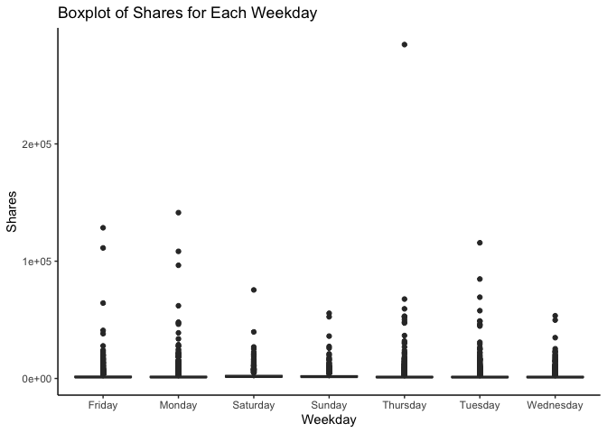
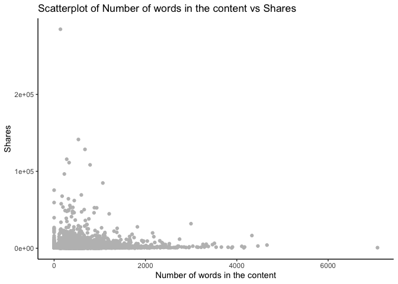
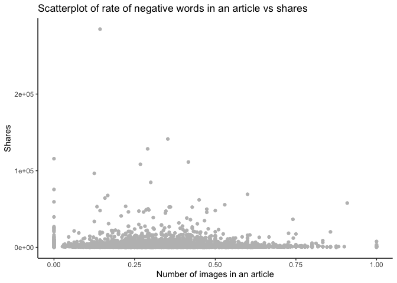
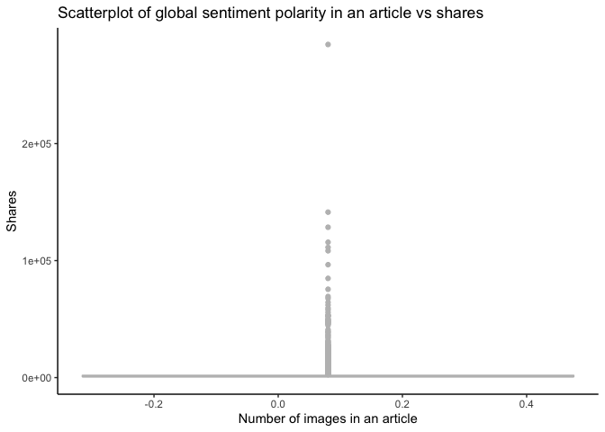

Tanley-Wood-Project2
================
Jordan Tanley and Jonathan Wood
2022-07-05

# Introduction - Jonathan

## Data

The data in this analysis will be the [online news popularity
dataset](https://archive.ics.uci.edu/ml/datasets/Online+News+Popularity).
This data has a set of features on articles from Mashable.com over a two
year period.

The goal of this project is to determine the number of shares (how many
times the article was shared over social media) the article has. We will
use this information to predict if an article can be popular by the
number of shares.

## Notable Variables

While there are 61 variables in the data set, we will not use all of
them for this project. The notable variables are the following:

-   “shares” - the number of shares the article has gotten over social
    media. This is the label or variable we want our models to predict
    for new articles
-   “data_channel_is” - a set of variables that tells if the article is
    in a particular category, such as business, sports, or lifestyle.
-   “weekday_is” - a set of variables that tells what day of the week
    the article was published on.
-   “num_keywords” - the number of keywords within the article
-   “num_images” - the number of images within the article
-   “num_videos” - the number of videos within the article

## Methods

Multiple methods will be used for this project to predict the number of
shares a new article can generate, including

-   Linear regression
-   Tree-based models
    -   Random forest
    -   Boosted tree

# Data - Jordan

In order to read in the data using a relative path, be sure to have the
data file saved in your working directory.

``` r
# read in the data
news <- read_csv("OnlineNewsPopularity/OnlineNewsPopularity.csv")
```

    ## Rows: 39644 Columns: 61
    ## ── Column specification ─────────────────────────────────────────────────────────────────────────────────────────────
    ## Delimiter: ","
    ## chr  (1): url
    ## dbl (60): timedelta, n_tokens_title, n_tokens_content, n_unique_tokens, n_non_stop_words, n_non_stop_unique_token...
    ## 
    ## ℹ Use `spec()` to retrieve the full column specification for this data.
    ## ℹ Specify the column types or set `show_col_types = FALSE` to quiet this message.

``` r
# sneek peek at the dataset
head(news)
```

``` r
# Creating a weekday variable (basically undoing the 7 dummy variables that came with the data) for EDA
news$weekday <- ifelse(news$weekday_is_friday == 1, "Friday",
                       ifelse(news$weekday_is_monday == 1, "Monday",
                              ifelse(news$weekday_is_tuesday == 1, "Tuesday",
                                     ifelse(news$weekday_is_wednesday == 1, "Wednesday",
                                            ifelse(news$weekday_is_thursday == 1, "Thursday",
                                                   ifelse(news$weekday_is_saturday == 1, "Saturday", 
                                                          "Sunday"))))))
```

Next, let’s subset the data so that we can only look at the data channel
of interest. We will look at articles with the “Social Media” data
channel.

``` r
# Subset the data to  one of the parameterized data channels and drop unnecessary variables
chan <- paste0("data_channel_is_", params$channel)

print(chan)
```

    ## [1] "data_channel_is_tech"

``` r
filtered_channel <- news %>% 
                as_tibble() %>% 
                filter(news[chan] == 1) %>% 
                select(-c(url, timedelta))

# take a peek at the data
filtered_channel %>%
  select(ends_with(chan))
```

# Summarizations - Both (at least 3 plots each)

For the numerical summaries, we can look at several aspects. Contingency
tables allow us to examine frequencies of categorical variables. The
first output below, for example, shows the counts for each weekday.
Similarly, the fifth table outputted shows the frequencies of number of
tokens in the article content. Another set of summary statistics to look
at are the 5 Number Summaries. These provide the minmum, 1st quantile,
median, 3rd quantile, and maximum for a particular variable.
Additionally, it may also be helful to look at the average. These are
helpful in determining the skewness (if mean = median vs. mean \< or \>
median) and helps in looking for outliers (anything outside (Q3 - Q1)1.5
from the median is generally considered an outlier). Below, the 5 Number
summaries (plus mean) are shown for Shares, Number of words in the
content, Number of words in the content for the upper quantile of
Shares, number of images in the article, number of videos in the
article, positive word rate, and negative word rate.

``` r
# Contingency table of frequencies for days of the week, added caption for clarity
kable(table(filtered_channel$weekday), 
      col.names = c("Weekday", "Frequency"), 
      caption = "Contingency table of frequencies for days of the week")
```

| Weekday   | Frequency |
|:----------|----------:|
| Friday    |       989 |
| Monday    |      1235 |
| Saturday  |       525 |
| Sunday    |       396 |
| Thursday  |      1310 |
| Tuesday   |      1474 |
| Wednesday |      1417 |

Contingency table of frequencies for days of the week

``` r
# Numerical Summary of Shares, added caption for clarity
filtered_channel %>% summarise(Minimum = min(shares), 
                          Q1 = quantile(shares, prob = 0.25), 
                          Average = mean(shares), 
                          Median = median(shares), 
                          Q3 = quantile(shares, prob = 0.75), 
                          Maximum = max(shares)) %>% 
                kable(caption = "Numerical Summary of Shares")
```

| Minimum |   Q1 |  Average | Median |   Q3 | Maximum |
|--------:|-----:|---------:|-------:|-----:|--------:|
|      36 | 1100 | 3072.283 |   1700 | 3000 |  663600 |

Numerical Summary of Shares

``` r
# Numerical Summary of Number of words in the content, added caption for clarity
filtered_channel %>% summarise(Minimum = min(n_tokens_content), 
                          Q1 = quantile(n_tokens_content, prob = 0.25), 
                          Average = mean(n_tokens_content), 
                          Median = median(n_tokens_content), 
                          Q3 = quantile(n_tokens_content, prob = 0.75), 
                          Maximum = max(n_tokens_content)) %>% 
                kable(caption = "Numerical Summary of Number of words in the content")
```

| Minimum |  Q1 |  Average | Median |  Q3 | Maximum |
|--------:|----:|---------:|-------:|----:|--------:|
|       0 | 256 | 571.6137 |    405 | 728 |    5530 |

Numerical Summary of Number of words in the content

``` r
# Numerical Summary of Number of words in the content for the upper quantile of Shares, added caption for clarity
filtered_channel %>% filter(shares > quantile(shares, prob = 0.75)) %>%
                summarise(Minimum = min(n_tokens_content), 
                          Q1 = quantile(n_tokens_content, prob = 0.25), 
                          Average = mean(n_tokens_content), 
                          Median = median(n_tokens_content), 
                          Q3 = quantile(n_tokens_content, prob = 0.75), 
                          Maximum = max(n_tokens_content)) %>% 
                kable(caption = "Numerical Summary of Number of words in the content for the upper quantile of Shares")
```

| Minimum |  Q1 |  Average | Median |  Q3 | Maximum |
|--------:|----:|---------:|-------:|----:|--------:|
|       0 | 276 | 640.9362 |    455 | 824 |    4139 |

Numerical Summary of Number of words in the content for the upper
quantile of Shares

``` r
kable(table(filtered_channel$n_tokens_content),
  col.names = c("Tokens", "Frequency"), 
  caption = "Contingency table of frequencies for number of tokens in the article content")
```

| Tokens | Frequency |
|:-------|----------:|
| 0      |        21 |
| 35     |         1 |
| 41     |         1 |
| 46     |         1 |
| 53     |         1 |
| 54     |         1 |
| 56     |         1 |
| 65     |         1 |
| 67     |         1 |
| 71     |         1 |
| 75     |         2 |
| 77     |         2 |
| 80     |         1 |
| 81     |         2 |
| 82     |         4 |
| 84     |         2 |
| 85     |         2 |
| 86     |         1 |
| 87     |         2 |
| 88     |         1 |
| 89     |         3 |
| 90     |         1 |
| 91     |         3 |
| 92     |         1 |
| 93     |         5 |
| 94     |         6 |
| 95     |         4 |
| 96     |         4 |
| 97     |         9 |
| 98     |         5 |
| 99     |         5 |
| 100    |         4 |
| 101    |         4 |
| 102    |         8 |
| 103    |         5 |
| 104    |         6 |
| 105    |         3 |
| 106    |         6 |
| 107    |         6 |
| 108    |         7 |
| 109    |        11 |
| 110    |         7 |
| 111    |         4 |
| 112    |         6 |
| 113    |         8 |
| 114    |        11 |
| 115    |         7 |
| 116    |        14 |
| 117    |         5 |
| 118    |         8 |
| 119    |         4 |
| 120    |         4 |
| 121    |         5 |
| 122    |         9 |
| 123    |         8 |
| 124    |         5 |
| 125    |         2 |
| 126    |         7 |
| 127    |        16 |
| 128    |        11 |
| 129    |         7 |
| 130    |         8 |
| 131    |         3 |
| 132    |        15 |
| 133    |         8 |
| 134    |         7 |
| 135    |         7 |
| 136    |         7 |
| 137    |        11 |
| 138    |         6 |
| 139    |        11 |
| 140    |         4 |
| 141    |         7 |
| 142    |         8 |
| 143    |         4 |
| 144    |        10 |
| 145    |        10 |
| 146    |         8 |
| 147    |         8 |
| 148    |         7 |
| 149    |        14 |
| 150    |         6 |
| 151    |        12 |
| 152    |         8 |
| 153    |        11 |
| 154    |        16 |
| 155    |         8 |
| 156    |         4 |
| 157    |        11 |
| 158    |        18 |
| 159    |         5 |
| 160    |         8 |
| 161    |        16 |
| 162    |        13 |
| 163    |        19 |
| 164    |         8 |
| 165    |        11 |
| 166    |        12 |
| 167    |        13 |
| 168    |        10 |
| 169    |        14 |
| 170    |        13 |
| 171    |        13 |
| 172    |         7 |
| 173    |         8 |
| 174    |        11 |
| 175    |         8 |
| 176    |        15 |
| 177    |        15 |
| 178    |        11 |
| 179    |        12 |
| 180    |         8 |
| 181    |        10 |
| 182    |        14 |
| 183    |         7 |
| 184    |        12 |
| 185    |        17 |
| 186    |        12 |
| 187    |        10 |
| 188    |        12 |
| 189    |        11 |
| 190    |        18 |
| 191    |        11 |
| 192    |        12 |
| 193    |        12 |
| 194    |        16 |
| 195    |        13 |
| 196    |        10 |
| 197    |        12 |
| 198    |        13 |
| 199    |         8 |
| 200    |        13 |
| 201    |        14 |
| 202    |        10 |
| 203    |        25 |
| 204    |        10 |
| 205    |        14 |
| 206    |        14 |
| 207    |         9 |
| 208    |        12 |
| 209    |        12 |
| 210    |        12 |
| 211    |        13 |
| 212    |        13 |
| 213    |        19 |
| 214    |        17 |
| 215    |        17 |
| 216    |         8 |
| 217    |        14 |
| 218    |         8 |
| 219    |        15 |
| 220    |        14 |
| 221    |        12 |
| 222    |        10 |
| 223    |        13 |
| 224    |         7 |
| 225    |        19 |
| 226    |        14 |
| 227    |        11 |
| 228    |        14 |
| 229    |        21 |
| 230    |        13 |
| 231    |        12 |
| 232    |        17 |
| 233    |        22 |
| 234    |        16 |
| 235    |        21 |
| 236    |         9 |
| 237    |        13 |
| 238    |        10 |
| 239    |        13 |
| 240    |        14 |
| 241    |        18 |
| 242    |        23 |
| 243    |        16 |
| 244    |        11 |
| 245    |        11 |
| 246    |        18 |
| 247    |         6 |
| 248    |        20 |
| 249    |        10 |
| 250    |        11 |
| 251    |        16 |
| 252    |        19 |
| 253    |        13 |
| 254    |        13 |
| 255    |        24 |
| 256    |        13 |
| 257    |        21 |
| 258    |        14 |
| 259    |        16 |
| 260    |        17 |
| 261    |        12 |
| 262    |        19 |
| 263    |        13 |
| 264    |        16 |
| 265    |        16 |
| 266    |        15 |
| 267    |        16 |
| 268    |        15 |
| 269    |        10 |
| 270    |         9 |
| 271    |         8 |
| 272    |        10 |
| 273    |        12 |
| 274    |        10 |
| 275    |        15 |
| 276    |        15 |
| 277    |        18 |
| 278    |        12 |
| 279    |        15 |
| 280    |        12 |
| 281    |        18 |
| 282    |        14 |
| 283    |        17 |
| 284    |        13 |
| 285    |        22 |
| 286    |        29 |
| 287    |        18 |
| 288    |        13 |
| 289    |        14 |
| 290    |        15 |
| 291    |        11 |
| 292    |        13 |
| 293    |        15 |
| 294    |        11 |
| 295    |        13 |
| 296    |         9 |
| 297    |        19 |
| 298    |        14 |
| 299    |        14 |
| 300    |        13 |
| 301    |        17 |
| 302    |        12 |
| 303    |        20 |
| 304    |        11 |
| 305    |        20 |
| 306    |        11 |
| 307    |        10 |
| 308    |        14 |
| 309    |        15 |
| 310    |        18 |
| 311    |        19 |
| 312    |        13 |
| 313    |        11 |
| 314    |         9 |
| 315    |        10 |
| 316    |        13 |
| 317    |        17 |
| 318    |        20 |
| 319    |        13 |
| 320    |        12 |
| 321    |        18 |
| 322    |        10 |
| 323    |        13 |
| 324    |         8 |
| 325    |        18 |
| 326    |         7 |
| 327    |         7 |
| 328    |        19 |
| 329    |        10 |
| 330    |         8 |
| 331    |         8 |
| 332    |        18 |
| 333    |        16 |
| 334    |        12 |
| 335    |        18 |
| 336    |         9 |
| 337    |         6 |
| 338    |        11 |
| 339    |        14 |
| 340    |         9 |
| 341    |        10 |
| 342    |        11 |
| 343    |        12 |
| 344    |         8 |
| 345    |        15 |
| 346    |        17 |
| 347    |         5 |
| 348    |        13 |
| 349    |         6 |
| 350    |        13 |
| 351    |        13 |
| 352    |        10 |
| 353    |        12 |
| 354    |        15 |
| 355    |        12 |
| 356    |        10 |
| 357    |        17 |
| 358    |         6 |
| 359    |        10 |
| 360    |        10 |
| 361    |         6 |
| 362    |         7 |
| 363    |        13 |
| 364    |         9 |
| 365    |        11 |
| 366    |        10 |
| 367    |        17 |
| 368    |        11 |
| 369    |         7 |
| 370    |        12 |
| 371    |         7 |
| 372    |        18 |
| 373    |        14 |
| 374    |         9 |
| 375    |         9 |
| 376    |         3 |
| 377    |        14 |
| 378    |         8 |
| 379    |         8 |
| 380    |         9 |
| 381    |         7 |
| 382    |         6 |
| 383    |        10 |
| 384    |         9 |
| 385    |         9 |
| 386    |        10 |
| 387    |         5 |
| 388    |        14 |
| 389    |         9 |
| 390    |         9 |
| 391    |        13 |
| 392    |        12 |
| 393    |        12 |
| 394    |         6 |
| 395    |        11 |
| 396    |         7 |
| 397    |        12 |
| 398    |        13 |
| 399    |         8 |
| 400    |         7 |
| 401    |        12 |
| 402    |         7 |
| 403    |        11 |
| 404    |        10 |
| 405    |         7 |
| 406    |        11 |
| 407    |         4 |
| 408    |         9 |
| 409    |         6 |
| 410    |         7 |
| 411    |         7 |
| 412    |         6 |
| 413    |         8 |
| 414    |         7 |
| 415    |         5 |
| 416    |        15 |
| 417    |         9 |
| 418    |         6 |
| 419    |        12 |
| 420    |        10 |
| 421    |         8 |
| 422    |         8 |
| 423    |        12 |
| 424    |        13 |
| 425    |        11 |
| 426    |         8 |
| 427    |         9 |
| 428    |        18 |
| 429    |         8 |
| 430    |         8 |
| 431    |         8 |
| 432    |         7 |
| 433    |         9 |
| 434    |         8 |
| 435    |        10 |
| 436    |         7 |
| 437    |         6 |
| 438    |        10 |
| 439    |         9 |
| 440    |         9 |
| 441    |         4 |
| 442    |         3 |
| 443    |         7 |
| 444    |         5 |
| 445    |         8 |
| 446    |         5 |
| 447    |         8 |
| 448    |         3 |
| 449    |         2 |
| 450    |         7 |
| 451    |         3 |
| 452    |        11 |
| 453    |         8 |
| 454    |         5 |
| 455    |         9 |
| 456    |         8 |
| 457    |        11 |
| 458    |         2 |
| 459    |         3 |
| 460    |         8 |
| 461    |        11 |
| 462    |         7 |
| 463    |         8 |
| 464    |         6 |
| 465    |         5 |
| 466    |         4 |
| 467    |         8 |
| 468    |         5 |
| 469    |         3 |
| 470    |         5 |
| 471    |         7 |
| 472    |         8 |
| 473    |         9 |
| 474    |         6 |
| 475    |         4 |
| 476    |         7 |
| 477    |         4 |
| 478    |         4 |
| 479    |         6 |
| 480    |         4 |
| 481    |        13 |
| 482    |         6 |
| 483    |         6 |
| 484    |         7 |
| 485    |         6 |
| 486    |         5 |
| 487    |         6 |
| 488    |         5 |
| 489    |         3 |
| 490    |         7 |
| 491    |         3 |
| 492    |         8 |
| 493    |        11 |
| 494    |         6 |
| 495    |         2 |
| 496    |        10 |
| 497    |         8 |
| 498    |         4 |
| 499    |         7 |
| 500    |         5 |
| 501    |         6 |
| 502    |         8 |
| 503    |        13 |
| 504    |         9 |
| 505    |         9 |
| 506    |         9 |
| 507    |         6 |
| 508    |         7 |
| 509    |        10 |
| 510    |         2 |
| 511    |         3 |
| 512    |         5 |
| 513    |         3 |
| 514    |         6 |
| 515    |         7 |
| 516    |         5 |
| 517    |         7 |
| 518    |         9 |
| 519    |         6 |
| 520    |         5 |
| 521    |         8 |
| 522    |         8 |
| 523    |         4 |
| 524    |         4 |
| 525    |         4 |
| 526    |         6 |
| 527    |        10 |
| 528    |         4 |
| 529    |         8 |
| 530    |         3 |
| 531    |         6 |
| 532    |         6 |
| 533    |         6 |
| 534    |        12 |
| 535    |         6 |
| 536    |         6 |
| 537    |         4 |
| 538    |         5 |
| 539    |         4 |
| 540    |         6 |
| 541    |         5 |
| 542    |         3 |
| 543    |         6 |
| 544    |         4 |
| 545    |         6 |
| 546    |         6 |
| 547    |         6 |
| 548    |         7 |
| 549    |         4 |
| 550    |         8 |
| 551    |         7 |
| 552    |         3 |
| 553    |        13 |
| 554    |         5 |
| 555    |         7 |
| 556    |        12 |
| 557    |         6 |
| 558    |        10 |
| 559    |         4 |
| 560    |         8 |
| 561    |         4 |
| 562    |         9 |
| 563    |         9 |
| 564    |         9 |
| 565    |         3 |
| 566    |         3 |
| 567    |         3 |
| 568    |         6 |
| 569    |         8 |
| 570    |         3 |
| 571    |         6 |
| 572    |         5 |
| 573    |         4 |
| 574    |         7 |
| 575    |         6 |
| 576    |         7 |
| 577    |         4 |
| 578    |         7 |
| 579    |        10 |
| 580    |         2 |
| 581    |         5 |
| 582    |         2 |
| 583    |         2 |
| 584    |         3 |
| 585    |         6 |
| 586    |         8 |
| 587    |         6 |
| 588    |         3 |
| 589    |         7 |
| 590    |         3 |
| 591    |         6 |
| 592    |         4 |
| 593    |         4 |
| 594    |         4 |
| 595    |         8 |
| 596    |         6 |
| 597    |         9 |
| 598    |         3 |
| 599    |         3 |
| 600    |         8 |
| 601    |         2 |
| 602    |         2 |
| 603    |         1 |
| 604    |         7 |
| 605    |         4 |
| 606    |        10 |
| 607    |         3 |
| 608    |         5 |
| 609    |         3 |
| 610    |         4 |
| 611    |         6 |
| 612    |         4 |
| 613    |         6 |
| 614    |         4 |
| 615    |         6 |
| 616    |         3 |
| 617    |         4 |
| 618    |         6 |
| 619    |         3 |
| 620    |         5 |
| 621    |         5 |
| 622    |         6 |
| 623    |         6 |
| 624    |        10 |
| 625    |         6 |
| 626    |         6 |
| 627    |         4 |
| 628    |         3 |
| 629    |        10 |
| 630    |         7 |
| 631    |         1 |
| 632    |         9 |
| 633    |         9 |
| 634    |         2 |
| 635    |         6 |
| 636    |         5 |
| 637    |         3 |
| 638    |         7 |
| 639    |         6 |
| 640    |         3 |
| 641    |         3 |
| 642    |         5 |
| 643    |         2 |
| 644    |         5 |
| 645    |         3 |
| 646    |        12 |
| 647    |         1 |
| 648    |         2 |
| 649    |         3 |
| 650    |         3 |
| 651    |         4 |
| 652    |         5 |
| 653    |         6 |
| 654    |         2 |
| 655    |         2 |
| 656    |         3 |
| 657    |         4 |
| 658    |         3 |
| 659    |         3 |
| 660    |         8 |
| 661    |         4 |
| 662    |         7 |
| 663    |         8 |
| 664    |         4 |
| 665    |         4 |
| 666    |         7 |
| 667    |         3 |
| 668    |         3 |
| 669    |         1 |
| 670    |         4 |
| 671    |         4 |
| 672    |         2 |
| 673    |         6 |
| 674    |         5 |
| 675    |         5 |
| 676    |         1 |
| 677    |         4 |
| 678    |         4 |
| 679    |         5 |
| 680    |         2 |
| 681    |         5 |
| 682    |         3 |
| 683    |         5 |
| 684    |         3 |
| 685    |         4 |
| 686    |         2 |
| 687    |         3 |
| 688    |         3 |
| 689    |         2 |
| 690    |         3 |
| 691    |         5 |
| 692    |         2 |
| 693    |         4 |
| 694    |         6 |
| 695    |         7 |
| 696    |         6 |
| 697    |         6 |
| 698    |         5 |
| 699    |         4 |
| 700    |         4 |
| 701    |         4 |
| 702    |         5 |
| 703    |         5 |
| 705    |         3 |
| 706    |         3 |
| 707    |         5 |
| 708    |         2 |
| 709    |         3 |
| 710    |         5 |
| 711    |         4 |
| 712    |         4 |
| 713    |         3 |
| 714    |         3 |
| 715    |         4 |
| 716    |         7 |
| 717    |         6 |
| 718    |         6 |
| 719    |         3 |
| 720    |         6 |
| 721    |         6 |
| 722    |         2 |
| 723    |         5 |
| 724    |         3 |
| 725    |         6 |
| 726    |         4 |
| 727    |         4 |
| 728    |         2 |
| 729    |         4 |
| 730    |         7 |
| 731    |         1 |
| 732    |         3 |
| 733    |         1 |
| 734    |         5 |
| 735    |         2 |
| 737    |         1 |
| 738    |         8 |
| 739    |         4 |
| 740    |         1 |
| 741    |         1 |
| 742    |         3 |
| 743    |         3 |
| 744    |         3 |
| 745    |         3 |
| 746    |         4 |
| 747    |         3 |
| 748    |         6 |
| 749    |         4 |
| 750    |         2 |
| 751    |         4 |
| 752    |         5 |
| 753    |        10 |
| 754    |         2 |
| 755    |         1 |
| 756    |         7 |
| 757    |         2 |
| 758    |         5 |
| 759    |         1 |
| 760    |         4 |
| 761    |         8 |
| 762    |         3 |
| 763    |         2 |
| 764    |         4 |
| 765    |         6 |
| 766    |         4 |
| 767    |         2 |
| 768    |         2 |
| 769    |         5 |
| 770    |         1 |
| 771    |         6 |
| 772    |         4 |
| 773    |         2 |
| 774    |         3 |
| 775    |         4 |
| 776    |         3 |
| 777    |         1 |
| 778    |         4 |
| 779    |         5 |
| 780    |         5 |
| 781    |         1 |
| 782    |         4 |
| 783    |         1 |
| 784    |        10 |
| 785    |         4 |
| 786    |         2 |
| 787    |         6 |
| 788    |         3 |
| 789    |         6 |
| 790    |         2 |
| 791    |         6 |
| 792    |         5 |
| 793    |         3 |
| 794    |         4 |
| 795    |         3 |
| 796    |         3 |
| 797    |         2 |
| 798    |         6 |
| 799    |         2 |
| 800    |         2 |
| 801    |         3 |
| 802    |         3 |
| 803    |         3 |
| 804    |         3 |
| 805    |         2 |
| 806    |         5 |
| 807    |         2 |
| 808    |         6 |
| 810    |         5 |
| 811    |         3 |
| 812    |         2 |
| 813    |         5 |
| 814    |         6 |
| 815    |         3 |
| 816    |         2 |
| 817    |         2 |
| 818    |         3 |
| 819    |         1 |
| 820    |         2 |
| 821    |         7 |
| 822    |         1 |
| 823    |         1 |
| 824    |         5 |
| 825    |         7 |
| 826    |         7 |
| 827    |         2 |
| 828    |         5 |
| 829    |         6 |
| 830    |         3 |
| 832    |         3 |
| 833    |         3 |
| 834    |         1 |
| 835    |         4 |
| 836    |         4 |
| 837    |         1 |
| 838    |         3 |
| 839    |         3 |
| 840    |         2 |
| 841    |         1 |
| 842    |         5 |
| 843    |         1 |
| 844    |         3 |
| 845    |         1 |
| 846    |         4 |
| 847    |         4 |
| 848    |         8 |
| 850    |         2 |
| 851    |         4 |
| 852    |         6 |
| 853    |         3 |
| 854    |         1 |
| 855    |         1 |
| 856    |         2 |
| 857    |         2 |
| 858    |         1 |
| 859    |         3 |
| 860    |         6 |
| 861    |         2 |
| 862    |         5 |
| 863    |         5 |
| 864    |         5 |
| 865    |         2 |
| 866    |         3 |
| 867    |         3 |
| 868    |         3 |
| 869    |         6 |
| 871    |         1 |
| 872    |         6 |
| 873    |         3 |
| 874    |         2 |
| 875    |         4 |
| 876    |         2 |
| 877    |         4 |
| 878    |         1 |
| 879    |         2 |
| 880    |         8 |
| 881    |         2 |
| 882    |         2 |
| 883    |         3 |
| 884    |         3 |
| 885    |         2 |
| 886    |         5 |
| 887    |         2 |
| 888    |         4 |
| 889    |         3 |
| 890    |         1 |
| 891    |         9 |
| 892    |         3 |
| 893    |         3 |
| 894    |         4 |
| 895    |         2 |
| 896    |         3 |
| 897    |         1 |
| 898    |         4 |
| 900    |         4 |
| 901    |         3 |
| 903    |         4 |
| 904    |         8 |
| 906    |         1 |
| 907    |         2 |
| 908    |         1 |
| 909    |         2 |
| 910    |         3 |
| 911    |         3 |
| 912    |         3 |
| 913    |         1 |
| 914    |         4 |
| 915    |         1 |
| 916    |         4 |
| 917    |         2 |
| 918    |         1 |
| 919    |         3 |
| 921    |         4 |
| 922    |         1 |
| 923    |         1 |
| 924    |         2 |
| 925    |         4 |
| 926    |         1 |
| 927    |         3 |
| 928    |         4 |
| 929    |         1 |
| 930    |         1 |
| 931    |         3 |
| 932    |         2 |
| 933    |         4 |
| 934    |         5 |
| 935    |         5 |
| 936    |         4 |
| 937    |         5 |
| 938    |         3 |
| 939    |         2 |
| 940    |         4 |
| 941    |         5 |
| 942    |         2 |
| 943    |         2 |
| 944    |         1 |
| 945    |         3 |
| 946    |         3 |
| 947    |         3 |
| 948    |         1 |
| 949    |         4 |
| 951    |         3 |
| 952    |         1 |
| 953    |         5 |
| 954    |         3 |
| 956    |         3 |
| 957    |         2 |
| 958    |         2 |
| 959    |         1 |
| 960    |         2 |
| 961    |         1 |
| 962    |         3 |
| 963    |         2 |
| 965    |         5 |
| 966    |         3 |
| 967    |         2 |
| 968    |         3 |
| 969    |         5 |
| 970    |         3 |
| 971    |         3 |
| 972    |         2 |
| 973    |         1 |
| 974    |         1 |
| 975    |         3 |
| 976    |         1 |
| 977    |         1 |
| 978    |         2 |
| 980    |         1 |
| 981    |         4 |
| 982    |         3 |
| 983    |         5 |
| 984    |         2 |
| 985    |         1 |
| 986    |         3 |
| 987    |         1 |
| 988    |         2 |
| 989    |         1 |
| 992    |         5 |
| 993    |         2 |
| 994    |         4 |
| 995    |         3 |
| 996    |         2 |
| 997    |         3 |
| 998    |         2 |
| 999    |         2 |
| 1001   |         3 |
| 1002   |         3 |
| 1003   |         5 |
| 1004   |         3 |
| 1005   |         2 |
| 1006   |         5 |
| 1007   |         3 |
| 1008   |         1 |
| 1009   |         4 |
| 1011   |         2 |
| 1012   |         5 |
| 1013   |         3 |
| 1014   |         3 |
| 1015   |         5 |
| 1016   |         3 |
| 1017   |         2 |
| 1018   |         1 |
| 1019   |         1 |
| 1020   |         2 |
| 1021   |         2 |
| 1022   |         4 |
| 1023   |         1 |
| 1024   |         2 |
| 1026   |         4 |
| 1027   |         4 |
| 1028   |         1 |
| 1030   |         8 |
| 1031   |         5 |
| 1034   |         3 |
| 1035   |         1 |
| 1036   |         2 |
| 1037   |         1 |
| 1038   |         4 |
| 1039   |         1 |
| 1040   |         1 |
| 1042   |         2 |
| 1043   |         1 |
| 1044   |         2 |
| 1045   |         4 |
| 1046   |         4 |
| 1047   |         1 |
| 1048   |         1 |
| 1049   |         3 |
| 1050   |         5 |
| 1051   |         3 |
| 1052   |         2 |
| 1053   |         4 |
| 1054   |         1 |
| 1056   |         2 |
| 1057   |         1 |
| 1058   |         1 |
| 1059   |         1 |
| 1060   |         1 |
| 1061   |         2 |
| 1062   |         1 |
| 1063   |         4 |
| 1065   |         2 |
| 1066   |         2 |
| 1067   |         2 |
| 1069   |         2 |
| 1070   |         2 |
| 1072   |         3 |
| 1073   |         3 |
| 1074   |         2 |
| 1076   |         2 |
| 1077   |         4 |
| 1078   |         3 |
| 1079   |         4 |
| 1080   |         1 |
| 1081   |         6 |
| 1082   |         1 |
| 1083   |         2 |
| 1084   |         1 |
| 1085   |         2 |
| 1086   |         5 |
| 1087   |         1 |
| 1088   |         2 |
| 1089   |         3 |
| 1090   |         1 |
| 1091   |         4 |
| 1092   |         1 |
| 1093   |         2 |
| 1095   |         1 |
| 1096   |         2 |
| 1097   |         2 |
| 1098   |         1 |
| 1099   |         5 |
| 1100   |         2 |
| 1101   |         2 |
| 1102   |         2 |
| 1103   |         3 |
| 1104   |         1 |
| 1105   |         4 |
| 1106   |         1 |
| 1107   |         2 |
| 1108   |         2 |
| 1110   |         2 |
| 1112   |         2 |
| 1115   |         4 |
| 1116   |         2 |
| 1117   |         1 |
| 1118   |         1 |
| 1119   |         1 |
| 1121   |         5 |
| 1122   |         4 |
| 1123   |         1 |
| 1124   |         3 |
| 1125   |         4 |
| 1126   |         4 |
| 1127   |         4 |
| 1128   |         1 |
| 1130   |         1 |
| 1134   |         2 |
| 1135   |         4 |
| 1137   |         2 |
| 1138   |         2 |
| 1139   |         2 |
| 1140   |         1 |
| 1142   |         1 |
| 1145   |         1 |
| 1146   |         2 |
| 1148   |         2 |
| 1149   |         1 |
| 1151   |         1 |
| 1152   |         2 |
| 1154   |         2 |
| 1155   |         1 |
| 1156   |         2 |
| 1159   |         1 |
| 1160   |         3 |
| 1161   |         1 |
| 1162   |         1 |
| 1163   |         1 |
| 1166   |         1 |
| 1168   |         1 |
| 1169   |         1 |
| 1170   |         1 |
| 1171   |         1 |
| 1172   |         2 |
| 1173   |         1 |
| 1174   |         2 |
| 1175   |         2 |
| 1176   |         3 |
| 1177   |         1 |
| 1178   |         2 |
| 1180   |         2 |
| 1182   |         1 |
| 1183   |         1 |
| 1184   |         1 |
| 1186   |         1 |
| 1188   |         2 |
| 1189   |         2 |
| 1191   |         2 |
| 1193   |         1 |
| 1194   |         4 |
| 1195   |         1 |
| 1196   |         1 |
| 1197   |         1 |
| 1199   |         1 |
| 1200   |         2 |
| 1203   |         2 |
| 1206   |         1 |
| 1207   |         2 |
| 1210   |         4 |
| 1211   |         1 |
| 1212   |         1 |
| 1213   |         1 |
| 1214   |         2 |
| 1215   |         2 |
| 1216   |         1 |
| 1218   |         2 |
| 1219   |         1 |
| 1221   |         2 |
| 1222   |         2 |
| 1224   |         3 |
| 1225   |         2 |
| 1226   |         3 |
| 1227   |         1 |
| 1228   |         2 |
| 1229   |         1 |
| 1230   |         2 |
| 1232   |         1 |
| 1235   |         1 |
| 1236   |         2 |
| 1237   |         3 |
| 1240   |         1 |
| 1241   |         1 |
| 1243   |         1 |
| 1244   |         1 |
| 1246   |         2 |
| 1247   |         1 |
| 1248   |         2 |
| 1249   |         3 |
| 1251   |         1 |
| 1252   |         1 |
| 1253   |         1 |
| 1254   |         2 |
| 1256   |         1 |
| 1257   |         1 |
| 1259   |         1 |
| 1260   |         1 |
| 1261   |         2 |
| 1262   |         1 |
| 1263   |         2 |
| 1264   |         1 |
| 1265   |         2 |
| 1266   |         1 |
| 1269   |         1 |
| 1270   |         1 |
| 1271   |         2 |
| 1272   |         1 |
| 1276   |         1 |
| 1280   |         2 |
| 1281   |         2 |
| 1283   |         1 |
| 1285   |         1 |
| 1287   |         1 |
| 1288   |         1 |
| 1289   |         1 |
| 1290   |         1 |
| 1291   |         1 |
| 1292   |         2 |
| 1293   |         4 |
| 1294   |         1 |
| 1295   |         2 |
| 1297   |         1 |
| 1298   |         1 |
| 1300   |         2 |
| 1301   |         1 |
| 1302   |         4 |
| 1303   |         2 |
| 1304   |         1 |
| 1305   |         3 |
| 1308   |         1 |
| 1309   |         2 |
| 1311   |         1 |
| 1313   |         2 |
| 1314   |         1 |
| 1315   |         1 |
| 1317   |         1 |
| 1320   |         1 |
| 1322   |         1 |
| 1323   |         2 |
| 1325   |         4 |
| 1327   |         2 |
| 1329   |         2 |
| 1331   |         1 |
| 1333   |         1 |
| 1334   |         1 |
| 1338   |         2 |
| 1342   |         1 |
| 1343   |         1 |
| 1344   |         1 |
| 1345   |         1 |
| 1347   |         3 |
| 1349   |         1 |
| 1351   |         1 |
| 1358   |         1 |
| 1359   |         1 |
| 1360   |         1 |
| 1361   |         1 |
| 1363   |         2 |
| 1364   |         3 |
| 1365   |         1 |
| 1366   |         3 |
| 1367   |         1 |
| 1370   |         1 |
| 1372   |         1 |
| 1374   |         3 |
| 1378   |         1 |
| 1380   |         1 |
| 1381   |         1 |
| 1383   |         2 |
| 1384   |         1 |
| 1386   |         1 |
| 1387   |         2 |
| 1390   |         2 |
| 1391   |         1 |
| 1393   |         1 |
| 1394   |         2 |
| 1397   |         1 |
| 1398   |         1 |
| 1400   |         2 |
| 1402   |         1 |
| 1406   |         1 |
| 1408   |         1 |
| 1410   |         1 |
| 1413   |         3 |
| 1414   |         1 |
| 1415   |         1 |
| 1417   |         1 |
| 1419   |         2 |
| 1421   |         1 |
| 1422   |         3 |
| 1423   |         1 |
| 1424   |         1 |
| 1425   |         1 |
| 1426   |         1 |
| 1427   |         2 |
| 1428   |         2 |
| 1430   |         1 |
| 1431   |         1 |
| 1432   |         1 |
| 1434   |         1 |
| 1435   |         3 |
| 1436   |         2 |
| 1438   |         1 |
| 1439   |         2 |
| 1444   |         1 |
| 1446   |         1 |
| 1452   |         1 |
| 1453   |         1 |
| 1454   |         2 |
| 1456   |         2 |
| 1458   |         2 |
| 1461   |         1 |
| 1466   |         1 |
| 1467   |         1 |
| 1468   |         1 |
| 1474   |         3 |
| 1475   |         2 |
| 1476   |         1 |
| 1478   |         1 |
| 1482   |         3 |
| 1483   |         1 |
| 1489   |         1 |
| 1496   |         3 |
| 1498   |         1 |
| 1499   |         1 |
| 1500   |         1 |
| 1501   |         1 |
| 1504   |         1 |
| 1505   |         1 |
| 1507   |         1 |
| 1511   |         1 |
| 1512   |         2 |
| 1513   |         2 |
| 1514   |         1 |
| 1515   |         2 |
| 1516   |         2 |
| 1517   |         2 |
| 1518   |         1 |
| 1519   |         1 |
| 1521   |         1 |
| 1522   |         1 |
| 1524   |         1 |
| 1528   |         1 |
| 1529   |         1 |
| 1530   |         1 |
| 1532   |         2 |
| 1534   |         1 |
| 1535   |         1 |
| 1536   |         1 |
| 1539   |         1 |
| 1542   |         1 |
| 1544   |         3 |
| 1549   |         2 |
| 1551   |         1 |
| 1553   |         1 |
| 1555   |         2 |
| 1558   |         1 |
| 1562   |         1 |
| 1563   |         2 |
| 1565   |         3 |
| 1566   |         1 |
| 1568   |         1 |
| 1569   |         1 |
| 1571   |         2 |
| 1572   |         2 |
| 1573   |         2 |
| 1574   |         1 |
| 1576   |         2 |
| 1582   |         2 |
| 1583   |         1 |
| 1584   |         1 |
| 1585   |         1 |
| 1588   |         1 |
| 1590   |         3 |
| 1593   |         2 |
| 1594   |         1 |
| 1599   |         1 |
| 1600   |         2 |
| 1601   |         1 |
| 1608   |         1 |
| 1612   |         1 |
| 1614   |         1 |
| 1615   |         1 |
| 1618   |         1 |
| 1619   |         1 |
| 1620   |         1 |
| 1621   |         1 |
| 1627   |         1 |
| 1629   |         2 |
| 1632   |         1 |
| 1635   |         1 |
| 1637   |         1 |
| 1639   |         1 |
| 1640   |         1 |
| 1642   |         1 |
| 1647   |         1 |
| 1648   |         1 |
| 1651   |         1 |
| 1652   |         1 |
| 1654   |         1 |
| 1655   |         1 |
| 1656   |         1 |
| 1659   |         2 |
| 1660   |         1 |
| 1661   |         2 |
| 1669   |         2 |
| 1670   |         1 |
| 1674   |         1 |
| 1675   |         1 |
| 1679   |         1 |
| 1681   |         1 |
| 1682   |         1 |
| 1684   |         1 |
| 1686   |         1 |
| 1687   |         2 |
| 1689   |         1 |
| 1690   |         1 |
| 1691   |         1 |
| 1694   |         1 |
| 1695   |         1 |
| 1697   |         1 |
| 1701   |         1 |
| 1702   |         1 |
| 1703   |         1 |
| 1706   |         1 |
| 1707   |         4 |
| 1708   |         1 |
| 1709   |         1 |
| 1710   |         1 |
| 1713   |         2 |
| 1718   |         1 |
| 1721   |         1 |
| 1725   |         1 |
| 1729   |         1 |
| 1730   |         2 |
| 1733   |         1 |
| 1735   |         1 |
| 1737   |         1 |
| 1738   |         1 |
| 1739   |         1 |
| 1740   |         1 |
| 1747   |         1 |
| 1749   |         1 |
| 1750   |         2 |
| 1751   |         2 |
| 1759   |         1 |
| 1762   |         2 |
| 1763   |         3 |
| 1764   |         1 |
| 1767   |         3 |
| 1769   |         1 |
| 1775   |         1 |
| 1777   |         1 |
| 1778   |         3 |
| 1782   |         2 |
| 1784   |         1 |
| 1787   |         1 |
| 1788   |         2 |
| 1790   |         1 |
| 1796   |         1 |
| 1797   |         1 |
| 1799   |         1 |
| 1802   |         1 |
| 1803   |         2 |
| 1804   |         1 |
| 1806   |         2 |
| 1809   |         2 |
| 1814   |         1 |
| 1816   |         2 |
| 1818   |         1 |
| 1822   |         1 |
| 1823   |         1 |
| 1825   |         1 |
| 1827   |         1 |
| 1829   |         1 |
| 1831   |         2 |
| 1832   |         1 |
| 1833   |         1 |
| 1834   |         1 |
| 1835   |         1 |
| 1837   |         1 |
| 1841   |         1 |
| 1845   |         1 |
| 1847   |         2 |
| 1852   |         1 |
| 1854   |         1 |
| 1856   |         1 |
| 1857   |         1 |
| 1858   |         1 |
| 1862   |         1 |
| 1863   |         1 |
| 1868   |         1 |
| 1870   |         2 |
| 1872   |         2 |
| 1873   |         1 |
| 1874   |         1 |
| 1878   |         1 |
| 1895   |         1 |
| 1900   |         2 |
| 1909   |         2 |
| 1912   |         1 |
| 1914   |         1 |
| 1916   |         1 |
| 1922   |         1 |
| 1928   |         2 |
| 1929   |         1 |
| 1930   |         1 |
| 1931   |         1 |
| 1933   |         1 |
| 1936   |         1 |
| 1937   |         2 |
| 1944   |         1 |
| 1945   |         1 |
| 1948   |         1 |
| 1949   |         2 |
| 1950   |         1 |
| 1953   |         1 |
| 1961   |         1 |
| 1966   |         1 |
| 1969   |         1 |
| 1973   |         1 |
| 1975   |         1 |
| 1977   |         1 |
| 1984   |         1 |
| 1990   |         1 |
| 1999   |         1 |
| 2001   |         1 |
| 2008   |         2 |
| 2013   |         1 |
| 2014   |         1 |
| 2017   |         1 |
| 2020   |         1 |
| 2023   |         1 |
| 2040   |         1 |
| 2041   |         2 |
| 2045   |         1 |
| 2046   |         1 |
| 2057   |         1 |
| 2059   |         1 |
| 2060   |         1 |
| 2061   |         1 |
| 2062   |         1 |
| 2069   |         1 |
| 2070   |         1 |
| 2077   |         1 |
| 2094   |         2 |
| 2099   |         1 |
| 2100   |         1 |
| 2109   |         2 |
| 2111   |         1 |
| 2114   |         2 |
| 2116   |         1 |
| 2121   |         1 |
| 2124   |         1 |
| 2137   |         1 |
| 2155   |         1 |
| 2159   |         1 |
| 2167   |         1 |
| 2169   |         1 |
| 2179   |         1 |
| 2182   |         1 |
| 2183   |         1 |
| 2185   |         1 |
| 2188   |         3 |
| 2190   |         1 |
| 2196   |         1 |
| 2199   |         1 |
| 2207   |         1 |
| 2208   |         1 |
| 2210   |         1 |
| 2213   |         1 |
| 2225   |         1 |
| 2230   |         1 |
| 2233   |         1 |
| 2242   |         1 |
| 2268   |         1 |
| 2272   |         1 |
| 2273   |         1 |
| 2284   |         1 |
| 2290   |         1 |
| 2326   |         1 |
| 2328   |         1 |
| 2330   |         1 |
| 2343   |         1 |
| 2351   |         1 |
| 2353   |         1 |
| 2362   |         1 |
| 2380   |         1 |
| 2385   |         1 |
| 2391   |         1 |
| 2392   |         1 |
| 2398   |         1 |
| 2417   |         1 |
| 2423   |         1 |
| 2428   |         1 |
| 2440   |         1 |
| 2441   |         1 |
| 2459   |         1 |
| 2476   |         1 |
| 2479   |         1 |
| 2482   |         1 |
| 2500   |         1 |
| 2502   |         1 |
| 2523   |         1 |
| 2541   |         1 |
| 2543   |         1 |
| 2554   |         1 |
| 2558   |         1 |
| 2561   |         1 |
| 2573   |         1 |
| 2582   |         1 |
| 2591   |         1 |
| 2596   |         1 |
| 2611   |         1 |
| 2620   |         1 |
| 2621   |         1 |
| 2635   |         1 |
| 2641   |         1 |
| 2645   |         1 |
| 2653   |         1 |
| 2664   |         1 |
| 2688   |         1 |
| 2689   |         1 |
| 2691   |         1 |
| 2698   |         1 |
| 2703   |         1 |
| 2730   |         1 |
| 2741   |         1 |
| 2765   |         1 |
| 2776   |         1 |
| 2778   |         1 |
| 2780   |         1 |
| 2805   |         1 |
| 2817   |         1 |
| 2835   |         1 |
| 2838   |         1 |
| 2847   |         1 |
| 2849   |         1 |
| 2865   |         1 |
| 2874   |         1 |
| 2900   |         1 |
| 2916   |         1 |
| 2922   |         1 |
| 2952   |         1 |
| 2953   |         1 |
| 3006   |         1 |
| 3021   |         1 |
| 3027   |         1 |
| 3034   |         1 |
| 3055   |         1 |
| 3058   |         1 |
| 3065   |         1 |
| 3076   |         1 |
| 3086   |         1 |
| 3103   |         1 |
| 3113   |         1 |
| 3136   |         1 |
| 3137   |         1 |
| 3139   |         1 |
| 3155   |         1 |
| 3163   |         1 |
| 3302   |         1 |
| 3309   |         1 |
| 3403   |         1 |
| 3537   |         1 |
| 3586   |         1 |
| 3664   |         1 |
| 3740   |         1 |
| 3774   |         1 |
| 3846   |         1 |
| 4063   |         1 |
| 4125   |         1 |
| 4139   |         1 |
| 4585   |         1 |
| 4979   |         1 |
| 5530   |         1 |

Contingency table of frequencies for number of tokens in the article
content

``` r
# Summarizing the number of images in the article
filtered_channel %>% 
  summarise(Minimum = min(num_imgs), 
      Q1 = quantile(num_imgs, prob = 0.25), 
      Average = mean(num_imgs), 
      Median = median(num_imgs), 
      Q3 = quantile(num_imgs, prob = 0.75), 
      Maximum = max(num_imgs)) %>% 
  kable(caption = "Numerical summary of number of images in an article")
```

| Minimum |  Q1 |  Average | Median |  Q3 | Maximum |
|--------:|----:|---------:|-------:|----:|--------:|
|       0 |   1 | 4.434522 |      1 |   6 |      65 |

Numerical summary of number of images in an article

``` r
# Summarizing the number of videos in the article
filtered_channel %>% 
  summarise(Minimum = min(num_videos), 
      Q1 = quantile(num_videos, prob = 0.25), 
      Average = mean(num_videos), 
      Median = median(num_videos), 
      Q3 = quantile(num_videos, prob = 0.75), 
      Maximum = max(num_videos)) %>% 
  kable(caption = "Numerical summary of number of videos in an article")
```

| Minimum |  Q1 |   Average | Median |  Q3 | Maximum |
|--------:|----:|----------:|-------:|----:|--------:|
|       0 |   0 | 0.4471821 |      0 |   1 |      73 |

Numerical summary of number of videos in an article

``` r
# Summarizing the number of positive word rate
filtered_channel %>% 
  summarise(Minimum = min(rate_positive_words), 
      Q1 = quantile(rate_positive_words, prob = 0.25), 
      Average = mean(rate_positive_words), 
      Median = median(rate_positive_words), 
      Q3 = quantile(rate_positive_words, prob = 0.75), 
      Maximum = max(rate_positive_words)) %>% 
  kable(caption = "Numerical Summary of the rate of positive words in an article")
```

| Minimum |        Q1 |   Average |   Median |        Q3 | Maximum |
|--------:|----------:|----------:|---------:|----------:|--------:|
|       0 | 0.6666667 | 0.7465615 | 0.752357 | 0.8333333 |       1 |

Numerical Summary of the rate of positive words in an article

``` r
# Summarizing the number of negative word rate
filtered_channel %>% 
  summarise(Minimum = min(rate_negative_words), 
      Q1 = quantile(rate_negative_words, prob = 0.25), 
      Average = mean(rate_negative_words), 
      Median = median(rate_negative_words), 
      Q3 = quantile(rate_negative_words, prob = 0.75), 
      Maximum = max(rate_negative_words)) %>% 
  kable(caption = "Numerical Summary of the rate of negative words in an article")
```

| Minimum |        Q1 |   Average |    Median |        Q3 | Maximum |
|--------:|----------:|----------:|----------:|----------:|--------:|
|       0 | 0.1666667 | 0.2505798 | 0.2454267 | 0.3304154 |       1 |

Numerical Summary of the rate of negative words in an article

The graphical summaries more dramatically show the trends in the data,
including skewness and outliers. The boxplots below show a visual
representation of the 5 Number summaries for Shares, split up by
weekday, and shares split up by text sentiment polarity. Boxplots make
it even easier to look out for outliers (look for the dots separated
from the main boxplot). Next, we can examine several scatterplots.
Scatterplots allow us to look at one numerical variable vs another to
see if there is any correlation between them. Look out for any plots
that have most of the points on a diagonal line! There are four
scatterplots below, investigating shares vs Number of words in the
content, Number of words in the title, rate of positive words, and rate
of negative words. Finally, a histogram can show the overall
distribution of a numerical variable, including skewness. The histogram
below sows the distribution of the shares variable. Look for a left or
right tail to signify skewness, and look out for multiple peaks to
signify a multi-modal variable.

``` r
# Boxplot of Shares for Each Weekday, colored gray with classic theme, added labels and title
ggplot(filtered_channel, aes(x = weekday, y = shares)) + 
          geom_boxplot(fill = "grey") + 
          labs(x = "Weekday", title = "Boxplot of Shares for Each Weekday", y = "Shares") + 
          theme_classic()
```

<!-- -->

``` r
# Scatterplot of Number of words in the content vs Shares, colored gray with classic theme, added labels and title
ggplot(filtered_channel, aes(x = n_tokens_content, y = shares)) + 
          geom_point(color = "grey") +
          labs(x = "Number of words in the content", y = "Shares", 
               title = "Scatterplot of Number of words in the content vs Shares") +
          theme_classic()
```

<!-- -->

``` r
# Scatterplot of Number of words in the title vs Shares, colored gray with classic theme, added labels and title
ggplot(filtered_channel, aes(x = n_tokens_title, y = shares)) + 
          geom_point(color = "grey") +
          labs(x = "Number of words in the title", y = "Shares", 
               title = "Scatterplot of Number of words in the title vs Shares") +
          theme_classic()
```

<!-- -->

``` r
ggplot(filtered_channel, aes(x=shares)) +
  geom_histogram(color="grey", binwidth = 2000) +
  labs(x = "Shares", 
               title = "Histogram of number of shares") +
  theme_classic()
```

<!-- -->

``` r
ggplot(filtered_channel, aes(x=rate_positive_words, y=shares)) +
  geom_point(color="grey") +
  labs(x = "rate of positive words in an article", y = "Shares", 
               title = "Scatterplot of rate of positive words in an article vs shares") +
  theme_classic()
```

<!-- -->

``` r
ggplot(filtered_channel, aes(x=rate_negative_words, y=shares)) +
  geom_point(color="grey") +
  labs(x = "rate of negative words in an article", y = "Shares", 
               title = "Scatterplot of rate of negative words in an article vs shares") +
  theme_classic()
```

<!-- -->

``` r
ggplot(filtered_channel, aes(x=global_sentiment_polarity, y=shares)) +
  geom_point(color="grey") +
  labs(x = "global sentiment polarity in an article", y = "Shares", 
               title = "Scatterplot of global sentiment polarity in an article vs shares") +
  theme_classic()
```

<!-- -->

``` r
# drop the weekday variable created for EDA (will get in the way for our models if we don't drop it)
filtered_channel <- subset(filtered_channel, select = -c(weekday))
```

# Modeling

## Splitting the Data

First, let’s split up the data into a testing set and a training set
using the proportions: 70% training and 30% testing.

``` r
set.seed(9876)
# Split the data into a training and test set (70/30 split)
# indices
train <- sample(1:nrow(filtered_channel), size = nrow(filtered_channel)*.70)
test <- setdiff(1:nrow(filtered_channel), train)

# training and testing subsets
Training <- filtered_channel[train, ]
Testing <- filtered_channel[test, ]
```

## Linear Models

Linear regression models allow us to look at relationships between one
response variable and several explanatory variables. A model can also
include interaction terms and even higher order terms. The general form
for a linear model is
,
where each

represents a predictor variable and the “…” can include more predictors,
interactions and/or higher order terms. Since our goal is to predict
shares, we will be using these models to predict of a subset of the data
created for training, and then we will later test the models on the
other subsetted data set aside for testing.

Linear Model \#1: - Jordan

``` r
# linear model on training dataset with 5-fold cv
fit1 <- train(shares ~ . , data = Training, method = "lm",
              preProcess = c("center", "scale"), 
              trControl = trainControl(method = "cv", number = 5))
```

Linear Model \#2: - Jonathan

``` r
lm_fit <- train(
  shares ~ .^2,
  data=Training,
  method="lm",
  preProcess = c("center", "scale"), 
  trControl = trainControl(method = "cv", number = 5)
)
```

## Random Forest - Jordan

Random Forest is a tree based method for fitting predictive models, that
averages across all trees. One may choose to use a tree based methood
due to their prediction accuracy, the fact that predictors do not need
to be scaled, no statistical assumptions, and a built-in variable
selection process. Random forest, in particular, randomly selects a
subset of

predictors. This corrects the bagging issue where every bootstrap
contains a strong predictor for the first split.

``` r
# fandom forest model on training dataset with 5-fold cv
ranfor <- train(shares ~ ., data = Training, method = "rf", preProcess = c("center", "scale"),
                trControl = trainControl(method = "cv", number = 5), 
                tuneGrid = expand.grid(mtry = c(1:round(ncol(Training)/3))))
```

    ## Warning in preProcess.default(thresh = 0.95, k = 5, freqCut = 19, uniqueCut = 10, : These variables have zero
    ## variances: data_channel_is_lifestyle, data_channel_is_entertainment, data_channel_is_bus, data_channel_is_socmed,
    ## data_channel_is_tech, data_channel_is_world

    ## Warning in preProcess.default(thresh = 0.95, k = 5, freqCut = 19, uniqueCut = 10, : These variables have zero
    ## variances: data_channel_is_lifestyle, data_channel_is_entertainment, data_channel_is_bus, data_channel_is_socmed,
    ## data_channel_is_tech, data_channel_is_world

    ## Warning in preProcess.default(thresh = 0.95, k = 5, freqCut = 19, uniqueCut = 10, : These variables have zero
    ## variances: data_channel_is_lifestyle, data_channel_is_entertainment, data_channel_is_bus, data_channel_is_socmed,
    ## data_channel_is_tech, data_channel_is_world

    ## Warning in preProcess.default(thresh = 0.95, k = 5, freqCut = 19, uniqueCut = 10, : These variables have zero
    ## variances: data_channel_is_lifestyle, data_channel_is_entertainment, data_channel_is_bus, data_channel_is_socmed,
    ## data_channel_is_tech, data_channel_is_world

    ## Warning in preProcess.default(thresh = 0.95, k = 5, freqCut = 19, uniqueCut = 10, : These variables have zero
    ## variances: data_channel_is_lifestyle, data_channel_is_entertainment, data_channel_is_bus, data_channel_is_socmed,
    ## data_channel_is_tech, data_channel_is_world

    ## Warning in preProcess.default(thresh = 0.95, k = 5, freqCut = 19, uniqueCut = 10, : These variables have zero
    ## variances: data_channel_is_lifestyle, data_channel_is_entertainment, data_channel_is_bus, data_channel_is_socmed,
    ## data_channel_is_tech, data_channel_is_world

    ## Warning in preProcess.default(thresh = 0.95, k = 5, freqCut = 19, uniqueCut = 10, : These variables have zero
    ## variances: data_channel_is_lifestyle, data_channel_is_entertainment, data_channel_is_bus, data_channel_is_socmed,
    ## data_channel_is_tech, data_channel_is_world

    ## Warning in preProcess.default(thresh = 0.95, k = 5, freqCut = 19, uniqueCut = 10, : These variables have zero
    ## variances: data_channel_is_lifestyle, data_channel_is_entertainment, data_channel_is_bus, data_channel_is_socmed,
    ## data_channel_is_tech, data_channel_is_world

    ## Warning in preProcess.default(thresh = 0.95, k = 5, freqCut = 19, uniqueCut = 10, : These variables have zero
    ## variances: data_channel_is_lifestyle, data_channel_is_entertainment, data_channel_is_bus, data_channel_is_socmed,
    ## data_channel_is_tech, data_channel_is_world

    ## Warning in preProcess.default(thresh = 0.95, k = 5, freqCut = 19, uniqueCut = 10, : These variables have zero
    ## variances: data_channel_is_lifestyle, data_channel_is_entertainment, data_channel_is_bus, data_channel_is_socmed,
    ## data_channel_is_tech, data_channel_is_world

    ## Warning in preProcess.default(thresh = 0.95, k = 5, freqCut = 19, uniqueCut = 10, : These variables have zero
    ## variances: data_channel_is_lifestyle, data_channel_is_entertainment, data_channel_is_bus, data_channel_is_socmed,
    ## data_channel_is_tech, data_channel_is_world

    ## Warning in preProcess.default(thresh = 0.95, k = 5, freqCut = 19, uniqueCut = 10, : These variables have zero
    ## variances: data_channel_is_lifestyle, data_channel_is_entertainment, data_channel_is_bus, data_channel_is_socmed,
    ## data_channel_is_tech, data_channel_is_world

    ## Warning in preProcess.default(thresh = 0.95, k = 5, freqCut = 19, uniqueCut = 10, : These variables have zero
    ## variances: data_channel_is_lifestyle, data_channel_is_entertainment, data_channel_is_bus, data_channel_is_socmed,
    ## data_channel_is_tech, data_channel_is_world

    ## Warning in preProcess.default(thresh = 0.95, k = 5, freqCut = 19, uniqueCut = 10, : These variables have zero
    ## variances: data_channel_is_lifestyle, data_channel_is_entertainment, data_channel_is_bus, data_channel_is_socmed,
    ## data_channel_is_tech, data_channel_is_world

    ## Warning in preProcess.default(thresh = 0.95, k = 5, freqCut = 19, uniqueCut = 10, : These variables have zero
    ## variances: data_channel_is_lifestyle, data_channel_is_entertainment, data_channel_is_bus, data_channel_is_socmed,
    ## data_channel_is_tech, data_channel_is_world

    ## Warning in preProcess.default(thresh = 0.95, k = 5, freqCut = 19, uniqueCut = 10, : These variables have zero
    ## variances: data_channel_is_lifestyle, data_channel_is_entertainment, data_channel_is_bus, data_channel_is_socmed,
    ## data_channel_is_tech, data_channel_is_world

    ## Warning in preProcess.default(thresh = 0.95, k = 5, freqCut = 19, uniqueCut = 10, : These variables have zero
    ## variances: data_channel_is_lifestyle, data_channel_is_entertainment, data_channel_is_bus, data_channel_is_socmed,
    ## data_channel_is_tech, data_channel_is_world

    ## Warning in preProcess.default(thresh = 0.95, k = 5, freqCut = 19, uniqueCut = 10, : These variables have zero
    ## variances: data_channel_is_lifestyle, data_channel_is_entertainment, data_channel_is_bus, data_channel_is_socmed,
    ## data_channel_is_tech, data_channel_is_world

    ## Warning in preProcess.default(thresh = 0.95, k = 5, freqCut = 19, uniqueCut = 10, : These variables have zero
    ## variances: data_channel_is_lifestyle, data_channel_is_entertainment, data_channel_is_bus, data_channel_is_socmed,
    ## data_channel_is_tech, data_channel_is_world

    ## Warning in preProcess.default(thresh = 0.95, k = 5, freqCut = 19, uniqueCut = 10, : These variables have zero
    ## variances: data_channel_is_lifestyle, data_channel_is_entertainment, data_channel_is_bus, data_channel_is_socmed,
    ## data_channel_is_tech, data_channel_is_world

    ## Warning in preProcess.default(thresh = 0.95, k = 5, freqCut = 19, uniqueCut = 10, : These variables have zero
    ## variances: data_channel_is_lifestyle, data_channel_is_entertainment, data_channel_is_bus, data_channel_is_socmed,
    ## data_channel_is_tech, data_channel_is_world

    ## Warning in preProcess.default(thresh = 0.95, k = 5, freqCut = 19, uniqueCut = 10, : These variables have zero
    ## variances: data_channel_is_lifestyle, data_channel_is_entertainment, data_channel_is_bus, data_channel_is_socmed,
    ## data_channel_is_tech, data_channel_is_world

    ## Warning in preProcess.default(thresh = 0.95, k = 5, freqCut = 19, uniqueCut = 10, : These variables have zero
    ## variances: data_channel_is_lifestyle, data_channel_is_entertainment, data_channel_is_bus, data_channel_is_socmed,
    ## data_channel_is_tech, data_channel_is_world

    ## Warning in preProcess.default(thresh = 0.95, k = 5, freqCut = 19, uniqueCut = 10, : These variables have zero
    ## variances: data_channel_is_lifestyle, data_channel_is_entertainment, data_channel_is_bus, data_channel_is_socmed,
    ## data_channel_is_tech, data_channel_is_world

    ## Warning in preProcess.default(thresh = 0.95, k = 5, freqCut = 19, uniqueCut = 10, : These variables have zero
    ## variances: data_channel_is_lifestyle, data_channel_is_entertainment, data_channel_is_bus, data_channel_is_socmed,
    ## data_channel_is_tech, data_channel_is_world

    ## Warning in preProcess.default(thresh = 0.95, k = 5, freqCut = 19, uniqueCut = 10, : These variables have zero
    ## variances: data_channel_is_lifestyle, data_channel_is_entertainment, data_channel_is_bus, data_channel_is_socmed,
    ## data_channel_is_tech, data_channel_is_world

    ## Warning in preProcess.default(thresh = 0.95, k = 5, freqCut = 19, uniqueCut = 10, : These variables have zero
    ## variances: data_channel_is_lifestyle, data_channel_is_entertainment, data_channel_is_bus, data_channel_is_socmed,
    ## data_channel_is_tech, data_channel_is_world

    ## Warning in preProcess.default(thresh = 0.95, k = 5, freqCut = 19, uniqueCut = 10, : These variables have zero
    ## variances: data_channel_is_lifestyle, data_channel_is_entertainment, data_channel_is_bus, data_channel_is_socmed,
    ## data_channel_is_tech, data_channel_is_world

    ## Warning in preProcess.default(thresh = 0.95, k = 5, freqCut = 19, uniqueCut = 10, : These variables have zero
    ## variances: data_channel_is_lifestyle, data_channel_is_entertainment, data_channel_is_bus, data_channel_is_socmed,
    ## data_channel_is_tech, data_channel_is_world

    ## Warning in preProcess.default(thresh = 0.95, k = 5, freqCut = 19, uniqueCut = 10, : These variables have zero
    ## variances: data_channel_is_lifestyle, data_channel_is_entertainment, data_channel_is_bus, data_channel_is_socmed,
    ## data_channel_is_tech, data_channel_is_world

    ## Warning in preProcess.default(thresh = 0.95, k = 5, freqCut = 19, uniqueCut = 10, : These variables have zero
    ## variances: data_channel_is_lifestyle, data_channel_is_entertainment, data_channel_is_bus, data_channel_is_socmed,
    ## data_channel_is_tech, data_channel_is_world

    ## Warning in preProcess.default(thresh = 0.95, k = 5, freqCut = 19, uniqueCut = 10, : These variables have zero
    ## variances: data_channel_is_lifestyle, data_channel_is_entertainment, data_channel_is_bus, data_channel_is_socmed,
    ## data_channel_is_tech, data_channel_is_world

    ## Warning in preProcess.default(thresh = 0.95, k = 5, freqCut = 19, uniqueCut = 10, : These variables have zero
    ## variances: data_channel_is_lifestyle, data_channel_is_entertainment, data_channel_is_bus, data_channel_is_socmed,
    ## data_channel_is_tech, data_channel_is_world

    ## Warning in preProcess.default(thresh = 0.95, k = 5, freqCut = 19, uniqueCut = 10, : These variables have zero
    ## variances: data_channel_is_lifestyle, data_channel_is_entertainment, data_channel_is_bus, data_channel_is_socmed,
    ## data_channel_is_tech, data_channel_is_world

    ## Warning in preProcess.default(thresh = 0.95, k = 5, freqCut = 19, uniqueCut = 10, : These variables have zero
    ## variances: data_channel_is_lifestyle, data_channel_is_entertainment, data_channel_is_bus, data_channel_is_socmed,
    ## data_channel_is_tech, data_channel_is_world

    ## Warning in preProcess.default(thresh = 0.95, k = 5, freqCut = 19, uniqueCut = 10, : These variables have zero
    ## variances: data_channel_is_lifestyle, data_channel_is_entertainment, data_channel_is_bus, data_channel_is_socmed,
    ## data_channel_is_tech, data_channel_is_world

    ## Warning in preProcess.default(thresh = 0.95, k = 5, freqCut = 19, uniqueCut = 10, : These variables have zero
    ## variances: data_channel_is_lifestyle, data_channel_is_entertainment, data_channel_is_bus, data_channel_is_socmed,
    ## data_channel_is_tech, data_channel_is_world

    ## Warning in preProcess.default(thresh = 0.95, k = 5, freqCut = 19, uniqueCut = 10, : These variables have zero
    ## variances: data_channel_is_lifestyle, data_channel_is_entertainment, data_channel_is_bus, data_channel_is_socmed,
    ## data_channel_is_tech, data_channel_is_world

    ## Warning in preProcess.default(thresh = 0.95, k = 5, freqCut = 19, uniqueCut = 10, : These variables have zero
    ## variances: data_channel_is_lifestyle, data_channel_is_entertainment, data_channel_is_bus, data_channel_is_socmed,
    ## data_channel_is_tech, data_channel_is_world

    ## Warning in preProcess.default(thresh = 0.95, k = 5, freqCut = 19, uniqueCut = 10, : These variables have zero
    ## variances: data_channel_is_lifestyle, data_channel_is_entertainment, data_channel_is_bus, data_channel_is_socmed,
    ## data_channel_is_tech, data_channel_is_world

    ## Warning in preProcess.default(thresh = 0.95, k = 5, freqCut = 19, uniqueCut = 10, : These variables have zero
    ## variances: data_channel_is_lifestyle, data_channel_is_entertainment, data_channel_is_bus, data_channel_is_socmed,
    ## data_channel_is_tech, data_channel_is_world

    ## Warning in preProcess.default(thresh = 0.95, k = 5, freqCut = 19, uniqueCut = 10, : These variables have zero
    ## variances: data_channel_is_lifestyle, data_channel_is_entertainment, data_channel_is_bus, data_channel_is_socmed,
    ## data_channel_is_tech, data_channel_is_world

    ## Warning in preProcess.default(thresh = 0.95, k = 5, freqCut = 19, uniqueCut = 10, : These variables have zero
    ## variances: data_channel_is_lifestyle, data_channel_is_entertainment, data_channel_is_bus, data_channel_is_socmed,
    ## data_channel_is_tech, data_channel_is_world

    ## Warning in preProcess.default(thresh = 0.95, k = 5, freqCut = 19, uniqueCut = 10, : These variables have zero
    ## variances: data_channel_is_lifestyle, data_channel_is_entertainment, data_channel_is_bus, data_channel_is_socmed,
    ## data_channel_is_tech, data_channel_is_world

    ## Warning in preProcess.default(thresh = 0.95, k = 5, freqCut = 19, uniqueCut = 10, : These variables have zero
    ## variances: data_channel_is_lifestyle, data_channel_is_entertainment, data_channel_is_bus, data_channel_is_socmed,
    ## data_channel_is_tech, data_channel_is_world

    ## Warning in preProcess.default(thresh = 0.95, k = 5, freqCut = 19, uniqueCut = 10, : These variables have zero
    ## variances: data_channel_is_lifestyle, data_channel_is_entertainment, data_channel_is_bus, data_channel_is_socmed,
    ## data_channel_is_tech, data_channel_is_world

    ## Warning in preProcess.default(thresh = 0.95, k = 5, freqCut = 19, uniqueCut = 10, : These variables have zero
    ## variances: data_channel_is_lifestyle, data_channel_is_entertainment, data_channel_is_bus, data_channel_is_socmed,
    ## data_channel_is_tech, data_channel_is_world

    ## Warning in preProcess.default(thresh = 0.95, k = 5, freqCut = 19, uniqueCut = 10, : These variables have zero
    ## variances: data_channel_is_lifestyle, data_channel_is_entertainment, data_channel_is_bus, data_channel_is_socmed,
    ## data_channel_is_tech, data_channel_is_world

    ## Warning in preProcess.default(thresh = 0.95, k = 5, freqCut = 19, uniqueCut = 10, : These variables have zero
    ## variances: data_channel_is_lifestyle, data_channel_is_entertainment, data_channel_is_bus, data_channel_is_socmed,
    ## data_channel_is_tech, data_channel_is_world

    ## Warning in preProcess.default(thresh = 0.95, k = 5, freqCut = 19, uniqueCut = 10, : These variables have zero
    ## variances: data_channel_is_lifestyle, data_channel_is_entertainment, data_channel_is_bus, data_channel_is_socmed,
    ## data_channel_is_tech, data_channel_is_world

    ## Warning in preProcess.default(thresh = 0.95, k = 5, freqCut = 19, uniqueCut = 10, : These variables have zero
    ## variances: data_channel_is_lifestyle, data_channel_is_entertainment, data_channel_is_bus, data_channel_is_socmed,
    ## data_channel_is_tech, data_channel_is_world

    ## Warning in preProcess.default(thresh = 0.95, k = 5, freqCut = 19, uniqueCut = 10, : These variables have zero
    ## variances: data_channel_is_lifestyle, data_channel_is_entertainment, data_channel_is_bus, data_channel_is_socmed,
    ## data_channel_is_tech, data_channel_is_world

    ## Warning in preProcess.default(thresh = 0.95, k = 5, freqCut = 19, uniqueCut = 10, : These variables have zero
    ## variances: data_channel_is_lifestyle, data_channel_is_entertainment, data_channel_is_bus, data_channel_is_socmed,
    ## data_channel_is_tech, data_channel_is_world

    ## Warning in preProcess.default(thresh = 0.95, k = 5, freqCut = 19, uniqueCut = 10, : These variables have zero
    ## variances: data_channel_is_lifestyle, data_channel_is_entertainment, data_channel_is_bus, data_channel_is_socmed,
    ## data_channel_is_tech, data_channel_is_world

    ## Warning in preProcess.default(thresh = 0.95, k = 5, freqCut = 19, uniqueCut = 10, : These variables have zero
    ## variances: data_channel_is_lifestyle, data_channel_is_entertainment, data_channel_is_bus, data_channel_is_socmed,
    ## data_channel_is_tech, data_channel_is_world

    ## Warning in preProcess.default(thresh = 0.95, k = 5, freqCut = 19, uniqueCut = 10, : These variables have zero
    ## variances: data_channel_is_lifestyle, data_channel_is_entertainment, data_channel_is_bus, data_channel_is_socmed,
    ## data_channel_is_tech, data_channel_is_world

    ## Warning in preProcess.default(thresh = 0.95, k = 5, freqCut = 19, uniqueCut = 10, : These variables have zero
    ## variances: data_channel_is_lifestyle, data_channel_is_entertainment, data_channel_is_bus, data_channel_is_socmed,
    ## data_channel_is_tech, data_channel_is_world

    ## Warning in preProcess.default(thresh = 0.95, k = 5, freqCut = 19, uniqueCut = 10, : These variables have zero
    ## variances: data_channel_is_lifestyle, data_channel_is_entertainment, data_channel_is_bus, data_channel_is_socmed,
    ## data_channel_is_tech, data_channel_is_world

    ## Warning in preProcess.default(thresh = 0.95, k = 5, freqCut = 19, uniqueCut = 10, : These variables have zero
    ## variances: data_channel_is_lifestyle, data_channel_is_entertainment, data_channel_is_bus, data_channel_is_socmed,
    ## data_channel_is_tech, data_channel_is_world

    ## Warning in preProcess.default(thresh = 0.95, k = 5, freqCut = 19, uniqueCut = 10, : These variables have zero
    ## variances: data_channel_is_lifestyle, data_channel_is_entertainment, data_channel_is_bus, data_channel_is_socmed,
    ## data_channel_is_tech, data_channel_is_world

    ## Warning in preProcess.default(thresh = 0.95, k = 5, freqCut = 19, uniqueCut = 10, : These variables have zero
    ## variances: data_channel_is_lifestyle, data_channel_is_entertainment, data_channel_is_bus, data_channel_is_socmed,
    ## data_channel_is_tech, data_channel_is_world

    ## Warning in preProcess.default(thresh = 0.95, k = 5, freqCut = 19, uniqueCut = 10, : These variables have zero
    ## variances: data_channel_is_lifestyle, data_channel_is_entertainment, data_channel_is_bus, data_channel_is_socmed,
    ## data_channel_is_tech, data_channel_is_world

    ## Warning in preProcess.default(thresh = 0.95, k = 5, freqCut = 19, uniqueCut = 10, : These variables have zero
    ## variances: data_channel_is_lifestyle, data_channel_is_entertainment, data_channel_is_bus, data_channel_is_socmed,
    ## data_channel_is_tech, data_channel_is_world

    ## Warning in preProcess.default(thresh = 0.95, k = 5, freqCut = 19, uniqueCut = 10, : These variables have zero
    ## variances: data_channel_is_lifestyle, data_channel_is_entertainment, data_channel_is_bus, data_channel_is_socmed,
    ## data_channel_is_tech, data_channel_is_world

    ## Warning in preProcess.default(thresh = 0.95, k = 5, freqCut = 19, uniqueCut = 10, : These variables have zero
    ## variances: data_channel_is_lifestyle, data_channel_is_entertainment, data_channel_is_bus, data_channel_is_socmed,
    ## data_channel_is_tech, data_channel_is_world

    ## Warning in preProcess.default(thresh = 0.95, k = 5, freqCut = 19, uniqueCut = 10, : These variables have zero
    ## variances: data_channel_is_lifestyle, data_channel_is_entertainment, data_channel_is_bus, data_channel_is_socmed,
    ## data_channel_is_tech, data_channel_is_world

    ## Warning in preProcess.default(thresh = 0.95, k = 5, freqCut = 19, uniqueCut = 10, : These variables have zero
    ## variances: data_channel_is_lifestyle, data_channel_is_entertainment, data_channel_is_bus, data_channel_is_socmed,
    ## data_channel_is_tech, data_channel_is_world

    ## Warning in preProcess.default(thresh = 0.95, k = 5, freqCut = 19, uniqueCut = 10, : These variables have zero
    ## variances: data_channel_is_lifestyle, data_channel_is_entertainment, data_channel_is_bus, data_channel_is_socmed,
    ## data_channel_is_tech, data_channel_is_world

    ## Warning in preProcess.default(thresh = 0.95, k = 5, freqCut = 19, uniqueCut = 10, : These variables have zero
    ## variances: data_channel_is_lifestyle, data_channel_is_entertainment, data_channel_is_bus, data_channel_is_socmed,
    ## data_channel_is_tech, data_channel_is_world

    ## Warning in preProcess.default(thresh = 0.95, k = 5, freqCut = 19, uniqueCut = 10, : These variables have zero
    ## variances: data_channel_is_lifestyle, data_channel_is_entertainment, data_channel_is_bus, data_channel_is_socmed,
    ## data_channel_is_tech, data_channel_is_world

    ## Warning in preProcess.default(thresh = 0.95, k = 5, freqCut = 19, uniqueCut = 10, : These variables have zero
    ## variances: data_channel_is_lifestyle, data_channel_is_entertainment, data_channel_is_bus, data_channel_is_socmed,
    ## data_channel_is_tech, data_channel_is_world

    ## Warning in preProcess.default(thresh = 0.95, k = 5, freqCut = 19, uniqueCut = 10, : These variables have zero
    ## variances: data_channel_is_lifestyle, data_channel_is_entertainment, data_channel_is_bus, data_channel_is_socmed,
    ## data_channel_is_tech, data_channel_is_world

    ## Warning in preProcess.default(thresh = 0.95, k = 5, freqCut = 19, uniqueCut = 10, : These variables have zero
    ## variances: data_channel_is_lifestyle, data_channel_is_entertainment, data_channel_is_bus, data_channel_is_socmed,
    ## data_channel_is_tech, data_channel_is_world

    ## Warning in preProcess.default(thresh = 0.95, k = 5, freqCut = 19, uniqueCut = 10, : These variables have zero
    ## variances: data_channel_is_lifestyle, data_channel_is_entertainment, data_channel_is_bus, data_channel_is_socmed,
    ## data_channel_is_tech, data_channel_is_world

    ## Warning in preProcess.default(thresh = 0.95, k = 5, freqCut = 19, uniqueCut = 10, : These variables have zero
    ## variances: data_channel_is_lifestyle, data_channel_is_entertainment, data_channel_is_bus, data_channel_is_socmed,
    ## data_channel_is_tech, data_channel_is_world

    ## Warning in preProcess.default(thresh = 0.95, k = 5, freqCut = 19, uniqueCut = 10, : These variables have zero
    ## variances: data_channel_is_lifestyle, data_channel_is_entertainment, data_channel_is_bus, data_channel_is_socmed,
    ## data_channel_is_tech, data_channel_is_world

    ## Warning in preProcess.default(thresh = 0.95, k = 5, freqCut = 19, uniqueCut = 10, : These variables have zero
    ## variances: data_channel_is_lifestyle, data_channel_is_entertainment, data_channel_is_bus, data_channel_is_socmed,
    ## data_channel_is_tech, data_channel_is_world

    ## Warning in preProcess.default(thresh = 0.95, k = 5, freqCut = 19, uniqueCut = 10, : These variables have zero
    ## variances: data_channel_is_lifestyle, data_channel_is_entertainment, data_channel_is_bus, data_channel_is_socmed,
    ## data_channel_is_tech, data_channel_is_world

    ## Warning in preProcess.default(thresh = 0.95, k = 5, freqCut = 19, uniqueCut = 10, : These variables have zero
    ## variances: data_channel_is_lifestyle, data_channel_is_entertainment, data_channel_is_bus, data_channel_is_socmed,
    ## data_channel_is_tech, data_channel_is_world

    ## Warning in preProcess.default(thresh = 0.95, k = 5, freqCut = 19, uniqueCut = 10, : These variables have zero
    ## variances: data_channel_is_lifestyle, data_channel_is_entertainment, data_channel_is_bus, data_channel_is_socmed,
    ## data_channel_is_tech, data_channel_is_world

    ## Warning in preProcess.default(thresh = 0.95, k = 5, freqCut = 19, uniqueCut = 10, : These variables have zero
    ## variances: data_channel_is_lifestyle, data_channel_is_entertainment, data_channel_is_bus, data_channel_is_socmed,
    ## data_channel_is_tech, data_channel_is_world

    ## Warning in preProcess.default(thresh = 0.95, k = 5, freqCut = 19, uniqueCut = 10, : These variables have zero
    ## variances: data_channel_is_lifestyle, data_channel_is_entertainment, data_channel_is_bus, data_channel_is_socmed,
    ## data_channel_is_tech, data_channel_is_world

    ## Warning in preProcess.default(thresh = 0.95, k = 5, freqCut = 19, uniqueCut = 10, : These variables have zero
    ## variances: data_channel_is_lifestyle, data_channel_is_entertainment, data_channel_is_bus, data_channel_is_socmed,
    ## data_channel_is_tech, data_channel_is_world

    ## Warning in preProcess.default(thresh = 0.95, k = 5, freqCut = 19, uniqueCut = 10, : These variables have zero
    ## variances: data_channel_is_lifestyle, data_channel_is_entertainment, data_channel_is_bus, data_channel_is_socmed,
    ## data_channel_is_tech, data_channel_is_world

    ## Warning in preProcess.default(thresh = 0.95, k = 5, freqCut = 19, uniqueCut = 10, : These variables have zero
    ## variances: data_channel_is_lifestyle, data_channel_is_entertainment, data_channel_is_bus, data_channel_is_socmed,
    ## data_channel_is_tech, data_channel_is_world

    ## Warning in preProcess.default(thresh = 0.95, k = 5, freqCut = 19, uniqueCut = 10, : These variables have zero
    ## variances: data_channel_is_lifestyle, data_channel_is_entertainment, data_channel_is_bus, data_channel_is_socmed,
    ## data_channel_is_tech, data_channel_is_world

    ## Warning in preProcess.default(thresh = 0.95, k = 5, freqCut = 19, uniqueCut = 10, : These variables have zero
    ## variances: data_channel_is_lifestyle, data_channel_is_entertainment, data_channel_is_bus, data_channel_is_socmed,
    ## data_channel_is_tech, data_channel_is_world

    ## Warning in preProcess.default(thresh = 0.95, k = 5, freqCut = 19, uniqueCut = 10, : These variables have zero
    ## variances: data_channel_is_lifestyle, data_channel_is_entertainment, data_channel_is_bus, data_channel_is_socmed,
    ## data_channel_is_tech, data_channel_is_world

    ## Warning in preProcess.default(thresh = 0.95, k = 5, freqCut = 19, uniqueCut = 10, : These variables have zero
    ## variances: data_channel_is_lifestyle, data_channel_is_entertainment, data_channel_is_bus, data_channel_is_socmed,
    ## data_channel_is_tech, data_channel_is_world

    ## Warning in preProcess.default(thresh = 0.95, k = 5, freqCut = 19, uniqueCut = 10, : These variables have zero
    ## variances: data_channel_is_lifestyle, data_channel_is_entertainment, data_channel_is_bus, data_channel_is_socmed,
    ## data_channel_is_tech, data_channel_is_world

    ## Warning in preProcess.default(thresh = 0.95, k = 5, freqCut = 19, uniqueCut = 10, : These variables have zero
    ## variances: data_channel_is_lifestyle, data_channel_is_entertainment, data_channel_is_bus, data_channel_is_socmed,
    ## data_channel_is_tech, data_channel_is_world

    ## Warning in preProcess.default(thresh = 0.95, k = 5, freqCut = 19, uniqueCut = 10, : These variables have zero
    ## variances: data_channel_is_lifestyle, data_channel_is_entertainment, data_channel_is_bus, data_channel_is_socmed,
    ## data_channel_is_tech, data_channel_is_world

    ## Warning in preProcess.default(thresh = 0.95, k = 5, freqCut = 19, uniqueCut = 10, : These variables have zero
    ## variances: data_channel_is_lifestyle, data_channel_is_entertainment, data_channel_is_bus, data_channel_is_socmed,
    ## data_channel_is_tech, data_channel_is_world

    ## Warning in preProcess.default(thresh = 0.95, k = 5, freqCut = 19, uniqueCut = 10, : These variables have zero
    ## variances: data_channel_is_lifestyle, data_channel_is_entertainment, data_channel_is_bus, data_channel_is_socmed,
    ## data_channel_is_tech, data_channel_is_world

    ## Warning in preProcess.default(thresh = 0.95, k = 5, freqCut = 19, uniqueCut = 10, : These variables have zero
    ## variances: data_channel_is_lifestyle, data_channel_is_entertainment, data_channel_is_bus, data_channel_is_socmed,
    ## data_channel_is_tech, data_channel_is_world

    ## Warning in preProcess.default(thresh = 0.95, k = 5, freqCut = 19, uniqueCut = 10, : These variables have zero
    ## variances: data_channel_is_lifestyle, data_channel_is_entertainment, data_channel_is_bus, data_channel_is_socmed,
    ## data_channel_is_tech, data_channel_is_world

    ## Warning in preProcess.default(thresh = 0.95, k = 5, freqCut = 19, uniqueCut = 10, : These variables have zero
    ## variances: data_channel_is_lifestyle, data_channel_is_entertainment, data_channel_is_bus, data_channel_is_socmed,
    ## data_channel_is_tech, data_channel_is_world

    ## Warning in preProcess.default(thresh = 0.95, k = 5, freqCut = 19, uniqueCut = 10, : These variables have zero
    ## variances: data_channel_is_lifestyle, data_channel_is_entertainment, data_channel_is_bus, data_channel_is_socmed,
    ## data_channel_is_tech, data_channel_is_world

    ## Warning in preProcess.default(thresh = 0.95, k = 5, freqCut = 19, uniqueCut = 10, : These variables have zero
    ## variances: data_channel_is_lifestyle, data_channel_is_entertainment, data_channel_is_bus, data_channel_is_socmed,
    ## data_channel_is_tech, data_channel_is_world

    ## Warning in preProcess.default(thresh = 0.95, k = 5, freqCut = 19, uniqueCut = 10, : These variables have zero
    ## variances: data_channel_is_lifestyle, data_channel_is_entertainment, data_channel_is_bus, data_channel_is_socmed,
    ## data_channel_is_tech, data_channel_is_world

    ## Warning in preProcess.default(thresh = 0.95, k = 5, freqCut = 19, uniqueCut = 10, : These variables have zero
    ## variances: data_channel_is_lifestyle, data_channel_is_entertainment, data_channel_is_bus, data_channel_is_socmed,
    ## data_channel_is_tech, data_channel_is_world

``` r
ranfor
```

    ## Random Forest 
    ## 
    ## 5142 samples
    ##   58 predictor
    ## 
    ## Pre-processing: centered (58), scaled (58) 
    ## Resampling: Cross-Validated (5 fold) 
    ## Summary of sample sizes: 4113, 4114, 4113, 4113, 4115 
    ## Resampling results across tuning parameters:
    ## 
    ##   mtry  RMSE      Rsquared     MAE     
    ##    1    7620.061  0.013748853  2270.071
    ##    2    7609.954  0.025376857  2280.663
    ##    3    7667.213  0.018713582  2324.289
    ##    4    7713.709  0.017754685  2337.199
    ##    5    7745.420  0.017567548  2357.458
    ##    6    7831.037  0.015683505  2366.752
    ##    7    7912.670  0.012363072  2396.979
    ##    8    7966.270  0.012083373  2405.541
    ##    9    7932.365  0.012807626  2394.825
    ##   10    7955.856  0.012984411  2410.153
    ##   11    8161.326  0.009948458  2437.334
    ##   12    8144.383  0.010052200  2441.507
    ##   13    8231.692  0.010668409  2440.994
    ##   14    8256.706  0.009895650  2445.545
    ##   15    8347.003  0.009568713  2459.684
    ##   16    8353.393  0.010112430  2457.017
    ##   17    8419.569  0.008833724  2476.728
    ##   18    8371.888  0.009052059  2463.191
    ##   19    8397.139  0.008467475  2470.703
    ##   20    8562.406  0.008133600  2484.105
    ## 
    ## RMSE was used to select the optimal model using the smallest value.
    ## The final value used for the model was mtry = 2.

## Boosted Tree - Jonathan

``` r
tune_grid <- expand.grid(
  n.trees = c(5, 10, 50, 100),
  interaction.depth = c(1,2,3, 4),
  shrinkage = 0.1,
  n.minobsinnode = 10
)

bt_fit <- train(
  shares ~ .,
  data=Training,
  method="gbm",
  preProcess = c("center", "scale"), 
  trControl = trainControl(method = "cv", number = 5)
)
```

    ## Warning in preProcess.default(method = c("center", "scale"), x = structure(c(12, : These variables have zero
    ## variances: data_channel_is_lifestyle, data_channel_is_entertainment, data_channel_is_bus, data_channel_is_socmed,
    ## data_channel_is_tech, data_channel_is_world

    ## Warning in preProcess.default(thresh = 0.95, k = 5, freqCut = 19, uniqueCut = 10, : These variables have zero
    ## variances: data_channel_is_lifestyle, data_channel_is_entertainment, data_channel_is_bus, data_channel_is_socmed,
    ## data_channel_is_tech, data_channel_is_world

    ## Warning in (function (x, y, offset = NULL, misc = NULL, distribution = "bernoulli", : variable 12:
    ## data_channel_is_lifestyle has no variation.

    ## Warning in (function (x, y, offset = NULL, misc = NULL, distribution = "bernoulli", : variable 13:
    ## data_channel_is_entertainment has no variation.

    ## Warning in (function (x, y, offset = NULL, misc = NULL, distribution = "bernoulli", : variable 14:
    ## data_channel_is_bus has no variation.

    ## Warning in (function (x, y, offset = NULL, misc = NULL, distribution = "bernoulli", : variable 15:
    ## data_channel_is_socmed has no variation.

    ## Warning in (function (x, y, offset = NULL, misc = NULL, distribution = "bernoulli", : variable 16:
    ## data_channel_is_tech has no variation.

    ## Warning in (function (x, y, offset = NULL, misc = NULL, distribution = "bernoulli", : variable 17:
    ## data_channel_is_world has no variation.

    ## Iter   TrainDeviance   ValidDeviance   StepSize   Improve
    ##      1 18477956.4496             nan     0.1000 44567.5323
    ##      2 18436935.8289             nan     0.1000 21360.9115
    ##      3 18368612.8282             nan     0.1000 -9115.1519
    ##      4 18325584.4962             nan     0.1000 25100.2548
    ##      5 18282003.7606             nan     0.1000 -10948.0191
    ##      6 18246273.1641             nan     0.1000 -9409.4731
    ##      7 18216530.5552             nan     0.1000 -14648.9821
    ##      8 18171842.6643             nan     0.1000 40418.1489
    ##      9 18150494.9254             nan     0.1000 -2506.4441
    ##     10 18107735.7163             nan     0.1000 36897.5262
    ##     20 17859017.4795             nan     0.1000 17086.2265
    ##     40 17627938.4956             nan     0.1000 -14544.8267
    ##     60 17483861.4426             nan     0.1000 -41882.7072
    ##     80 17362999.2864             nan     0.1000 -10268.0120
    ##    100 17293591.0667             nan     0.1000 -14811.3066
    ##    120 17236282.1405             nan     0.1000 -26589.0214
    ##    140 17158054.3995             nan     0.1000 -4144.0520
    ##    150 17124204.1094             nan     0.1000 -22426.7475

    ## Warning in preProcess.default(thresh = 0.95, k = 5, freqCut = 19, uniqueCut = 10, : These variables have zero
    ## variances: data_channel_is_lifestyle, data_channel_is_entertainment, data_channel_is_bus, data_channel_is_socmed,
    ## data_channel_is_tech, data_channel_is_world

    ## Warning in (function (x, y, offset = NULL, misc = NULL, distribution = "bernoulli", : variable 12:
    ## data_channel_is_lifestyle has no variation.

    ## Warning in (function (x, y, offset = NULL, misc = NULL, distribution = "bernoulli", : variable 13:
    ## data_channel_is_entertainment has no variation.

    ## Warning in (function (x, y, offset = NULL, misc = NULL, distribution = "bernoulli", : variable 14:
    ## data_channel_is_bus has no variation.

    ## Warning in (function (x, y, offset = NULL, misc = NULL, distribution = "bernoulli", : variable 15:
    ## data_channel_is_socmed has no variation.

    ## Warning in (function (x, y, offset = NULL, misc = NULL, distribution = "bernoulli", : variable 16:
    ## data_channel_is_tech has no variation.

    ## Warning in (function (x, y, offset = NULL, misc = NULL, distribution = "bernoulli", : variable 17:
    ## data_channel_is_world has no variation.

    ## Iter   TrainDeviance   ValidDeviance   StepSize   Improve
    ##      1 18447896.5570             nan     0.1000 6658.2025
    ##      2 18362380.0347             nan     0.1000 54420.1711
    ##      3 18289349.6983             nan     0.1000 54419.6856
    ##      4 18217475.2253             nan     0.1000 18105.8390
    ##      5 18139260.3659             nan     0.1000 -3857.6197
    ##      6 18075127.6566             nan     0.1000 17974.0629
    ##      7 18005584.7123             nan     0.1000 43584.9568
    ##      8 17946818.0903             nan     0.1000 45350.9579
    ##      9 17902565.6082             nan     0.1000 -24363.6338
    ##     10 17864067.1961             nan     0.1000 16432.8277
    ##     20 17441607.7814             nan     0.1000 23388.2856
    ##     40 16989921.0792             nan     0.1000  779.3116
    ##     60 16730393.8918             nan     0.1000 6837.6880
    ##     80 16466781.2576             nan     0.1000 -32742.3495
    ##    100 16331760.8801             nan     0.1000 -55584.0186
    ##    120 16048854.4683             nan     0.1000 -12372.1794
    ##    140 15838337.4577             nan     0.1000 -49127.7478
    ##    150 15736096.0145             nan     0.1000 -33193.0613

    ## Warning in preProcess.default(thresh = 0.95, k = 5, freqCut = 19, uniqueCut = 10, : These variables have zero
    ## variances: data_channel_is_lifestyle, data_channel_is_entertainment, data_channel_is_bus, data_channel_is_socmed,
    ## data_channel_is_tech, data_channel_is_world

    ## Warning in (function (x, y, offset = NULL, misc = NULL, distribution = "bernoulli", : variable 12:
    ## data_channel_is_lifestyle has no variation.

    ## Warning in (function (x, y, offset = NULL, misc = NULL, distribution = "bernoulli", : variable 13:
    ## data_channel_is_entertainment has no variation.

    ## Warning in (function (x, y, offset = NULL, misc = NULL, distribution = "bernoulli", : variable 14:
    ## data_channel_is_bus has no variation.

    ## Warning in (function (x, y, offset = NULL, misc = NULL, distribution = "bernoulli", : variable 15:
    ## data_channel_is_socmed has no variation.

    ## Warning in (function (x, y, offset = NULL, misc = NULL, distribution = "bernoulli", : variable 16:
    ## data_channel_is_tech has no variation.

    ## Warning in (function (x, y, offset = NULL, misc = NULL, distribution = "bernoulli", : variable 17:
    ## data_channel_is_world has no variation.

    ## Iter   TrainDeviance   ValidDeviance   StepSize   Improve
    ##      1 18418382.8751             nan     0.1000 49265.7475
    ##      2 18306648.2095             nan     0.1000 53538.7775
    ##      3 18200929.8816             nan     0.1000 64482.7941
    ##      4 18099041.4436             nan     0.1000 14866.6666
    ##      5 18032383.5826             nan     0.1000 25185.2366
    ##      6 17937748.5336             nan     0.1000 33687.5291
    ##      7 17890098.6773             nan     0.1000 20425.5370
    ##      8 17824406.2024             nan     0.1000 28440.8472
    ##      9 17758223.5787             nan     0.1000 -6156.9943
    ##     10 17708910.7164             nan     0.1000 14414.8093
    ##     20 16992724.8768             nan     0.1000 -8069.8968
    ##     40 16194024.3391             nan     0.1000 -46306.8614
    ##     60 15575257.2748             nan     0.1000 -33253.0983
    ##     80 15097010.1416             nan     0.1000 -23250.2271
    ##    100 14665536.4386             nan     0.1000 -15410.9698
    ##    120 14281965.5603             nan     0.1000 -12865.0076
    ##    140 13827232.1267             nan     0.1000 -15163.5572
    ##    150 13598863.9549             nan     0.1000 -14228.3049

    ## Warning in preProcess.default(thresh = 0.95, k = 5, freqCut = 19, uniqueCut = 10, : These variables have zero
    ## variances: data_channel_is_lifestyle, data_channel_is_entertainment, data_channel_is_bus, data_channel_is_socmed,
    ## data_channel_is_tech, data_channel_is_world

    ## Warning in (function (x, y, offset = NULL, misc = NULL, distribution = "bernoulli", : variable 12:
    ## data_channel_is_lifestyle has no variation.

    ## Warning in (function (x, y, offset = NULL, misc = NULL, distribution = "bernoulli", : variable 13:
    ## data_channel_is_entertainment has no variation.

    ## Warning in (function (x, y, offset = NULL, misc = NULL, distribution = "bernoulli", : variable 14:
    ## data_channel_is_bus has no variation.

    ## Warning in (function (x, y, offset = NULL, misc = NULL, distribution = "bernoulli", : variable 15:
    ## data_channel_is_socmed has no variation.

    ## Warning in (function (x, y, offset = NULL, misc = NULL, distribution = "bernoulli", : variable 16:
    ## data_channel_is_tech has no variation.

    ## Warning in (function (x, y, offset = NULL, misc = NULL, distribution = "bernoulli", : variable 17:
    ## data_channel_is_world has no variation.

    ## Iter   TrainDeviance   ValidDeviance   StepSize   Improve
    ##      1 123290634.3115             nan     0.1000 -105578.3353
    ##      2 122061749.8247             nan     0.1000 -384822.7981
    ##      3 120659038.4863             nan     0.1000 -476723.2721
    ##      4 120794951.1097             nan     0.1000 -355999.2758
    ##      5 121028028.2132             nan     0.1000 -590337.6280
    ##      6 120970060.0474             nan     0.1000 51425.6129
    ##      7 119887732.5662             nan     0.1000 -647828.8093
    ##      8 120149501.2318             nan     0.1000 -743879.1317
    ##      9 120343060.9062             nan     0.1000 -492104.8848
    ##     10 119700357.4166             nan     0.1000 -411034.6773
    ##     20 117961411.6927             nan     0.1000 -128012.9850
    ##     40 114988835.5081             nan     0.1000 -1216256.2677
    ##     60 109006009.5899             nan     0.1000 -770896.1195
    ##     80 105353999.3230             nan     0.1000 -428479.4009
    ##    100 104981576.2752             nan     0.1000 240869.2086
    ##    120 102026608.4113             nan     0.1000 231757.7015
    ##    140 99242216.6915             nan     0.1000 -679488.2770
    ##    150 98930640.1613             nan     0.1000 -814125.6048

    ## Warning in preProcess.default(thresh = 0.95, k = 5, freqCut = 19, uniqueCut = 10, : These variables have zero
    ## variances: data_channel_is_lifestyle, data_channel_is_entertainment, data_channel_is_bus, data_channel_is_socmed,
    ## data_channel_is_tech, data_channel_is_world

    ## Warning in (function (x, y, offset = NULL, misc = NULL, distribution = "bernoulli", : variable 12:
    ## data_channel_is_lifestyle has no variation.

    ## Warning in (function (x, y, offset = NULL, misc = NULL, distribution = "bernoulli", : variable 13:
    ## data_channel_is_entertainment has no variation.

    ## Warning in (function (x, y, offset = NULL, misc = NULL, distribution = "bernoulli", : variable 14:
    ## data_channel_is_bus has no variation.

    ## Warning in (function (x, y, offset = NULL, misc = NULL, distribution = "bernoulli", : variable 15:
    ## data_channel_is_socmed has no variation.

    ## Warning in (function (x, y, offset = NULL, misc = NULL, distribution = "bernoulli", : variable 16:
    ## data_channel_is_tech has no variation.

    ## Warning in (function (x, y, offset = NULL, misc = NULL, distribution = "bernoulli", : variable 17:
    ## data_channel_is_world has no variation.

    ## Iter   TrainDeviance   ValidDeviance   StepSize   Improve
    ##      1 124893549.1543             nan     0.1000 288395.7482
    ##      2 124806778.9158             nan     0.1000 4851.2829
    ##      3 124706500.2279             nan     0.1000 85153.9884
    ##      4 124652071.9140             nan     0.1000 -10664.3123
    ##      5 123172915.9427             nan     0.1000 -94036.7292
    ##      6 121597575.9506             nan     0.1000 -430094.1358
    ##      7 120470064.0153             nan     0.1000 -926238.5242
    ##      8 120286600.2906             nan     0.1000 211739.5588
    ##      9 119640053.4889             nan     0.1000 -543425.4121
    ##     10 118423945.7118             nan     0.1000 -119037.3263
    ##     20 116109222.9276             nan     0.1000 -841861.4628
    ##     40 108602942.7241             nan     0.1000 -834061.1455
    ##     60 104688774.8329             nan     0.1000 -571791.0045
    ##     80 96963686.5961             nan     0.1000 -2808.1602
    ##    100 87788380.5325             nan     0.1000 -484171.9202
    ##    120 81707900.5403             nan     0.1000 -678917.8244
    ##    140 80538534.6177             nan     0.1000 -595000.7602
    ##    150 79991827.3983             nan     0.1000 -162112.0180

    ## Warning in preProcess.default(thresh = 0.95, k = 5, freqCut = 19, uniqueCut = 10, : These variables have zero
    ## variances: data_channel_is_lifestyle, data_channel_is_entertainment, data_channel_is_bus, data_channel_is_socmed,
    ## data_channel_is_tech, data_channel_is_world

    ## Warning in (function (x, y, offset = NULL, misc = NULL, distribution = "bernoulli", : variable 12:
    ## data_channel_is_lifestyle has no variation.

    ## Warning in (function (x, y, offset = NULL, misc = NULL, distribution = "bernoulli", : variable 13:
    ## data_channel_is_entertainment has no variation.

    ## Warning in (function (x, y, offset = NULL, misc = NULL, distribution = "bernoulli", : variable 14:
    ## data_channel_is_bus has no variation.

    ## Warning in (function (x, y, offset = NULL, misc = NULL, distribution = "bernoulli", : variable 15:
    ## data_channel_is_socmed has no variation.

    ## Warning in (function (x, y, offset = NULL, misc = NULL, distribution = "bernoulli", : variable 16:
    ## data_channel_is_tech has no variation.

    ## Warning in (function (x, y, offset = NULL, misc = NULL, distribution = "bernoulli", : variable 17:
    ## data_channel_is_world has no variation.

    ## Iter   TrainDeviance   ValidDeviance   StepSize   Improve
    ##      1 123226932.3759             nan     0.1000 -34085.1326
    ##      2 123107420.9771             nan     0.1000 43343.3348
    ##      3 121637153.4933             nan     0.1000 -509248.2207
    ##      4 121806198.5823             nan     0.1000 -580317.6398
    ##      5 120836034.4630             nan     0.1000 -393878.9515
    ##      6 120108536.8105             nan     0.1000 -1293938.8785
    ##      7 120319422.9469             nan     0.1000 -949916.6294
    ##      8 120413284.3714             nan     0.1000 -480960.2717
    ##      9 119822042.8100             nan     0.1000 -1581571.9214
    ##     10 118716419.6786             nan     0.1000 142645.9415
    ##     20 116622029.6688             nan     0.1000 -752833.5081
    ##     40 112598420.3812             nan     0.1000 -513561.6433
    ##     60 108148052.9746             nan     0.1000 -1025228.8350
    ##     80 104048908.6615             nan     0.1000 -1144367.5320
    ##    100 100659546.3554             nan     0.1000 -263485.3834
    ##    120 93783392.7350             nan     0.1000 -1063310.7281
    ##    140 90288351.0018             nan     0.1000 -451124.1164
    ##    150 90050767.6613             nan     0.1000 -985515.4671

    ## Warning in preProcess.default(thresh = 0.95, k = 5, freqCut = 19, uniqueCut = 10, : These variables have zero
    ## variances: data_channel_is_lifestyle, data_channel_is_entertainment, data_channel_is_bus, data_channel_is_socmed,
    ## data_channel_is_tech, data_channel_is_world

    ## Warning in (function (x, y, offset = NULL, misc = NULL, distribution = "bernoulli", : variable 12:
    ## data_channel_is_lifestyle has no variation.

    ## Warning in (function (x, y, offset = NULL, misc = NULL, distribution = "bernoulli", : variable 13:
    ## data_channel_is_entertainment has no variation.

    ## Warning in (function (x, y, offset = NULL, misc = NULL, distribution = "bernoulli", : variable 14:
    ## data_channel_is_bus has no variation.

    ## Warning in (function (x, y, offset = NULL, misc = NULL, distribution = "bernoulli", : variable 15:
    ## data_channel_is_socmed has no variation.

    ## Warning in (function (x, y, offset = NULL, misc = NULL, distribution = "bernoulli", : variable 16:
    ## data_channel_is_tech has no variation.

    ## Warning in (function (x, y, offset = NULL, misc = NULL, distribution = "bernoulli", : variable 17:
    ## data_channel_is_world has no variation.

    ## Iter   TrainDeviance   ValidDeviance   StepSize   Improve
    ##      1 125764587.4445             nan     0.1000 14054.3569
    ##      2 125656268.2251             nan     0.1000 149543.9815
    ##      3 125613876.0592             nan     0.1000 13845.2196
    ##      4 125555448.9149             nan     0.1000 68686.4570
    ##      5 125494000.6521             nan     0.1000 24997.2385
    ##      6 124075133.3560             nan     0.1000 -77123.9613
    ##      7 124031005.8046             nan     0.1000 -8963.5515
    ##      8 122828456.8506             nan     0.1000 -217008.2375
    ##      9 121801056.6284             nan     0.1000 -548633.6982
    ##     10 121629292.1087             nan     0.1000 137498.5953
    ##     20 118248075.8350             nan     0.1000 -580995.3924
    ##     40 115383848.0937             nan     0.1000 -872550.3203
    ##     60 111797192.2120             nan     0.1000 636964.3198
    ##     80 108557609.7511             nan     0.1000 -827180.8314
    ##    100 106069243.4133             nan     0.1000 -902307.4551
    ##    120 102246891.3049             nan     0.1000 377878.6095
    ##    140 100188307.3332             nan     0.1000 -684453.9126
    ##    150 99576336.3336             nan     0.1000 -402581.3993

    ## Warning in preProcess.default(thresh = 0.95, k = 5, freqCut = 19, uniqueCut = 10, : These variables have zero
    ## variances: data_channel_is_lifestyle, data_channel_is_entertainment, data_channel_is_bus, data_channel_is_socmed,
    ## data_channel_is_tech, data_channel_is_world

    ## Warning in (function (x, y, offset = NULL, misc = NULL, distribution = "bernoulli", : variable 12:
    ## data_channel_is_lifestyle has no variation.

    ## Warning in (function (x, y, offset = NULL, misc = NULL, distribution = "bernoulli", : variable 13:
    ## data_channel_is_entertainment has no variation.

    ## Warning in (function (x, y, offset = NULL, misc = NULL, distribution = "bernoulli", : variable 14:
    ## data_channel_is_bus has no variation.

    ## Warning in (function (x, y, offset = NULL, misc = NULL, distribution = "bernoulli", : variable 15:
    ## data_channel_is_socmed has no variation.

    ## Warning in (function (x, y, offset = NULL, misc = NULL, distribution = "bernoulli", : variable 16:
    ## data_channel_is_tech has no variation.

    ## Warning in (function (x, y, offset = NULL, misc = NULL, distribution = "bernoulli", : variable 17:
    ## data_channel_is_world has no variation.

    ## Iter   TrainDeviance   ValidDeviance   StepSize   Improve
    ##      1 125674624.6222             nan     0.1000 45944.5639
    ##      2 125570414.8626             nan     0.1000 75189.2246
    ##      3 124033017.0766             nan     0.1000 -4528.2711
    ##      4 123977864.4276             nan     0.1000 -19033.8283
    ##      5 123785503.6163             nan     0.1000 242262.8334
    ##      6 123730060.3230             nan     0.1000  973.6198
    ##      7 122293237.4735             nan     0.1000 -334043.1375
    ##      8 121160106.4186             nan     0.1000 -224548.0026
    ##      9 121044271.1328             nan     0.1000 125757.8058
    ##     10 120219682.1832             nan     0.1000 -328802.4042
    ##     20 113664570.9218             nan     0.1000 -131104.9810
    ##     40 109174085.9945             nan     0.1000 -854976.5117
    ##     60 103067498.7299             nan     0.1000 -340410.0085
    ##     80 97460346.8123             nan     0.1000 -725479.8304
    ##    100 93904983.6849             nan     0.1000 -637313.6541
    ##    120 92567593.3402             nan     0.1000 -1254731.2140
    ##    140 89332908.0346             nan     0.1000 -1115224.3837
    ##    150 89104106.5881             nan     0.1000 -183068.6664

    ## Warning in preProcess.default(thresh = 0.95, k = 5, freqCut = 19, uniqueCut = 10, : These variables have zero
    ## variances: data_channel_is_lifestyle, data_channel_is_entertainment, data_channel_is_bus, data_channel_is_socmed,
    ## data_channel_is_tech, data_channel_is_world

    ## Warning in (function (x, y, offset = NULL, misc = NULL, distribution = "bernoulli", : variable 12:
    ## data_channel_is_lifestyle has no variation.

    ## Warning in (function (x, y, offset = NULL, misc = NULL, distribution = "bernoulli", : variable 13:
    ## data_channel_is_entertainment has no variation.

    ## Warning in (function (x, y, offset = NULL, misc = NULL, distribution = "bernoulli", : variable 14:
    ## data_channel_is_bus has no variation.

    ## Warning in (function (x, y, offset = NULL, misc = NULL, distribution = "bernoulli", : variable 15:
    ## data_channel_is_socmed has no variation.

    ## Warning in (function (x, y, offset = NULL, misc = NULL, distribution = "bernoulli", : variable 16:
    ## data_channel_is_tech has no variation.

    ## Warning in (function (x, y, offset = NULL, misc = NULL, distribution = "bernoulli", : variable 17:
    ## data_channel_is_world has no variation.

    ## Iter   TrainDeviance   ValidDeviance   StepSize   Improve
    ##      1 125662999.6347             nan     0.1000 14795.2523
    ##      2 123649711.7435             nan     0.1000 -327247.4102
    ##      3 123682800.2554             nan     0.1000 -377701.5610
    ##      4 123591699.7968             nan     0.1000 28842.0415
    ##      5 123500139.5112             nan     0.1000 -10050.8667
    ##      6 122207197.4743             nan     0.1000 -399124.6775
    ##      7 121075832.9843             nan     0.1000 -240946.5741
    ##      8 120137266.0568             nan     0.1000 -1231161.2392
    ##      9 119290032.9747             nan     0.1000 -353526.6744
    ##     10 118803239.7941             nan     0.1000 -216640.3845
    ##     20 114414375.2823             nan     0.1000 -844229.5475
    ##     40 109322415.4329             nan     0.1000 -172200.5106
    ##     60 104042767.8355             nan     0.1000 -342843.8201
    ##     80 102435707.5305             nan     0.1000 -926490.2652
    ##    100 97894074.7749             nan     0.1000 -527919.9157
    ##    120 95578425.2359             nan     0.1000 -501152.0569
    ##    140 90927408.0966             nan     0.1000 -701402.0375
    ##    150 88526532.9697             nan     0.1000 -387651.2065

    ## Warning in preProcess.default(thresh = 0.95, k = 5, freqCut = 19, uniqueCut = 10, : These variables have zero
    ## variances: data_channel_is_lifestyle, data_channel_is_entertainment, data_channel_is_bus, data_channel_is_socmed,
    ## data_channel_is_tech, data_channel_is_world

    ## Warning in (function (x, y, offset = NULL, misc = NULL, distribution = "bernoulli", : variable 12:
    ## data_channel_is_lifestyle has no variation.

    ## Warning in (function (x, y, offset = NULL, misc = NULL, distribution = "bernoulli", : variable 13:
    ## data_channel_is_entertainment has no variation.

    ## Warning in (function (x, y, offset = NULL, misc = NULL, distribution = "bernoulli", : variable 14:
    ## data_channel_is_bus has no variation.

    ## Warning in (function (x, y, offset = NULL, misc = NULL, distribution = "bernoulli", : variable 15:
    ## data_channel_is_socmed has no variation.

    ## Warning in (function (x, y, offset = NULL, misc = NULL, distribution = "bernoulli", : variable 16:
    ## data_channel_is_tech has no variation.

    ## Warning in (function (x, y, offset = NULL, misc = NULL, distribution = "bernoulli", : variable 17:
    ## data_channel_is_world has no variation.

    ## Iter   TrainDeviance   ValidDeviance   StepSize   Improve
    ##      1 121099157.3222             nan     0.1000 -68624.9820
    ##      2 121051676.4340             nan     0.1000 19209.3294
    ##      3 119584580.8540             nan     0.1000 -352059.1424
    ##      4 118490958.9076             nan     0.1000 -174418.6960
    ##      5 117661021.6292             nan     0.1000 -677242.4753
    ##      6 117828786.9880             nan     0.1000 -515486.8296
    ##      7 118019294.9384             nan     0.1000 -546760.1500
    ##      8 118185693.3974             nan     0.1000 -443007.6633
    ##      9 118368546.6900             nan     0.1000 -468449.3174
    ##     10 117433507.3727             nan     0.1000 -525614.8490
    ##     20 115990626.0588             nan     0.1000 -1401981.4357
    ##     40 113509892.6870             nan     0.1000 -1042066.0379
    ##     60 110252203.4681             nan     0.1000 -739949.8405
    ##     80 106325627.0498             nan     0.1000 -655428.8102
    ##    100 103149308.7011             nan     0.1000 252184.6538
    ##    120 100355142.3198             nan     0.1000 339101.2290
    ##    140 97550892.5712             nan     0.1000 -757877.4401
    ##    150 97478766.3582             nan     0.1000 -1454804.5194

    ## Warning in preProcess.default(thresh = 0.95, k = 5, freqCut = 19, uniqueCut = 10, : These variables have zero
    ## variances: data_channel_is_lifestyle, data_channel_is_entertainment, data_channel_is_bus, data_channel_is_socmed,
    ## data_channel_is_tech, data_channel_is_world

    ## Warning in (function (x, y, offset = NULL, misc = NULL, distribution = "bernoulli", : variable 12:
    ## data_channel_is_lifestyle has no variation.

    ## Warning in (function (x, y, offset = NULL, misc = NULL, distribution = "bernoulli", : variable 13:
    ## data_channel_is_entertainment has no variation.

    ## Warning in (function (x, y, offset = NULL, misc = NULL, distribution = "bernoulli", : variable 14:
    ## data_channel_is_bus has no variation.

    ## Warning in (function (x, y, offset = NULL, misc = NULL, distribution = "bernoulli", : variable 15:
    ## data_channel_is_socmed has no variation.

    ## Warning in (function (x, y, offset = NULL, misc = NULL, distribution = "bernoulli", : variable 16:
    ## data_channel_is_tech has no variation.

    ## Warning in (function (x, y, offset = NULL, misc = NULL, distribution = "bernoulli", : variable 17:
    ## data_channel_is_world has no variation.

    ## Iter   TrainDeviance   ValidDeviance   StepSize   Improve
    ##      1 120693494.9003             nan     0.1000 20958.1150
    ##      2 119375294.5141             nan     0.1000 -314452.6124
    ##      3 119203725.3079             nan     0.1000 117732.5885
    ##      4 119087701.5460             nan     0.1000 83841.0464
    ##      5 119058598.1276             nan     0.1000 -10769.0874
    ##      6 118971043.5994             nan     0.1000 62910.5449
    ##      7 117765502.1123             nan     0.1000 -746414.7536
    ##      8 117014816.1210             nan     0.1000 -1008024.1135
    ##      9 115771856.8162             nan     0.1000 37890.0453
    ##     10 115989127.3884             nan     0.1000 -755971.2480
    ##     20 111275612.6417             nan     0.1000 -340652.9415
    ##     40 105028144.8420             nan     0.1000 -1227703.3155
    ##     60 97243243.0134             nan     0.1000 123815.6382
    ##     80 95011424.3522             nan     0.1000 -553452.6012
    ##    100 92490805.1548             nan     0.1000 -666187.6780
    ##    120 91022543.7890             nan     0.1000 -279179.5754
    ##    140 89616211.3466             nan     0.1000 -814089.7384
    ##    150 89971314.2201             nan     0.1000 -1069194.3236

    ## Warning in preProcess.default(thresh = 0.95, k = 5, freqCut = 19, uniqueCut = 10, : These variables have zero
    ## variances: data_channel_is_lifestyle, data_channel_is_entertainment, data_channel_is_bus, data_channel_is_socmed,
    ## data_channel_is_tech, data_channel_is_world

    ## Warning in (function (x, y, offset = NULL, misc = NULL, distribution = "bernoulli", : variable 12:
    ## data_channel_is_lifestyle has no variation.

    ## Warning in (function (x, y, offset = NULL, misc = NULL, distribution = "bernoulli", : variable 13:
    ## data_channel_is_entertainment has no variation.

    ## Warning in (function (x, y, offset = NULL, misc = NULL, distribution = "bernoulli", : variable 14:
    ## data_channel_is_bus has no variation.

    ## Warning in (function (x, y, offset = NULL, misc = NULL, distribution = "bernoulli", : variable 15:
    ## data_channel_is_socmed has no variation.

    ## Warning in (function (x, y, offset = NULL, misc = NULL, distribution = "bernoulli", : variable 16:
    ## data_channel_is_tech has no variation.

    ## Warning in (function (x, y, offset = NULL, misc = NULL, distribution = "bernoulli", : variable 17:
    ## data_channel_is_world has no variation.

    ## Iter   TrainDeviance   ValidDeviance   StepSize   Improve
    ##      1 120674145.4412             nan     0.1000 -267645.0666
    ##      2 119274621.1167             nan     0.1000 -251023.0812
    ##      3 119367821.2689             nan     0.1000 -339455.9142
    ##      4 119474953.7900             nan     0.1000 -393602.7330
    ##      5 118214542.5774             nan     0.1000 -246623.1382
    ##      6 117256316.0965             nan     0.1000 -496588.7928
    ##      7 117372677.9202             nan     0.1000 -451858.0827
    ##      8 117184938.0705             nan     0.1000 174070.8184
    ##      9 117296505.5164             nan     0.1000 -445212.3401
    ##     10 117397431.9086             nan     0.1000 -394865.2846
    ##     20 113359901.3661             nan     0.1000 -533400.8516
    ##     40 106828075.0269             nan     0.1000 -273137.4488
    ##     60 95716322.3412             nan     0.1000 -974335.0567
    ##     80 87680153.0848             nan     0.1000 -889576.6550
    ##    100 82039155.6722             nan     0.1000 -855164.1283
    ##    120 77706572.2852             nan     0.1000 -296066.6149
    ##    140 77030693.7438             nan     0.1000 -958253.3203
    ##    150 74176822.1580             nan     0.1000 53666.3324

    ## Warning in preProcess.default(thresh = 0.95, k = 5, freqCut = 19, uniqueCut = 10, : These variables have zero
    ## variances: data_channel_is_lifestyle, data_channel_is_entertainment, data_channel_is_bus, data_channel_is_socmed,
    ## data_channel_is_tech, data_channel_is_world

    ## Warning in (function (x, y, offset = NULL, misc = NULL, distribution = "bernoulli", : variable 12:
    ## data_channel_is_lifestyle has no variation.

    ## Warning in (function (x, y, offset = NULL, misc = NULL, distribution = "bernoulli", : variable 13:
    ## data_channel_is_entertainment has no variation.

    ## Warning in (function (x, y, offset = NULL, misc = NULL, distribution = "bernoulli", : variable 14:
    ## data_channel_is_bus has no variation.

    ## Warning in (function (x, y, offset = NULL, misc = NULL, distribution = "bernoulli", : variable 15:
    ## data_channel_is_socmed has no variation.

    ## Warning in (function (x, y, offset = NULL, misc = NULL, distribution = "bernoulli", : variable 16:
    ## data_channel_is_tech has no variation.

    ## Warning in (function (x, y, offset = NULL, misc = NULL, distribution = "bernoulli", : variable 17:
    ## data_channel_is_world has no variation.

    ## Iter   TrainDeviance   ValidDeviance   StepSize   Improve
    ##      1 121565583.9527             nan     0.1000 -209463.0428
    ##      2 121531067.8801             nan     0.1000 22783.0902
    ##      3 121486415.5137             nan     0.1000 10119.0476
    ##      4 121454576.1909             nan     0.1000 6635.5090
    ##      5 120286379.4562             nan     0.1000 -353295.1505
    ##      6 119323139.8765             nan     0.1000 -1104680.4418
    ##      7 118751252.9341             nan     0.1000 -796464.2709
    ##      8 118489402.1572             nan     0.1000 -1709071.0143
    ##      9 118678243.4058             nan     0.1000 -1214700.7816
    ##     10 117840451.6328             nan     0.1000 -159328.7832
    ##     20 116945026.5037             nan     0.1000 -646164.4339
    ##     40 115203730.6548             nan     0.1000 -979029.5937
    ##     60 112321623.0189             nan     0.1000 -912969.2092
    ##     80 110006391.0711             nan     0.1000 -955814.4799
    ##    100 107823807.8119             nan     0.1000 507430.5770
    ##    120 106401226.8744             nan     0.1000 -867721.4060
    ##    140 104547386.4883             nan     0.1000 -752166.7953
    ##    150 102821557.4292             nan     0.1000 -585135.1666

    ## Warning in preProcess.default(thresh = 0.95, k = 5, freqCut = 19, uniqueCut = 10, : These variables have zero
    ## variances: data_channel_is_lifestyle, data_channel_is_entertainment, data_channel_is_bus, data_channel_is_socmed,
    ## data_channel_is_tech, data_channel_is_world

    ## Warning in (function (x, y, offset = NULL, misc = NULL, distribution = "bernoulli", : variable 12:
    ## data_channel_is_lifestyle has no variation.

    ## Warning in (function (x, y, offset = NULL, misc = NULL, distribution = "bernoulli", : variable 13:
    ## data_channel_is_entertainment has no variation.

    ## Warning in (function (x, y, offset = NULL, misc = NULL, distribution = "bernoulli", : variable 14:
    ## data_channel_is_bus has no variation.

    ## Warning in (function (x, y, offset = NULL, misc = NULL, distribution = "bernoulli", : variable 15:
    ## data_channel_is_socmed has no variation.

    ## Warning in (function (x, y, offset = NULL, misc = NULL, distribution = "bernoulli", : variable 16:
    ## data_channel_is_tech has no variation.

    ## Warning in (function (x, y, offset = NULL, misc = NULL, distribution = "bernoulli", : variable 17:
    ## data_channel_is_world has no variation.

    ## Iter   TrainDeviance   ValidDeviance   StepSize   Improve
    ##      1 121767677.8606             nan     0.1000 -12671.8372
    ##      2 120258999.7589             nan     0.1000 -516461.8287
    ##      3 120450711.6298             nan     0.1000 -648634.8687
    ##      4 120330075.4910             nan     0.1000 79045.2937
    ##      5 119193954.0187             nan     0.1000 -898957.6167
    ##      6 119359277.2263             nan     0.1000 -602182.3109
    ##      7 119509601.7236             nan     0.1000 -489848.9068
    ##      8 118662157.2776             nan     0.1000 -661272.3316
    ##      9 118893562.1294             nan     0.1000 -772901.1466
    ##     10 117723417.5668             nan     0.1000 -234984.1037
    ##     20 113154331.9663             nan     0.1000 -807306.3295
    ##     40 105682109.3261             nan     0.1000 -636377.2229
    ##     60 102941268.4354             nan     0.1000 -915101.1831
    ##     80 99028696.1826             nan     0.1000 -996109.2093
    ##    100 92309601.1467             nan     0.1000 -755342.7427
    ##    120 87624526.2456             nan     0.1000 -796289.0045
    ##    140 83118063.1439             nan     0.1000 -729329.5156
    ##    150 81186398.1576             nan     0.1000 -325510.3689

    ## Warning in preProcess.default(thresh = 0.95, k = 5, freqCut = 19, uniqueCut = 10, : These variables have zero
    ## variances: data_channel_is_lifestyle, data_channel_is_entertainment, data_channel_is_bus, data_channel_is_socmed,
    ## data_channel_is_tech, data_channel_is_world

    ## Warning in (function (x, y, offset = NULL, misc = NULL, distribution = "bernoulli", : variable 12:
    ## data_channel_is_lifestyle has no variation.

    ## Warning in (function (x, y, offset = NULL, misc = NULL, distribution = "bernoulli", : variable 13:
    ## data_channel_is_entertainment has no variation.

    ## Warning in (function (x, y, offset = NULL, misc = NULL, distribution = "bernoulli", : variable 14:
    ## data_channel_is_bus has no variation.

    ## Warning in (function (x, y, offset = NULL, misc = NULL, distribution = "bernoulli", : variable 15:
    ## data_channel_is_socmed has no variation.

    ## Warning in (function (x, y, offset = NULL, misc = NULL, distribution = "bernoulli", : variable 16:
    ## data_channel_is_tech has no variation.

    ## Warning in (function (x, y, offset = NULL, misc = NULL, distribution = "bernoulli", : variable 17:
    ## data_channel_is_world has no variation.

    ## Iter   TrainDeviance   ValidDeviance   StepSize   Improve
    ##      1 121826556.3050             nan     0.1000 -18623.2069
    ##      2 120707921.2339             nan     0.1000 -144564.3527
    ##      3 119553485.5950             nan     0.1000 -522548.5186
    ##      4 119319839.8930             nan     0.1000 143404.6823
    ##      5 118377586.0264             nan     0.1000 -819972.5111
    ##      6 117815129.4722             nan     0.1000 -984026.9849
    ##      7 116630330.8320             nan     0.1000 133540.6590
    ##      8 116282392.6644             nan     0.1000 -1894439.1243
    ##      9 115268597.3751             nan     0.1000 111561.9613
    ##     10 115365655.3297             nan     0.1000 -889365.1856
    ##     20 112421509.2228             nan     0.1000 -442311.8882
    ##     40 106599901.5287             nan     0.1000 -371187.1995
    ##     60 102297220.2017             nan     0.1000 -650204.8455
    ##     80 102013846.6476             nan     0.1000 -878456.4396
    ##    100 98608576.8296             nan     0.1000 -561017.5658
    ##    120 96224449.7850             nan     0.1000 -200577.5188
    ##    140 91957766.8964             nan     0.1000 -305165.0058
    ##    150 90681871.5945             nan     0.1000 -666931.0447

    ## Warning in preProcess.default(thresh = 0.95, k = 5, freqCut = 19, uniqueCut = 10, : These variables have zero
    ## variances: data_channel_is_lifestyle, data_channel_is_entertainment, data_channel_is_bus, data_channel_is_socmed,
    ## data_channel_is_tech, data_channel_is_world

    ## Warning in (function (x, y, offset = NULL, misc = NULL, distribution = "bernoulli", : variable 12:
    ## data_channel_is_lifestyle has no variation.

    ## Warning in (function (x, y, offset = NULL, misc = NULL, distribution = "bernoulli", : variable 13:
    ## data_channel_is_entertainment has no variation.

    ## Warning in (function (x, y, offset = NULL, misc = NULL, distribution = "bernoulli", : variable 14:
    ## data_channel_is_bus has no variation.

    ## Warning in (function (x, y, offset = NULL, misc = NULL, distribution = "bernoulli", : variable 15:
    ## data_channel_is_socmed has no variation.

    ## Warning in (function (x, y, offset = NULL, misc = NULL, distribution = "bernoulli", : variable 16:
    ## data_channel_is_tech has no variation.

    ## Warning in (function (x, y, offset = NULL, misc = NULL, distribution = "bernoulli", : variable 17:
    ## data_channel_is_world has no variation.

    ## Iter   TrainDeviance   ValidDeviance   StepSize   Improve
    ##      1 101869409.5601             nan     0.1000 24201.1287
    ##      2 101797810.3807             nan     0.1000 19433.9339
    ##      3 100154174.5316             nan     0.1000 -92067.1430
    ##      4 98984131.0473             nan     0.1000 -615411.8648
    ##      5 98333543.9882             nan     0.1000 -1026537.3123
    ##      6 98414384.3674             nan     0.1000 -446400.4812
    ##      7 98031221.8372             nan     0.1000 -1068055.1431
    ##      8 96524029.8572             nan     0.1000 -297550.4918
    ##      9 96304820.3774             nan     0.1000 -640638.1203
    ##     10 96199726.4543             nan     0.1000 -861756.1754
    ##     20 91708812.4176             nan     0.1000 -403818.5783
    ##     40 85535652.1536             nan     0.1000 -864385.5448
    ##     50 81398464.5011             nan     0.1000 -9606.4104

``` r
bt_fit
```

    ## Stochastic Gradient Boosting 
    ## 
    ## 5142 samples
    ##   58 predictor
    ## 
    ## Pre-processing: centered (58), scaled (58) 
    ## Resampling: Cross-Validated (5 fold) 
    ## Summary of sample sizes: 4113, 4114, 4113, 4114, 4114 
    ## Resampling results across tuning parameters:
    ## 
    ##   interaction.depth  n.trees  RMSE      Rsquared     MAE     
    ##   1                   50      8068.679  0.001674571  2374.438
    ##   1                  100      8124.579  0.001771881  2385.558
    ##   1                  150      8220.637  0.001912719  2383.908
    ##   2                   50      8091.078  0.003016005  2355.108
    ##   2                  100      8337.345  0.003682630  2347.498
    ##   2                  150      8378.030  0.004075067  2325.109
    ##   3                   50      8043.104  0.005188791  2328.361
    ##   3                  100      8225.570  0.005937115  2321.697
    ##   3                  150      8363.877  0.005592161  2327.003
    ## 
    ## Tuning parameter 'shrinkage' was held constant at a value of 0.1
    ## Tuning parameter 'n.minobsinnode' was held
    ##  constant at a value of 10
    ## RMSE was used to select the optimal model using the smallest value.
    ## The final values used for the model were n.trees = 50, interaction.depth = 3, shrinkage = 0.1 and n.minobsinnode
    ##  = 10.

# Comparison - Jordan

Finally, let’s compare our four models: 2 linear models, 1 random forest
model, and 1 boosted tree model.

``` r
# random forest prediction on testing model and its performance
predRF <- predict(ranfor, newdata = Testing)
RF <- postResample(predRF, Testing$shares)

# linear model 1 prediction on testing model and its performance
predlm1 <- predict(fit1, newdata = Testing)
LM <- postResample(predlm1, Testing$shares)

# linear model 2 prediction on testing model and its performance
predlm2 <- predict(lm_fit, newdata = Testing)
LM2 <- postResample(predlm2, Testing$shares)

# boosted tree prediction on testing model and its performance
predbt <- predict(bt_fit, newdata = Testing)
BT <- postResample(predbt, Testing$shares)

# combine each of the performance stats for the models and add a column with the model names
dat <- data.frame(rbind(t(data.frame(LM)), t(data.frame(RF)), t(data.frame(LM2)), t(data.frame(BT))))
df <- as_tibble(rownames_to_column(dat, "models"))

# find the model with the lowesr RMSE
best <- df %>% filter(RMSE == min(RMSE)) %>% select(models)

# print "The Best fitting model according to RMSE is [insert model name for lowest RMSE here]"
paste("The Best fitting model according to RMSE is", best$models, sep = " ")
```

    ## [1] "The Best fitting model according to RMSE is RF"

# Automation - Jonathan

``` r
#rmarkdown::render(
#  "Tanley-Wood-Project2.Rmd",
#  output_format="github_document",
#  output_dir="./Analysis",
#  output_options = list(
#    html_preview = FALSE
#  )
#)
```
